# System Design - Personal notes from courses and articles

## 📚Resources I used:

- Courses:
  - [Neetcode course System Design](https://neetcode.io)
  - [System Design for Interviews and Beyond](https://leetcode.com/explore/interview/card/system-design-for-interviews-and-beyond)
  - [Highload Software Architecture on Projector](https://prjctr.com/course/highload-software-architecture)
- Articles:
  - [Helpful list of LeetCode Posts on System Design at Facebook, Google, Amazon, Uber, Microsoft](https://leetcode.com/discuss/interview-question/1140451/helpful-list-of-leetcode-posts-on-system-design-at-facebook-google-amazon-uber-microsoft)
  - [System design primer](https://github.com/donnemartin/system-design-primer)
  - [My System Design Template](https://leetcode.com/discuss/career/229177/My-System-Design-Template)
  - [Latency Numbers Every Programmer Should Know](https://colin-scott.github.io/personal_website/research/interactive_latency.html)
  - [Real-time Messaging in Slack](https://slack.engineering/real-time-messaging)
  - [How Discord Stores Billions of Messages](https://discord.com/blog/how-discord-stores-billions-of-messages)
  - [How Discord Stores Trillions of Messages](https://discord.com/blog/how-discord-stores-trillions-of-messages)
  - [Meta Onsite System Design Questions](https://leetcode.com/discuss/interview-experience/4428743/Meta-Onsite-System-Design-Questions)
  - [A Senior Engineer's Guide to the System Design Interview](https://interviewing.io/guides/system-design-interview)
  - [system-design-resources on github](https://github.com/InterviewReady/system-design-resources)
- Books:
  - [System Design Interview – An insider's Guide by Alex Xu](https://www.amazon.com/System-Design-Interview-insiders-Second/dp/B08CMF2CQF?tag=interior0d3-20)
  - [Microservices patterns](https://microservices.io/patterns)
  - [Microservices Patterns: With examples in Java by Chris Richardson](https://www.amazon.com/Microservices-Patterns-examples-Chris-Richardson/dp/1617294543?tag=interior0d3-20)
- Videos:
  - [System Design Interview – An insider's Guide discussion](https://youtube.com/playlist?list=PLlghaO_0b1OcY4yfpwGUOcFlnU7LpIkhC&si=Y7OqweK6rEgtaZUw)
  - [Videos System Design for Interviews and Beyond videos](https://www.youtube.com/c/SystemDesignInterview/videos) 
  - [System design playlist #1 on Youtube](https://www.youtube.com/playlist?list=PLMCXHnjXnTnvo6alSjVkgxV-VH6EPyvoX)  
  - [System design playlist #2 on Youtube](https://www.youtube.com/playlist?list=PLrtCHHeadkHp92TyPt1Fj452_VGLipJnL) 
  - [Most Tech Interview Prep is GARBAGE. (From a Principal Engineer at Amazon)](https://www.youtube.com/watch?v=0Z9RW_hhUT4&ab_channel=ALifeEngineered)

---

## Universal patterns for building scalable systems:

---

## System Design Basics

- The system should be designed according to:
    - Reliability 
    - Fault Tolerance 
    - Redundancy
    - Availability
    - Scalability
    - Consistency
    - Throughput
        - The number of requests that can be handled per second `RPS`
        - The number of queries to database per second `QPS`
    - Scalability
        - The ability to handle more requests per second
    - Latency
        - The time it takes to handle a request
        - The time it takes to handle a query to database
- The most important requirements:
    - Scalability
    - Availability
    - Performance
    - If persistence is required, then durability is also important

---

## Networking

### TCP vs UDP

- `TCP` is a connection-oriented protocol, which means that before data can be transferred, two computers must first
  establish a connection.
    - Reliable
    - Connection-oriented
    - Slow
    - Used for HTTP, emails, file transfers, SSH.
- `UDP` is a connectionless protocol, which means that data can be transferred as soon as you have the IP address and
  port number of the destination computer.
    - Unreliable
    - Connectionless
    - Fast
    - Used for DNS, streaming, video, online gaming.

### OSI Model

### DNS

### Network protocols

---

## CDN

- `CDN` is a system of distributed servers (network) that deliver webpages and other web content to a user based on the
  geographic locations of the user, the origin of the webpage and a content delivery server.
- `Edge server` is a server that is located at the edge of the network and is responsible for caching content. It is
  usually located in a data center that is close to the user. The edge server caches content from the origin server and
  serves it to users when requested. The edge server can also serve static content directly to users without
  contacting the origin server. This reduces the load on the origin server and improves performance.
- `Origin server` is a server that stores the original, definitive versions of web pages and other files. It is usually
  located in a data center that is far from the user. The origin server receives requests from edge servers and
  fulfills them by sending the appropriate content.

---

## Proxies

### Forward Proxy and Reverse Proxy

- `Forward proxy` and a reverse proxy are two types of proxies used to provide additional security, anonymity, and
  caching for web traffic. A forward proxy acts as an intermediary between clients and servers on the Internet. When a
  client requests a web page or other resources from a server, the request is first sent to the forward proxy. The
  forward proxy then retrieves the requested content on behalf of the client and returns it to the client. This can
  provide additional security and privacy for clients by hiding their IP addresses and location information from the
  server. Forward proxies are often used in corporate networks to control access to the Internet and to improve
  performance by caching frequently accessed content. `forward proxy` is used to provide security and caching for client
  requests
- `Reverse proxy`, on the other hand, sits between the client and the server, intercepting requests from the client
  and forwarding them to the appropriate server. The client believes it is communicating directly with the server, but
  in reality, it is communicating with the reverse proxy. The reverse proxy can provide additional security by filtering
  requests and blocking malicious traffic. It can also improve performance by caching frequently accessed content and
  distributing traffic across multiple servers. `reverse proxy` is used to provide security, load balancing, and caching
  for server requests.

### Load Balancing stategies

- **Round Robin** - The simplest load balancing method. The load balancer cycles through the available servers, and
  each server handles an equal number of requests. If one of the servers goes down, the load balancer stops sending
  requests to that server.
- **Least Connections** - Each server is assigned a number of current connections. When a new request comes in, the
  load balancer sends it to the server with the fewest connections. This method works well if the work each server does
  is roughly the same. If one server is handling twice as many connections as the others, it will get twice as many
  new requests as the others. This will quickly overload the server.
- **IP Hash** - Each request from a client is always sent to the same server. This is based on the client's IP
  address. If a server goes down, the load balancer will send requests from that server's IP address to the remaining
  servers, which could overload those servers. If a new server is added, the load balancer may send some requests from
  existing servers to the new server, which would cause a performance hit.
- **Weighted Round Robin** - Similar to round robin, but some servers are weighted more heavily than others. This
  allows you to balance the load between servers based on their capabilities. For example, you might have one
  powerful server and three smaller servers. You could set the weights so that the powerful server handles 60% of
  the requests and each of the smaller servers handles 20%.
- **Least Response Time** - Each server is assigned an estimated average response time. When a new request comes in,
  the load balancer sends it to the server with the lowest average response time. This method works well if the work
  each server does is roughly the same. If one server is much faster or slower than the others, this method will not
  work well.

### Consistent Hashing

- `Consistent hashing` is a special kind of hashing such that when a hash table is resized, only `K/n` keys need to
  be remapped on average, where `K` is the number of keys, and `n` is the number of slots. `Consistent hashing` is
  useful in situations where we need to add or remove nodes without significant reorganization of the data. It is
  also useful for caching, where we need to store cached data on multiple machines, and we want to add or remove
  machines without invalidating all the cached data.
- Servers put in `circle` placed by key hash of their `IP address`. When we need to add new server, we just add it to
  circle and place it by hash of its IP address. When we need to remove server, we just remove it from circle.
- We move `clockwise` from the hash of the key we are looking for. The first server we come to is the server that
  stores the value for that key.
- The idea of `consistent hashing` is to distribute the load evenly across the servers. When a new server is added,
  only a small portion of the keys need to be remapped. When a server is removed, the keys that were assigned to
  that server are evenly distributed among the remaining servers.

---

## Databases

### Relational Database

- `Relational database` is a database that stores and provides access to data points that are related to one another.
  Relational databases are based on the relational model, an intuitive, straightforward way of representing data in
  tables. Each row in the table is a record with a unique ID called the key. The columns of the table hold attributes
  of the data, and each record usually has a value for each attribute, making it easy to establish the relationships
  among data points.
- `ACID`:
    - **Atomicity** - Atomicity guarantees that each transaction is "all or nothing": if one part of the transaction
      fails, the entire transaction fails, and the database state is left unchanged. For example, if a transfer
      transaction is supposed to debit $100 from one account and credit $100 to another, but the debit succeeds and the
      credit fails, then the entire transaction fails, and the balance in both accounts remains unchanged.
    - **Consistency** - Consistency ensures that any transaction will bring the database from one valid state to
      another. Any data written to the database must be valid according to all defined rules, including constraints,
      cascades, triggers, and any combination thereof.
    - **Isolation** - Isolation ensures that the concurrent execution of transactions results in a system state that
      would be obtained if transactions were executed serially, i.e., one after the other. The database guarantees
      that the results of any transaction are as if transactions were executed one at a time. Transactions are
      isolated from each other. The effects of any given transaction are not visible to any other transaction until
      that transaction has been completed.
    - **Durability** - Durability ensures that once a transaction has been committed, it will remain so, even in the
      event of power loss, crashes, or errors.

### NoSQL Database

- `NoSQL database` is a database that stores and provides access to data that does not have a predefined data
  model. NoSQL databases are highly scalable and are designed to handle large amounts of data and high user
  traffic. They are well suited for storing large sets of user data, such as social media profiles, product
  catalogs, and inventory records. NoSQL databases are also well suited for storing large sets of time series data
  such as clickstreams and location tracking data. NoSQL databases are not good at handling complex queries that
  require joins.
- `BASE`:
    - **Basically Available** - The system guarantees availability.
    - **Soft state** - The state of the system may change over time.
    - **Eventual consistency** - The system will become consistent over a period of time.
    - **Consistency** - The system will become consistent over a period of time.
- NoSQL pros:
    - When a lot of Inserts and Reads
    - Shema is easily changeable
    - Build for scale
    - Build for aggregations

- NoSQL cons:
    - Not build for updates
    - ACID not guaranteed
    - Cannot have transactions
    - Joins are hard
    - Difference between SQL and NoSQL

### SQL vs NoSQL

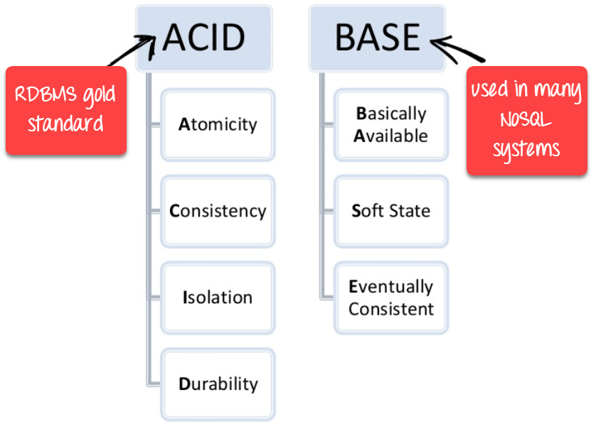

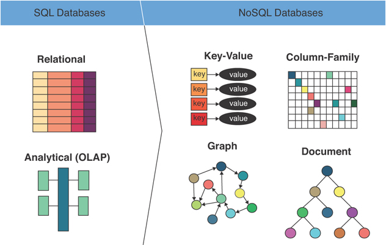

### Replication

- `Replication` is the process of copying data from one database to another. Replication is used to increase
  availability and reliability of data. It is also used to distribute data geographically so that it can be
  accessed locally from various places.
- Replication stategies:
    - **Master-slave replication** - In this strategy, all writes are done to the master database, and the slave
      databases are updated with the changes. If the master database goes down, one of the slave databases can be
      promoted to be the new master. This strategy is simple and easy to implement, but it does not scale well.
    - **Master-master replication** - In this strategy, both master databases are writable and both read from the
      slave databases. This strategy can scale well, but it is more complex to implement and it can lead to conflicts
      when the same data is modified concurrently on both master databases.
    - **Federation** - In this strategy, each database is treated as a separate entity. Applications connect directly
      to the appropriate database, with no single master database. This strategy can scale well, but it is more
      complex to implement and it can lead to conflicts when the same data is modified concurrently on multiple
      databases.

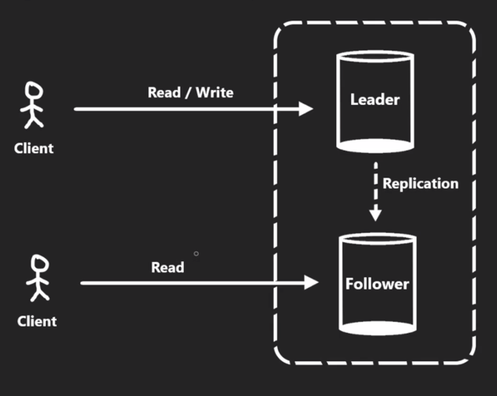

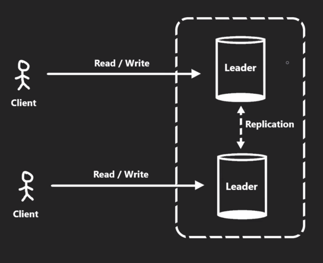

- A `master database` generally only supports `write` operations. A `slave database` gets copies of
  the data from the master database and only supports read operations. All the data-modifying
  commands like insert, delete, or update must be sent to the master database. Most
  applications require a much higher ratio of reads to writes; thus, the number of slave
  databases in a system is usually larger than the number of master databases.

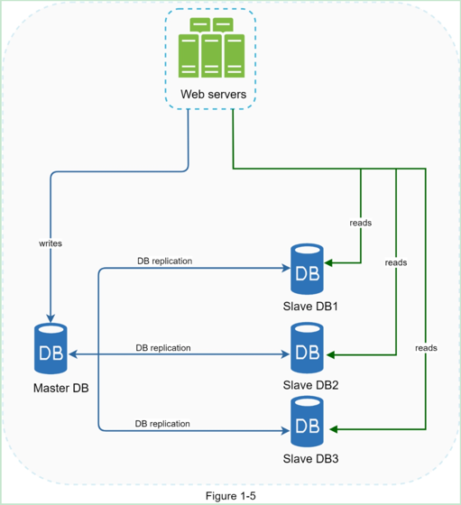

### Sharding

- `Sharding` is the process of storing the same data set in multiple databases. Sharding is used to increase
  scalability and performance of databases. It is also used to distribute data geographically so that it can be
  accessed locally from various places.
- Sharding stategies:
    - **Hash-based sharding** - Hash-based sharding is the most common sharding strategy. In this strategy, each
      shard is responsible for a range of the hash values. For example, if we have three shards, one shard may be
      responsible for hash values 0-33, the second shard may be responsible for hash values 34-66, and the third shard
      may be responsible for hash values 67-99. When a new record is inserted into the database, the hash value of the
      key is computed, and the record is inserted into the shard that is responsible for that hash value range.
    - **Range-based sharding** - Range-based sharding is similar to hash-based sharding, except that the shards are
      responsible for a range of the actual values of the keys. For example, if we have three shards, one shard may
      be responsible for keys a-m, the second shard may be responsible for keys n-z, and the third shard may be
      responsible for keys 0-9. When a new record is inserted into the database, the key is compared against the
      ranges, and the record is inserted into the shard that is responsible for that key range.
    - **List sharding** - List sharding is similar to range-based sharding, except that the shards are responsible
      for a list of the actual values of the keys. For example, if we have three shards, one shard may be responsible
      for keys a, d, g, j, m, p, s, v, y, and the second shard may be responsible for keys b, e, h, k, n, q, t, w, z,
      and the third shard may be responsible for keys c, f, i, l, o, r, u, x. When a new record is inserted into the
      database, the key is compared against the lists, and the record is inserted into the shard that is responsible
      for that key.
    - **Directory sharding** - Directory sharding is similar to list sharding, except that the shards are
      responsible for a directory of the actual values of the keys. For example, if we have three shards, one shard
      may be responsible for keys starting with a-m, the second shard may be responsible for keys starting with n-z,
      and the third shard may be responsible for keys starting with 0-9. When a new record is inserted into the
      database, the key is compared against the directories, and the record is inserted into the shard that is
      responsible for that key.

### Cache

- `Cache` is a temporary storage area for data that is accessed very frequently. It is used to increase the
  performance of data retrieval operations. It is also used to reduce the load on the database by storing
  frequently-accessed data in the cache.
- Types:
    - `LRU Cache` - Least Recently Used Cache
    - `LFU Cache` - Least Frequently Used Cache

- [Сaching strategies](https://codeahoy.com/2017/08/11/caching-strategies-and-how-to-choose-the-right-one):
    - `Cache-Aside` - The cache sits on the side and the application directly talks to both the cache and the database.
      There is no connection between the cache and the primary database. All operations to cache and the database are
      handled by the application. Cache-aside caches are usually general purpose and work best for `read-heavy`
      workloads.
        1. The application first checks the cache.
        2. If the data is found in cache, we’ve cache hit. The data is read and returned to the client.
        3. If the data is not found in cache, we’ve cache miss. The application has to do some extra work. It
           queries the database to read the data, returns it to the client and stores the data in cache so the
           subsequent reads for the same data results in a cache hit.
           

    - `Read-Through Cache` - Read-through cache sits in-line with the database. When there is a cache miss, it loads
      missing data from database, populates the cache and returns it to the application. Read-through caches work best
      for `read-heavy` workloads when the same data is requested many times. For example, a news story.
        1. In cache-aside, the application is responsible for fetching data from the database and populating the cache.
           In read-through, this logic is usually supported by the library or stand-alone cache provider.
        2. Unlike cache-aside, the data model in read-through cache cannot be different than that of the database.
           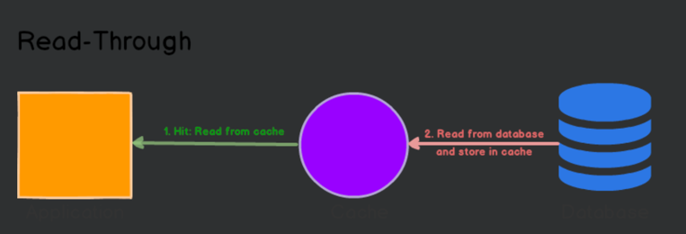

    - `Write-Through Cache` - data is first written to the cache and then to the database. The cache sits in-line with
      the database and writes always go through the cache to the main database. This helps cache maintain consistency
      with the main database.
        1. The application writes the data directly to the cache.
        2. The cache updates the data in the main database. When the write is complete, both the cache and the database
           have the same value and the cache always remains consistent.
           

    - `Write-Around` - Here, data is written directly to the database and only the data that is read makes it way into
      the cache.
    - `Write-Back` or `Write-Behind` - Here, the application writes data to the cache which stores the data and
      acknowledges to the application immediately. Then later, the cache writes the data back to the database. Here, the
      application writes data to the cache which stores the data and acknowledges to the application immediately. Then
      later, the cache writes the data back to the database. Write back caches improve the write performance and are
      good for `write-heavy` workloads.
      

- **Deduplication cache**

### CAP Theorem

- `CAP theorem` states that it is impossible for a distributed data store to simultaneously provide more than two
  out of the following three guarantees:
    - **Consistency** - Every read receives the most recent write or an error.
    - **Availability** - Every request receives a (non-error) response, without the guarantee that it contains the
      most recent write.
    - **Partition tolerance** - The system continues to operate despite an arbitrary number of messages being
      dropped (or delayed) by the network between nodes.

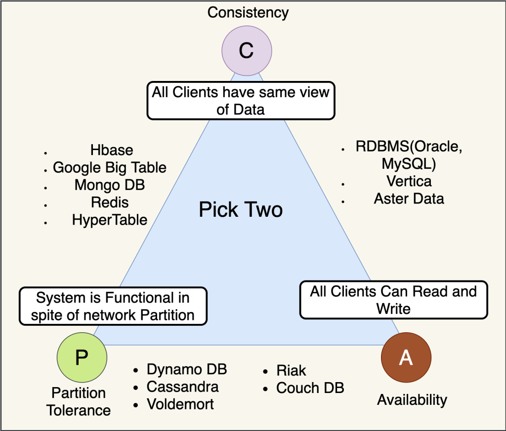

- In a distributed system, `partitions` cannot be avoided, and when a partition occurs, we must
  choose between `consistency` and `availability`. `n3` goes down and cannot
  communicate with `n1` and `n2`. If clients write data to `n1` or `n2`, data cannot be propagated to
  `n3`. If data is written to n3 but not propagated to `n1` and `n2` yet, `n1` and `n2` would have stale
  data.
- If we choose `consistency` over `availability` (`CP` system), we must block all write operations to
  `n1` and `n2` to avoid data inconsistency among these three servers, which makes the system
  unavailable. Bank systems usually have extremely high consistent requirements. For
  example, it is crucial for a bank system to display the most up-to-date balance info. If
  inconsistency occurs due to a network partition, the bank system returns an error before the
  inconsistency is resolved
- If we choose `availability` over `consistency` (`AP` system), the system keeps accepting
  reads, even though it might return `stale` data. For writes, `n1` and `n2` will keep accepting writes,
  and data will be synced to `n3` when the network partition is resolved.

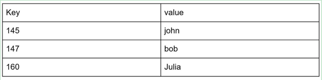

### PACELC Theorem

---

## Numbers every programmer should know

- [Latency Numbers Every Programmer Should Know](https://colin-scott.github.io/personal_website/research/interactive_latency.html)

- `ns` = nanosecond, `µs` = microsecond, `ms` = millisecond
    - `1 ns` = 10^-9 seconds
    - `1 µs`= 10^-6 seconds = 1,000 ns
    - `1 ms` = 10^-3 seconds = 1,000 µs = 1,000,000 ns

- By analyzing the numbers we get the following conclusions:
    - Memory is fast but the disk is slow.
    - Avoid disk seeks if possible.
    - Simple compression algorithms are fast.
    - Compress data before sending it over the internet if possible.
    - Data centers are usually in different regions, and it takes time to send data between them.

#### Availability

---

## System Design terms

### Edge computing

- `Edge computing` is a networking philosophy focused on bringing computing as close to the source of data as possible
  in order to reduce latency and bandwidth use. In simpler terms, edge computing means running fewer processes in the
  cloud and moving those processes to local places, such as on a user’s computer, an IoT device, or an edge server.
  Bringing computation to the network’s edge minimizes the amount of long-distance communication that has to happen
  between a client and server.

### Bloom filter

- `Bloom filter` is a space-efficient probabilistic data structure, that is used to test whether an element is a member
  of a set.
- `False positive` matches are possible
- `False negatives` are not – in other words, a query returns either **possibly in set** or **definitely not in set**
- Elements can be added to the set, but not removed (though this can be addressed with a "counting" filter);
- the more elements that are added to the set, the larger the probability of false positives.

---

### Message delivery guarantees

- At-most-once guarantee
- At-least-once guarantee
- Exactly-once guarantee

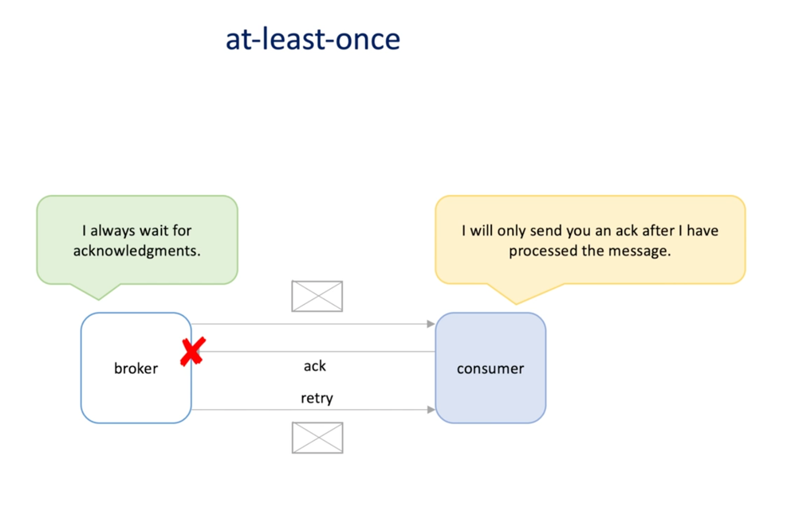

---

### Autoscaling

- Scaling policies (metric-based, schedule-based, predictive)

---

### How to avoid cascading failures in a distributed system

- `Caching` - key value store
- `Gradual deploy`

---

## Region vs Availability Zone

- `Region` is a geographical area. Each region consists of availability zones. Each region is completely independent.
    - Example: us, uk, eu
- `Availability zone` is one or more data centers in region:
    - Example: 3 data centers in one availability zone or 2 data centers in another availability zone

--- 

# System Design Interview Questions

## Design Rate Limiter #1

### What is Rate Limiter?

- In a network system, a rate limiter is used to control the rate of traffic sent by a client or a
  service. In the HTTP world, a rate limiter limits the number of client requests allowed to be
  sent over a specified period. If the API request count exceeds the threshold defined by the
  rate limiter, all the excess calls are blocked. Here are a few examples:
    - A user can write no more than 2 posts per second.
    - You can create a maximum of 10 accounts per day from the same IP address.
    - You can claim rewards no more than 5 times per week from the same device.

### Establish design scope for rate limiter

- `Candidate`: What kind of rate limiter are we going to design? Is it a client-side rate limiter or server-side API
  rate limiter?
- `Interviewer`: Great question. We focus on the server-side API rate limiter.
- `Candidate`: Does the rate limiter throttle API requests based on IP, the user ID, or other properties?
- `Interviewer`: The rate limiter should be flexible enough to support different sets of throttle rules.
- `Candidate`: What is the scale of the system? Is it built for a startup or a big company with a large user base?
- `Interviewer`: The system must be able to handle a large number of requests.
- `Candidate`: Will the system work in a distributed environment?
- `Interviewer`: Yes.
- `Candidate`: Is the rate limiter a separate service or should it be implemented in application code?
- `Interviewer`: It is a design decision up to you.
- `Candidate`: Do we need to inform users who are throttled?
- `Interviewer`: Yes.

### Requirements for rate limiter

- Accurately limit excessive requests.
- Low latency. The rate limiter should not slow down HTTP response time.
- Use as little memory as possible.
- Distributed rate limiting. The rate limiter can be shared across multiple servers or
  processes.
- Exception handling. Show clear exceptions to users when their requests are throttled.
- High fault tolerance. If there are any problems with the rate limiter (for example, a cache server goes offline), it
  does not affect the entire system.

### Rate limiter types

- Client-side rate limiter
- Server-side rate limiter
- Middleware rate limiter

### Algorithms for rate limiting

- Token bucket
- Leaking bucket
- Fixed window counter
- Sliding window log
- Sliding window counter

### Token bucket algorithm

- This algorithm has a centralized bucket host where you take tokens on each request, and slowly drip more tokens into
  the bucket. If the bucket is empty, reject the request
- A `token bucket` is a container that has pre-defined capacity.
- Tokens are put in the bucket at preset rates periodically
- Once the bucket is full, no more tokens are added
- Each request consumes one token. When a request arrives, we check if there are enough tokens in the bucket.
    - If there are enough tokens, we take one token out for each request, and the request goes through.
    - If there are not enough tokens, the request is dropped

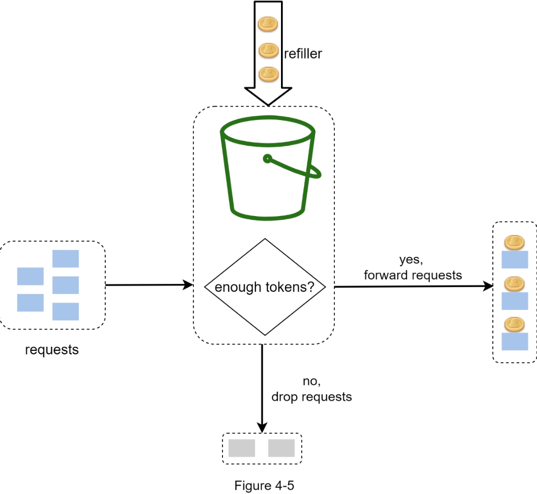

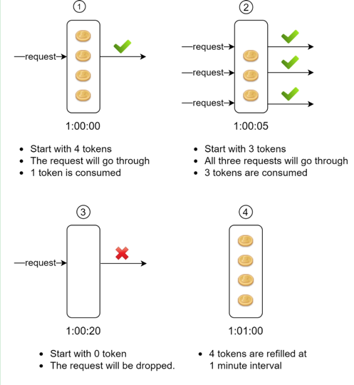

- The token bucket algorithm takes two parameters:
    - `Bucket size`: the maximum number of tokens allowed in the bucket
    - `Refill rate`: number of tokens put into the bucket every second
- Pros:
    - The algorithm is easy to implement.
    - Memory efficient.
    - Token bucket allows a burst of traffic for short periods. A request can go through as long
      as there are tokens left.
- Cons:
    - Two parameters in the algorithm are bucket size and token refill rate. However, it might
      be challenging to tune them properly.

### Leaking bucket algorithm

- The `leaking bucket algorithm` is similar to the token bucket except that requests are processed
  at a fixed rate. It is usually implemented with a first-in-first-out (FIFO) `queue`.
  The algorithm works as follows:
    - When a request arrives, the system checks if the queue is full. If it is not full, the request is added to the
      queue.
    - Otherwise, the request is dropped.
    - Requests are pulled from the queue and processed at regular intervals.

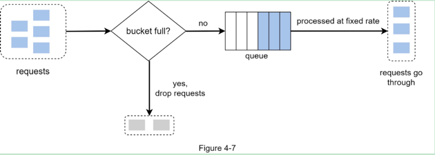

- Leaking bucket algorithm takes the following two parameters:
    - `Bucket size`: it is equal to the queue size. The queue holds the requests to be processed at
      a fixed rate.
    - `Outflow rate`: it defines how many requests can be processed at a fixed rate, usually in
      seconds.
- Pros:
    - Memory efficient given the limited queue size.
    - Requests are processed at a fixed rate therefore it is suitable for use cases that a stable
      outflow rate is needed.
- Cons:
    - A burst of traffic fills up the queue with old requests, and if they are not processed in
      time, recent requests will be rate limited.
    - There are two parameters in the algorithm. It might not be easy to tune them properly

### Fixed window counter algorithm

- `Fixed window counter algorithm` works as follows:
    - The algorithm divides the timeline into fix-sized time windows and assign a counter for
      each window.
    - Each request increments the counter by one.
    - Once the counter reaches the pre-defined threshold, new requests are dropped until a new time window starts

- Example:
    - The time unit is 1 second
    - The system allows a maximum of 3 requests per second.
    - In each second window, if more than 3 requests are received, extra requests are dropped

- A major problem with this algorithm is that a burst of traffic at the edges of time windows
  could cause more requests than allowed quota to go through
    - The system allows a maximum of 5 requests per minute, and the available quota
      resets at the human-friendly round minute.
    - As seen, there are five requests between 2:00:00 and 2:01:00 and five more requests between 2:01:00 and 2:02:00.
    - For the one-minute window between 2:00:30 and 2:01:30, 10 requests go through.
    - That is twice as many as allowed requests.

### Sliding window log algorithm

- `Sliding window log algorithm` works as follows:
    - The algorithm keeps track of request timestamps. Timestamp data is usually kept in
      cache, such as sorted sets of Redis.
    - When a new request comes in, remove all the outdated timestamps. Outdated timestamps are defined as those older
      than the start of the current time window.
    - Add timestamp of the new request to the log.
    - If the log size is the same or lower than the allowed count, a request is accepted. Otherwise, it is rejected

- Example:
    - In this example, the rate limiter allows 2 requests per minute. The time unit is 1 minute.
    - The log is empty when a new request arrives at `1:00:01`. Thus, the request is allowed.
    - A new request arrives at `1:00:30`, the timestamp `1:00:30` is inserted into the log. After the
      insertion, the log size is `2`, not larger than the allowed count. Thus, the request is allowed.
    - A new request arrives at `1:00:50`, and the timestamp is inserted into the log. After the
      insertion, the log size is `3`, larger than the allowed size `2`. Therefore, this request is rejected
      even though the timestamp remains in the log.
    - A new request arrives at `1:01:40`. Requests in the range `[1:00:40,1:01:40)` are within the
      latest time frame, but requests sent before `1:00:40` are outdated.
    - Two outdated timestamps, `1:00:01` and `1:00:30`, are removed from the log.
    - After the remove operation, the log size becomes `2`; therefore, the request is accepted

- Pros:
    - Rate limiting implemented by this algorithm is very accurate. In any rolling window,
      requests will not exceed the rate limit.
- Cons:
    - The algorithm consumes a lot of memory because even if a request is rejected, its
      timestamp might still be stored in memory.

### Sliding window counter algorithm

- The `sliding window counter algorithm` is a hybrid approach that combines the fixed window counter and sliding window
  log.

- Example:
    - Let’s say I set a limit of `50` requests per minute on an API endpoint. The counter can be thought of like this:
    - In this situation, I did `18` requests during the current minute, which started `15` seconds ago, and `42`
      requests during the entire previous minute.
    - Based on this information, the rate approximation is calculated like this:
        - rate = `42 * ((60-15)/60) + 18` = `42 * 0.75 + 18` = `49.5` requests
- Pros:
    - Tiny memory usage: only two numbers per counter
    - Incrementing a counter can be done by sending a single `INCR` command
    - Calculating the rate is reasonably easy: one GET command and some very simple, fast math
- Cons:
    - It only works for not-so-strict look back window. It is an approximation of the actual rate
      because it assumes requests in the previous window are evenly distributed. However, this
      problem may not be as bad as it seems.

### Detailed design for rate limiter

- The rate limiter is implemented as a `middleware`. It is placed in front of the API server.
- `Rules` are stored on the disk. Workers frequently pull rules from the disk and store them in the cache.
- When a client sends a request to the server, the request is sent to the rate limiter middleware first.
- Rate limiter `middleware` loads rules from the `cache`. It fetches counters and last request
  timestamp from `Redis` cache. Based on the response, the rate limiter decides:
    - if the request is not rate limited, it is forwarded to API servers.
    - if the request is rate limited, the rate limiter returns `429` too many requests error to
      the client. In the meantime, the request is either dropped or forwarded to the `queue`.

### Synchronization issue

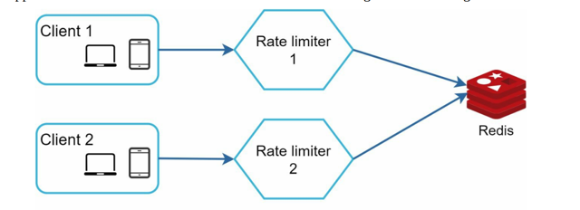

- `Synchronization issue` can be solved by using centralized data stores like `Redis`.

---

## Desing Consistent hashing

- `Consistent hashing` is a special kind of hashing such that when a
  hash table is re-sized and consistent hashing is used, only `k/n` keys need to be remapped on
  average, where `k` is the number of keys, and `n` is the number of slots. In contrast, in most
  traditional hash tables, a change in the number of array slots causes nearly all keys to be
  remapped
- The basic steps are:
    - Map servers and keys on to the ring using a uniformly distributed hash function.
    - To find out which server a key is mapped to, go clockwise from the key position until the
      first server on the ring is found

### Server lookup in Consistent hashing

- To determine which server a key is stored on, we go clockwise from the key position on the ring until a server is
  found.
- Going clockwise, `key0` is stored on server 0; `key1` is stored on server 1; `key2` is stored on server 2
  and `key3` is stored on server 3

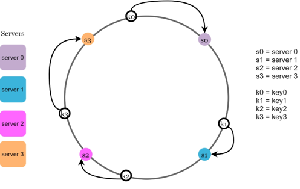

### Add a server in Consistent hashing

- After a new server 4 is added, only `key0` needs to be redistributed.
- `k1`, `k2`, and `k3` remain on the same servers. Let us take a close look at the logic.
- Before server 4 is added, `key0` is stored on server 0. Now, `key0` will be stored on server 4 because server 4 is
  the first
  server it encounters by going clockwise from `key0`’s position on the ring.
- The other keys are not redistributed based on consistent hashing algorithm.

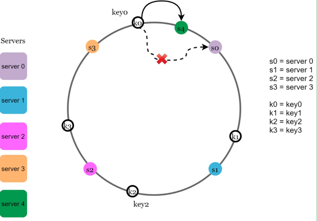

### Remove a server in Consistent hashing

- When a server is removed, only a small fraction of keys require redistribution with consistent hashing.
- When server 1 is removed, only `key1` must be remapped to server 2. The rest of the keys are unaffected.

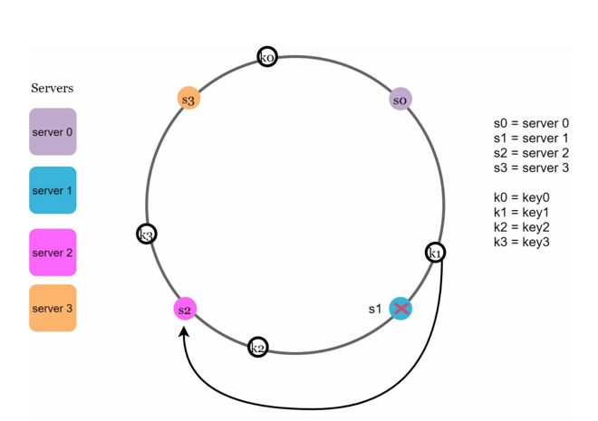

### Virtual nodes in Consistent hashing

- A `virtual node` refers to the real node, and each server is represented by multiple virtual nodes on the ring.
- The 3 is arbitrarily chosen; and in real-world systems, the number of virtual nodes is much larger.
- Instead of using `s0`, we have `s0_0`, `s0_1`, and `s0_2` to represent `server 0` on the ring.
- Similarly, `s1_0`, `s1_1`, and `s1_2` represent `server 1` on the ring.
- With virtual nodes, each server is responsible for multiple partitions.
- Partitions (edges) with label `s0` are managed by `server 0`. On the other hand, partitions with label `s1` are
  managed by `server 1`.
- As the number of `virtual nodes` increases, the distribution of keys becomes more balanced.

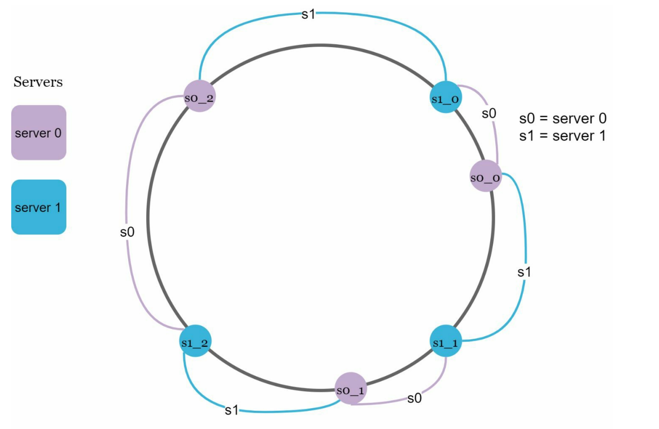

- To find which server a key is stored on, we go `clockwise` from the key’s location and find the first `virtual node`
  encountered on the ring.

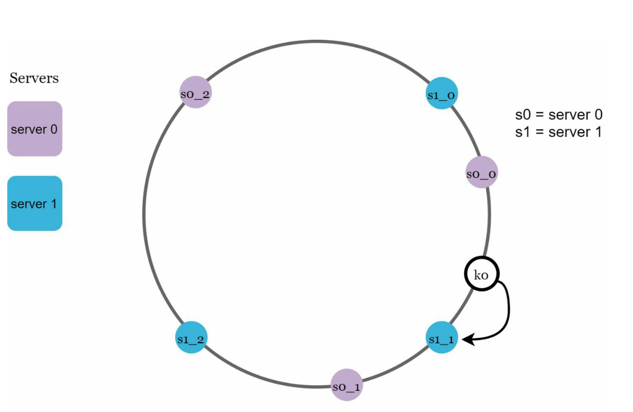

### Redestribution when added server in Consistent hashing

- When a server is added or removed, a fraction of data needs to be redistributed
- `server 4` is added onto the ring. The affected range starts from `s4` (newly added node) and
  moves `anticlockwise`
  around the ring until a server is found (`s3`).
- Thus, keys located between `s3` and `s4` need to be redistributed to `s4`

### Redestribution when removed server in Consistent hashing

- When a server (s1) is removed, the affected range starts from `s1` (removed node) and moves `anticlockwise` around
  the ring until a server is found (s0).
- Thus, keys located between s0 and s1 must be redistributed to s2.

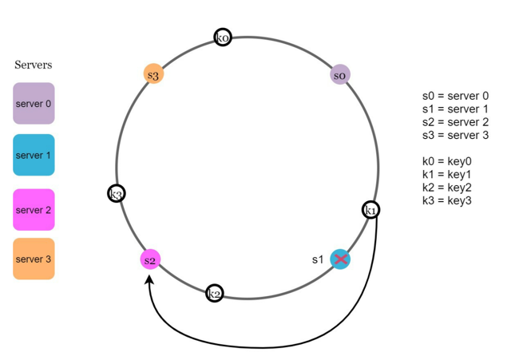

### Data replication in Consistent hashing

- To achieve high availability and reliability, data must be replicated asynchronously over `N`
  servers, where `N` is a configurable parameter.
- These `N` servers are chosen using the following logic:
    - after a key is mapped to a position on the hash ring, `walk clockwise` from that position
      and choose the first `N` servers on the ring to store data copies.
    - `key0` is replicated at `s1`, `s2`, and `s3`

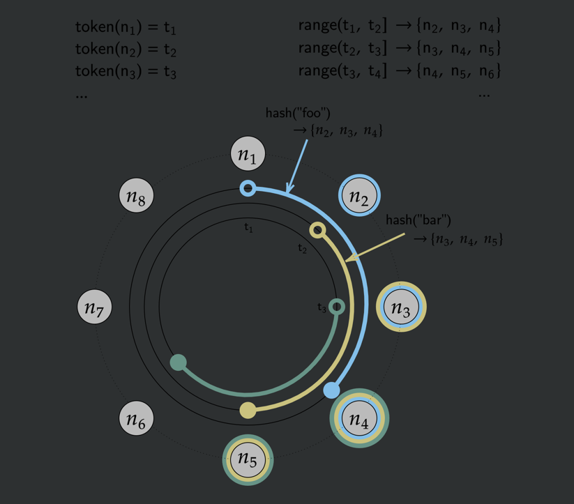

---

## Desing a key-value store

- A `key-value` store, also referred to as a key-value database, is a non-relational database. Each
  unique identifier is stored as a key with its associated value.
- This data pairing is known as a `key-value` pair.
- `Cassandra`:
    - `Reads` are more expensive than writes.
    - `Writes` are appended to a commit log and written to an in memory structure called a memtable that is eventually
      flushed to disk.
    - `Reads`, however, need to query the memtable and potentially multiple SSTables (on-disk files), a more expensive
      operation

### Data partitioning in key-value store

- `Data partitioning` is a technique used to distribute data across multiple machines. It is used to
  scale the storage and retrieval of data.
- `Data partitioning` can be achived by `consistent hashing`

### Consistency in key-value store

- Since data is replicated at multiple nodes, it must be synchronized across replicas. `Quorum
  consensus` can guarantee consistency for both read and write operations. Let us establish a
  few definitions first.
    - `N` = The number of `replicas`
    - `W` = A `write quorum` of size `W`. For a `write` operation to be considered as successful, write operation must
      be acknowledged from `W` replicas.
    - `R` = A `read quorum` of size `R`. For a `read` operation to be considered as successful, read operation must wait
      for responses from at least `R` replicas.
- The configuration of `W`, R and `N` is a typical tradeoff between latency and consistency
    - If `W = 1 or R = 1`, an `operation is returned quickly` because a coordinator only needs to wait for a
      response from any of the replicas.
    - If `W or R > 1`, the system offers `better consistency`; however, the `query will be slower` because the
      coordinator must wait for the response from the slowest replica.
    - If `W + R > N`, `strong consistency` is guaranteed because there must be at least one overlapping node that has
      the latest data to ensure consistency.
- How to configure N, W, and R to fit our use cases? Here are some of the possible setups:
    - If `R = 1 and W = N`, the system is optimized for a `fast read`.
    - If `W = 1 and R = N`, the system is optimized for `fast write`.
    - If `W + R > N`, strong `consistency` is `guaranteed` (Usually N = 3, W = R = 2).
    - If `W + R <= N`, strong `consistency` is `not guaranteed`.
- Consistency models:
    - `Strong consistency`: any read operation returns a value corresponding to the result of the
      most updated write data item. A client never sees out-of-date data.
    - `Weak consistency`: subsequent read operations may not see the most updated value.
    - `Eventual consistency`: this is a specific form of weak consistency. Given enough time, all
      updates are propagated, and all replicas are consistent.

### Handling temporary failures for key-value store

- If a server is unavailable due to network or server failures, another server will process requests temporarily.
- When the down server is up, changes will be pushed back to achieve data consistency.
- This process is called `hinted handoff`.
- Since `s2` is unavailable, reads and writes will be handled by `s3` temporarily.
- When `s2` comes back online, `s3` will hand the data back to `s2`.

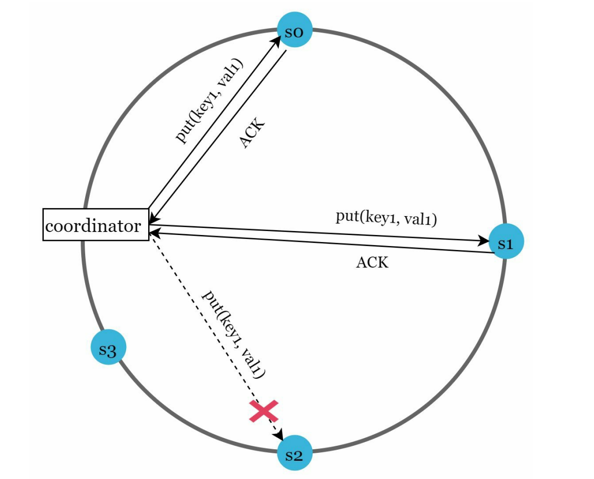

### Handling permanent failures for key-value store

- What if a replica is permanently unavailable?
- To handle such a situation, we implement an `anti-entropy protocol` to keep replicas in sync.
- Anti-entropy involves comparing each piece of data on replicas and updating each replica to the newest version.
- A `Merkle tree` is used for inconsistency detection and minimizing the amount of data transferred

### Handling data center outage for key-value store

- Data center outage could happen due to power outage, network outage, natural disaster, etc.
- To build a system capable of handling data center outage, it is important to replicate data across multiple data
  centers.
- Even if a data center is completely offline, users can still access data through the other data centers.

### System architecture diagram for key-value store

- Main features of the architecture are listed as follows:
    - Clients communicate with the key-value store through simple APIs: get(key) and put(key,
      value).
    - A coordinator is a node that acts as a proxy between the client and the key-value store.
    - Nodes are distributed on a ring using consistent hashing.
    - The system is completely decentralized so adding and moving nodes can be automatic.
    - Data is replicated at multiple nodes.
    - There is no single point of failure as every node has the same set of responsibilities

### Write path in key-value store

- When data is written to `Cassandra`, it is first written to the `commit log`. Subsequently, the data is asynchronously
  written to the `memtable` (in-memory storage) and the `SSTable` (sorted file data on disk).
- The commit log provides data durability by retaining information about each write operation, even if the data hasn't
  been completely written to the memtable and SSTable.
- During a Cassandra restart or in case of a failure, the commit log is used to recover data that may have been lost
  during the failure. It allows Cassandra to replay the data from the commit log and update the memtable and SSTable
  accordingly.
- In summary, the commit log is a crucial component of Cassandra's data durability mechanism, ensuring the reliability
  of data in case of system failures.

- The write request is persisted on a commit log file.
    - `log` - this is a **linked list** data-structute. Where adding a new entry is `O(1)` and reading is `O(n)`.
- Data is saved in the memory cache.
- When the memory cache is full or reaches a predefined threshold, data is flushed to SSTable on disk.
- A sorted-string table (SSTable) is a sorted list of <key, value> pairs, contains sorted keys from log

### Read path in key-value store

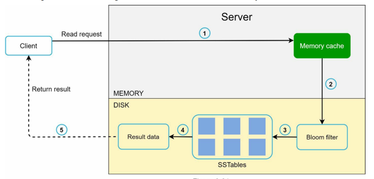

- The system first checks if data is in memory - `memtable`. If not, go to step 2.
    - Data in Cassandra `memtables` is stored in a highly optimized, columnar format, which allows for efficient read
      and
      write operations. This format is designed to maximize performance and minimize disk I/O, which is essential for
      Cassandra's high-throughput, low-latency, and distributed architecture.
- If data is not in memory, the system checks the `bloom filter`
    - `Bloom filter` is a probabilistic data structure that is used to test whether an element is a member of a set.
- The bloom filter is used to figure out which SSTables might contain the key.
- `SSTables` return the result of the data set.
- The result of the data set is returned to the client.
- It's important to note that the in-memory data structures and the on-disk storage (SSTables) in Cassandra can have
  different formats and structures. The on-disk format is designed for durability and efficient storage, while the
  in-memory format (memtable) is optimized for quick access and updates.

### Techniques for a distributed key-value store

---

## Desing a unique ID generator in distributed systems

### Establish design scope for unique ID generator

- `Candidate`: What are the characteristics of unique IDs?
- `Interviewer`: IDs must be unique and sortable.
- `Candidate`: For each new record, does ID increment by 1?
- `Interviewer`: The ID increments by time but not necessarily only increments by 1. IDs created in the evening are
  larger than those created in the morning on the same day.
- `Candidate`: Do IDs only contain numerical values?
- `Interviewer`: Yes, that is correct.
- `Candidate`: What is the ID length requirement?
- `Interviewer`: IDs should fit into 64-bit.
- `Candidate`: What is the scale of the system?
- `Interviewer`: The system should be able to generate 10,000 IDs per second.

### Requirements for unique ID generator

- IDs must be unique.
- IDs are numerical values only.
- IDs fit into 64-bit.
- IDs are ordered by date.
- Ability to generate over 10,000 unique IDs per second.

### Multi-master replication

- `Multi-master replication` is a replication strategy where all nodes are equal and can accept writes.
- This approach uses the databases `auto_increment` feature. Instead of increasing the next ID by 1, we increase it
  by `k`, where `k` is the number of database servers in use.
- Next ID to be generated is equal to the previous ID in the same server plus `2`.
- This solves some scalability issues because IDs can scale with the number of database servers.
- However, this strategy has some major drawbacks:
    - Hard to scale with multiple data centers
    - IDs do not go up with time across multiple servers.
    - It does not scale well when a server is added or removed.

### UUID

- `UUID` is another easy way to obtain unique IDs. UUID is a 128-bit number used to identify information in computer
  systems.
- `UUID` has a very low probability of getting collusion.
- In this design, each web server contains an ID generator, and a web server is responsible for enerating IDs
  independently.
- Pros:
    - Generating `UUID` is simple. No coordination between servers is needed so there will not be any synchronization
      issues.
    - The system is easy to scale because each web server is responsible for generating IDs they consume. ID generator
      can easily scale with web servers.
- Cons:
    - IDs are 128 bits long, but our requirement is 64 bits.
    - IDs do not go up with time.
    - IDs could be non-numeric.

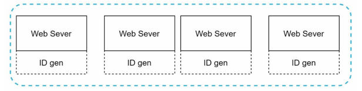

### Ticket Server

- `Ticket server` is a centralized service that generates unique IDs.
- The idea is to use a centralized `auto_increment` feature in a single database server.
- Pros:
    - Numeric IDs.
    - It is easy to implement, and it works for small to medium-scale applications.
- Cons:
    - Single point of failure. Single ticket server means if the ticket server goes down, all systems that depend on it
      will face issues.
    - To avoid a single point of failure, we can set up multiple ticket servers.
    - However, this will introduce new challenges such as data synchronization

### Twitter snowflake approach

- Sections:
    - `Sign bit`: 1 bit. It will always be 0. This is reserved for future uses. It can potentially be
      used to distinguish between signed and unsigned numbers.
    - `Timestamp`: 41 bits. Milliseconds since the epoch or custom epoch. We use Twitter
      snowflake default epoch 1288834974657, equivalent to Nov 04, 2010, 01:42:54 UTC.
    - `Datacenter ID`: 5 bits, which gives us 2 ^ 5 = 32 datacenters.
    - `Machine ID`: 5 bits, which gives us 2 ^ 5 = 32 machines per datacenter.
    - `Sequence number`: 12 bits. For every ID generated on that machine/process, the sequence
      number is incremented by 1. The number is reset to 0 every millisecond.

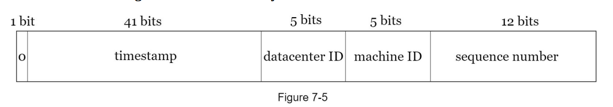

- `Datacenter IDs` and `machine IDs` are chosen at the startup time, generally fixed once the system is up running
- `Timestamp`:
    - As timestamps grow with time, IDs are sortable by time.
    - The maximum timestamp that can be represented in `41` bits is 2 ^ 41 - 1 = `2199023255551` milliseconds (ms),
      which gives us: ~ `69` years
        - `2199023255551` ms / `1000` seconds / `365` days / `24` hours / `3600` seconds
- `Sequence number`
    - Sequence number is `12` bits, which give us 2 ^ 12 = `4096` combinations.
    - This field is `0` unless more than one ID is generated in a millisecond on the same server.
    - In theory, a machine can support a maximum of `4096` new IDs per millisecond.

---

## Design a URL shortening service like TinyURL

### Establish design scope for URL shortening service

- `Candidate`: Can you give an example of how a URL shortener work?
- `Interviewer`: Assume URL https://www.systeminterview.com/q=chatsystem&c=loggedin&v=v3&l=long is the original URL.
  Your service creates an alias with shorter length: https://tinyurl.com/y7keocwj. If you click the alias, it redirects
  you to the original URL.
- `Candidate`: What is the traffic volume?
- `Interviewer`: 100 million URLs are generated per day.
- `Candidate`: How long is the shortened URL?
- `Interviewer`: As short as possible.
- `Candidate`: What characters are allowed in the shortened URL?
- `Interviewer`: Shortened URL can be a combination of numbers (0-9) and characters (a-z, AZ).
- `Candidate`: Can shortened URLs be deleted or updated?
- `Interviewer`: For simplicity, let us assume shortened URLs cannot be deleted or updated

### API Endpoints for URL shortening service

- POST `api/v1/data/shorten`
    - request parameter: {`longUrl`: longURLString}
    - return shortURL
- GET `api/v1/shortUrl`
    - Return longURL for HTTP redirection

### URL redirecting for URL shortening service

- Once the server receives a tinyurl request, it changes the short URL to the long URL with `301` redirect.

### 301 redirect vs 302 redirect for URL shortening service

- A `301` redirect shows that the requested URL is `permanently` moved to the
  long URL. Since it is permanently redirected, the browser caches the response, and
  subsequent requests for the same URL will not be sent to the URL shortening service.
- A `302` redirect means that the URL is `temporarily` moved to the long URL,
  meaning that subsequent requests for the same URL will be sent to the URL shortening
  service first

### Hash value length for URL shortening service

- The `hashValue` consists of characters from [0-9, a-z, A-Z], containing `10 + 26 + 26` = `62` possible characters.
- When `n` = 7, `62^n` = `~3.5 trillion`, 3.5 trillion is more than enough to hold 365 billion URLs, so the length of
  hashValue is `7`.

### URL shortening deep dive

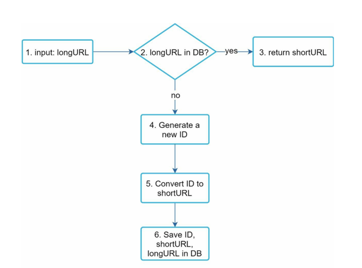

1. `longURL` is the input.
2. The system checks if the `longURL` is in the database.
3. If it is, it means the `longURL` was converted to `shortURL` before. In this case, fetch the `shortURL` from the
   database
   and return it to the client.
4. If not, the `longURL` is new. A new unique ID (primary key) Is generated by the unique ID generator.
5. Convert the ID to `shortURL` with `base 62` conversion.
6. Create a new database row with the `ID`, `shortURL`, and `longURL`.

- Concrete example.
    - Assuming the input longURL is: https://en.wikipedia.org/wiki/Systems_design
    - Unique ID generator returns ID: `2009215674938`.
    - Convert the ID to shortURL using the `base 62` conversion. ID (2009215674938) is converted to `zn9edcu`
    - Save `ID`, `shortURL`, and `longURL` to the database

### URL redirecting deep dive

- As there are more reads than writes, `<shortURL, longURL>` mapping is stored in a cache to improve performance.

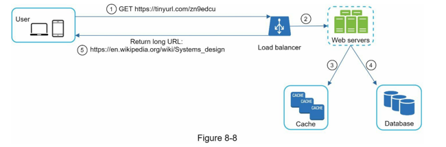

- The flow of URL redirecting is summarized as follows:
    - A user clicks a short URL link: https://tinyurl.com/zn9edcu
    - The load balancer forwards the request to web servers.
    - If a `shortURL` is already in the cache, return the `longURL` directly.
    - If a `shortURL` is not in the cache, fetch the `longURL` from the database.
    - If it is not in the database, it is likely a user entered an invalid `shortURL`.
    - The `longURL` is returned to the user

---

## Design a web crawler

- A web crawler is known as a robot or spider.
- It is widely used by search engines to discover new or updated content on the web.
- A crawler is used for many purposes:
    - `Search engine indexing`: crawler collects web pages to create a local index for search engines
    - `Web archiving`: This is the process of collecting information from the web to preserve data for future uses
    - `Web mining`: Web mining helps to discover useful knowledge from the internet
    - `Web monitoring`: The crawlers help to monitor copyright and trademark infringements over the Internet
- `Locality`:
    - Distribute crawl servers geographically. When crawl servers are closer to website hosts, crawlers experience
      faster
      download time
- `Timeouts`:
    - Some web servers respond slowly or may not respond at all. To avoid long wait time, a
      maximal wait time is specified.
    - If a host does not respond within a predefined time, the crawler will stop the job and crawl some other pages.

### Establish design scope for web crawler

- `Candidate`: What is the main purpose of the crawler? Is it used for search engine indexing, data mining, or something
  else?
- `Interviewer`: Search engine indexing.
- `Candidate`: How many web pages does the web crawler collect per month?
- `Interviewer`: 1 billion pages.
- `Candidate`: What content types are included? HTML only or other content types such as PDFs and images as well?
- `Interviewer`: HTML only.
- `Candidate`: Shall we consider newly added or edited web pages?
- `Interviewer`: Yes, we should consider the newly added or edited web pages.
- `Candidate`: Do we need to store HTML pages crawled from the web?
- `Interviewer`: Yes, up to 5 years
- `Candidate`: How do we handle web pages with duplicate content?
- `Interviewer`: Pages with duplicate content should be ignored.

### Web crawler high level design

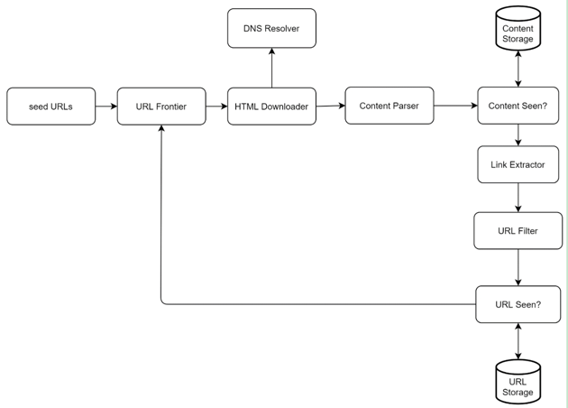

### Seed URLs for web crawler

- Seed URLs are the URLs that are used to start the crawling process.
- A good seed URL serves as a good starting point that a crawler can utilize to traverse as many links as possible
- The first proposed approach is based on locality as different countries may have different popular websites.
- Another way is to choose seed URLs based on topics; for example, we can divide URL space into shopping, sports,
  healthcare, etc.
- Seed URL selection is an open-ended question

### URL Frontier for web crawler

- Most modern web crawlers split the crawl state into two: `to be downloaded` and `already downloaded`.
- The component that stores URLs `to be downloaded` is called the URL Frontier.
- You can refer to this as a First-in-First-out (FIFO) `queue`

### HTML Downloader for web crawler

- The HTML downloader downloads web pages from the internet.
- Those URLs are provided by the `URL Frontier`
- To achieve high performance, crawl jobs are distributed into multiple servers
- The URL space is partitioned into smaller pieces; so, each downloader is responsible for a subset of the URLs

### DNS Resolver for web crawler

- To download a web page, a URL must be translated into an `IP address`.
- The `HTML Downloader` calls the `DNS Resolver` to get the corresponding `IP` address for the `URL`
- `DNS Resolver` is a bottleneck for crawlers because DNS requests might take time due to the synchronous nature of many
  DNS interfaces
    - Maintaining our DNS cache to avoid calling DNS frequently is an effective technique for speed optimization.
    - DNS cache keeps the domain name to IP address mapping and is updated periodically by cron jobs.

### Content Parser for web crawler

- After a web page is downloaded, it must be parsed and validated because malformed web pages could provoke problems and
  waste storage space.
- Implementing a content parser in a crawl server will slow down the crawling process

### Content Seen for web crawler

- It helps to detect new content previously stored in the system.
- An efficient way to accomplish this task is to compare the hash values of the two web pages

### Content Storage for web crawler

- It is a storage system for storing HTML content.
- The choice of storage system depends on factors such as data type, data size, access frequency, life span, etc.
- Both disk and memory are used:
    - Most of the content is stored on disk because the data set is too big to fit in memory.
    - Popular content is kept in memory to reduce latency.

### URL Extractor for web crawler

- URL Extractor parses and extracts links from HTML pages

### URL Filter for web crawler

- The URL filter excludes certain content types, file extensions, error links and URLs in `blacklisted` sites.

### URL Seen for web crawler

- `URL Seen` is a data structure that keeps track of URLs that are visited before or already in
  the `Frontier`.
- `URL Seen` helps to avoid adding the same URL multiple times as this can increase server load and cause potential
  infinite loops.
- Bloom filter and hash table are common techniques to implement the `URL Seen` component.

### URL Storage for web crawler

- URL Storage stores already visited URLs.

### Web crawler workflow

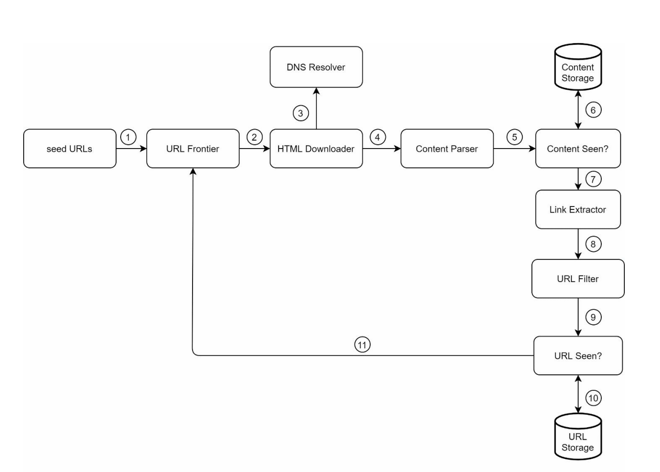

- Step 1: Add `seed` URLs to the `URL Frontier`
- Step 2: `HTML Downloader` fetches a list of URLs from `URL Frontier`.
- Step 3: `HTML Downloader` gets `IP` addresses of `URLs` from `DNS resolver` and starts downloading.
- Step 4: `Content Parser` parses HTML pages and checks if pages are malformed.
- Step 5: After content is parsed and validated, it is passed to the `Content Seen` component.
- Step 6: `Content Seen` component checks if a HTML page is already in the storage.
    - If it is in the storage, this means the same content in a different URL has already been
      processed. In this case, the HTML page is discarded.
    - If it is not in the storage, the system has not processed the same content before. The
      content is passed to `Link Extractor`.
- Step 7: `Link extractor` extracts links from HTML pages.
- Step 8: Extracted links are passed to the `URL filter`.
- Step 9: After links are filtered, they are passed to the `URL Seen` component.
- Step 10: `URL Seen` component checks if a URL is already in the storage, if yes, it is processed before, and nothing
  needs to be done.
  Step 11: If a URL has not been processed before, it is added to the `URL Frontier`

### DFS vs BFS for web crawler

- `DFS` is usually not a good choice because the depth of DFS can be very deep.
- `BFS` is commonly used by web crawlers and is implemented by a first-in-first-out (FIFO) queue. In a FIFO queue, URLs
  are dequeued in the order they are enqueued.

### URL frontier for web crawler deep dive

- Generally, a web crawler should avoid sending too many requests to the same hosting server within a short period.
- The general idea of enforcing politeness is to download one page at a time from the same host.
- A delay can be added between two download tasks.

- Priority:
    - `Prioritizer`: It takes URLs as input and computes the priorities.
    - `Queue f1 to fn`: Each queue has an assigned priority. Queues with high priority are selected with higher
      probability.
    - `Front queue selector`: Randomly choose a queue with a bias towards queues with higher priority.
- Politeness:
    - `Back queue router`: It ensures that each queue (b1, b2, … bn) only contains URLs from the same host.
    - `Mapping table`: It maps each host to a queue.
    - `FIFO queues b1, b2 to bn`: Each queue contains URLs from the same host.
    - `Back queue selector`: Each worker thread is mapped to a FIFO queue, and it only downloads URLs from that queue.
      The
      queue selection logic is done by the Queue selector.
    - `Worker thread 1 to N`. A worker thread downloads web pages one by one from the same host. A delay can be added
      between two download tasks.

---

## Design a notification system #1

### Establish design scope for notification system

- `Candidate`: What types of notifications does the system support?
- `Interviewer`: Push notification, SMS message, and email.
- `Candidate`: Is it a real-time system?
- `Interviewer`: Let us say it is a soft real-time system. We want a user to receive notifications as soon as possible.
  However, if the system is under a high workload, a slight delay is acceptable.
- `Candidate`: What are the supported devices?
- `Interviewer`: iOS devices, android devices, and laptop/desktop.
- `Candidate`: What triggers notifications?
- `Interviewer`: Notifications can be triggered by client applications. They can also be scheduled on the server-side.
- `Candidate`: Will users be able to opt-out?
- `Interviewer`: Yes, users who choose to opt-out will no longer receive notifications.
- `Candidate`: How many notifications are sent out each day?
- `Interviewer`: 10 million mobile push notifications, 1 million SMS messages, and 5 million emails.

### Types of notifications

- Push notification
- SMS message
- Email

### iOS push notification

- `Provider`. A provider builds and sends notification requests to `Apple Push Notification Service` (APNS). To
  construct a push notification, the provider provides the following data:
    - `Device token`: This is a unique identifier used for sending push notifications.
    - `Payload`: This is a JSON dictionary that contains a notification’s payload.
- `APNS`: This is a remote service provided by Apple to propagate push notifications to iOS devices.
- `iOS Device`: It is the end client, which receives push notifications.

### Android push notification

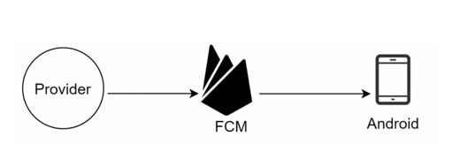

- `Android` adopts a similar notification flow. Instead of using APNs, `Firebase Cloud Messaging` (FCM) is commonly used
  to send push notifications to android devices

### SMS notification

- For `SMS` messages, third party SMS services like `Twilio`, `Nexmo`, and many others are commonly used. Most of them
  are
  commercial services

### Email notification

- Although companies can set up their own email servers, many of them opt for commercial email services.
- `Sendgrid` and `Mailchimp` are among the most popular email services, which offer a better delivery rate and data
  analytics.

### High-level design of a notification system

1. A `service` calls APIs provided by notification servers to send notifications.
2. `Notification servers` fetch metadata such as user info, device token, and notification setting from the cache or
   database.
3. A notification event is sent to the corresponding queue for processing. For instance, an iOS push notification event
   is sent to the iOS PN queue.
4. `Workers` pull notification events from message queues.
5. `Workers` send notifications to third party services.
6. `Third-party` services send notifications to user devices.

### Preventing data loss in a notification system

- To satisfy this requirement, the notification system persists notification data in a database and implements a retry
  mechanism

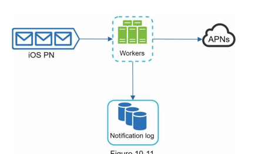

### Will recipients receive a notification exactly once in a notification system?

- The short answer is no. Although notification is delivered exactly once most of the time, the
  distributed nature could result in duplicate notifications.
- To reduce the duplication occurrence, we introduce a dedupe mechanism and handle each failure case carefully.
- Here is a simple dedupe logic:
    - When a notification event first arrives, we check if it is seen before by checking the event ID.
    - If it is seen before, it is discarded. Otherwise, we will send out the notification

### Notification template for a notification system

- A large notification system sends out millions of notifications per day, and many of these notifications follow a
  similar format.
- Notification templates are introduced to avoid building every notification from scratch.
- A notification template is a preformatted notification to create your unique notification by customizing parameters,
  styling, tracking links, etc.

### Notification setting for a notification system

- Users generally receive way too many notifications daily and they can easily feel overwhelmed.
- Thus, many websites and apps give users fine-grained control over notification settings

### Rate limiting for a notification system

- To avoid overwhelming users with too many notifications, we can limit the number of notifications a user can receive.
- This is important because receivers could turn off notifications completely if we send too often.

### Retry mechanism for a notification system

- When a third-party service fails to send a notification, the notification will be added to the message queue for
  retrying.
- If the problem persists, an alert will be sent out to developers.

### Security in push notifications for a notification system

- For iOS or Android apps, `appKey` and `appSecret` are used to secure push notification APIs
- Only authenticated or verified clients are allowed to send push notifications using our APIs

### Monitor queued notifications for a notification system

- A key metric to monitor is the total number of queued notifications.
- If the number is large, the notification events are not processed fast enough by workers.
- To avoid delay in the notification delivery, more workers are needed

### Deep dive into notification system

---

## Design a news feed system

### Establish design scope for a news feed system

- `Candidate`: Is this a mobile app? Or a web app? Or both?
- `Interviewer`: Both
- `Candidate`: What are the important features?
- `Interview`: A user can publish a post and see her friends’ posts on the news feed page.
- `Candidate`: Is the news feed sorted by reverse chronological order or any particular order such as topic scores? For
  instance, posts from your close friends have higher scores.
- `Interviewer`: To keep things simple, let us assume the feed is sorted by reverse chronological order.
- `Candidate`: How many friends can a user have?
- `Interviewer`: 5000
- `Candidate`: What is the traffic volume?
- `Interviewer`: 10 million DAU
- `Candidate`: Can feed contain images, videos, or just text?
- `Interviewer`: It can contain media files, including both images and videos.

### Feed publishing API for a news feed system

- To publish a post, a HTTP POST request will be sent to the server. The API is shown below:
    - POST `/v1/me/feed`
    - Params:
        - `content`: content is the text of the post.
        - `auth_token`: it is used to authenticate API requests.

### Newsfeed retrieval API for a news feed system

- The API to retrieve news feed is shown below:
    - GET `/v1/me/feed`
    - Params:
        - `auth_token`: it is used to authenticate API requests.

### Feed publishing deep dive for a news feed system

1. `User`: a user can view news feeds on a browser or mobile app. A user makes a posy through
   API: `/v1/me/feed?content=Hello&auth_token={auth_token}`
2. `Load balancer`: distribute traffic to web servers.
3. `Web servers`: web servers redirect traffic to different internal services.
4. `Post service`: persist post in the database and cache.
5. `Fanout service`: push new content to friends’ news feed. Newsfeed data is stored in the
   cache for fast retrieval.
6. `Notification service`: inform friends that new content is available and send out push
   notifications

### Fanout service for a news feed system

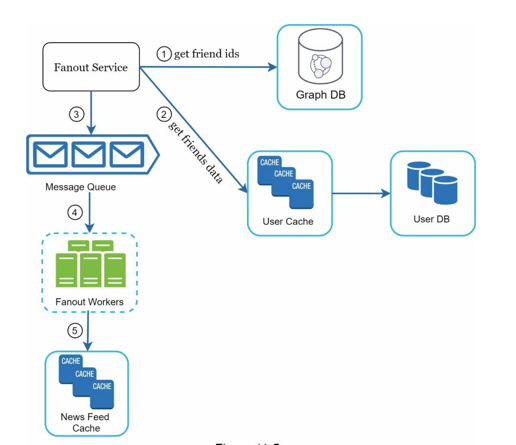

The fanout service works as follows:

1. Fetch friend IDs from the graph database. `Graph databases` are suited for managing
   friend relationship and friend recommendations.
2. Get friends info from the user cache. The system then filters out friends based on user
   settings. For example, if you mute someone, her posts will not show up on your news feed
   even though you are still friends. Another reason why posts may not show is that a user
   could selectively share information with specific friends or hide it from other people.
3. Send friends list and new post ID to the `message queue`.
4. Fanout workers fetch data from the message queue and store news feed data in the news
   feed cache. You can think of the news feed cache as a <post_id, user_id> mapping table.
   The memory consumption can become very large if we store the entire user
   and post objects in the cache. Thus, only IDs are stored. To keep the memory size small,
   we set a configurable limit. The chance of a user scrolling through thousands of posts in
   news feed is slim. Most users are only interested in the latest content, so the cache miss
   rate is low.
5. Store <post_id, user_id > in news feed cache.

### Fanout on write for a news feed system

- With this approach, news feed is pre-computed during write time. A new
  post is delivered to friends’ cache immediately after it is published.
- Pros:
    - The news feed is generated in real-time and can be pushed to friends immediately.
    - Fetching news feed is fast because the news feed is pre-computed during write time.
- Cons:
    - If a user has many friends, fetching the friend list and generating news feeds for all of
      them are slow and time consuming. It is called hotkey problem.
    - For inactive users or those rarely log in, pre-computing news feeds waste computing
      resources.

### Fanout on read for a news feed system

- The news feed is generated during read time. This is an on-demand model.
  Recent posts are pulled when a user loads her home page.
- Pros:
    - For inactive users or those who rarely log in, fanout on read works better because it will
      not waste computing resources on them.
    - Data is not pushed to friends so there is no hotkey problem.
- Cons:
    - Fetching the news feed is slow as the news feed is not pre-computed.

### Newsfeed retrieval deep dive for a news feed system

1. media content (images, videos, etc.) are stored in CDN for fast retrieval
2. A user sends a request to retrieve her news feed. The request looks like this: `/v1/me/feed`
3. The load balancer redistributes requests to web servers.
4. Web servers call the news feed service to fetch news feeds.
5. News feed service gets a list post IDs from the news feed cache.
6. A user’s news feed is more than just a list of feed IDs. It contains username, profile
   picture, post content, post image, etc. Thus, the news feed service fetches the complete
   user and post objects from caches (user cache and post cache) to construct the fully
   hydrated news feed.
7. The fully hydrated news feed is returned in JSON format back to the client for
   rendering.

---

## Design a chat system

### Establish design scope for a chat system

- `Candidate`: What kind of chat app shall we design? 1 on 1 or group based?
- `Interviewer`: It should support both 1 on 1 and group chat.
- `Candidate`: Is this a mobile app? Or a web app? Or both?
- `Interviewer`: Both.
- `Candidate`: What is the scale of this app? A startup app or massive scale?
- `Interviewer`: It should support 50 million daily active users (DAU).
- `Candidate`: For group chat, what is the group member limit?
- `Interviewer`: A maximum of 100 people
- `Candidate`: What features are important for the chat app? Can it support attachment?
- `Interviewer`: 1 on 1 chat, group chat, online indicator. The system only supports text messages.
- `Candidate`: Is there a message size limit?
- `Interviewer`: Yes, text length should be less than 100,000 characters long.
- `Candidate`: Is end-to-end encryption required?
- `Interviewer`: Not required for now but we will discuss that if time allows.
- `Candidate`: How long shall we store the chat history?
- `Interviewer`: Forever

### Techniques are used to simulate a server-initiated connection

- `Polling`
- `Long polling`
- `Websocket`

### Pooling in a chat system

- Polling is a technique that the client periodically asks the server if there are messages available.
- Depending on polling frequency, polling could be costly.
- It could consume precious server resources to answer a question that offers no as an answer most of the time.

### Long polling in a chat system

- In long polling, a client holds the connection open until there are actually new messages available or a timeout
  threshold has been reached.
- Once the client receives new messages, it immediately sends another request to the server, restarting the process.

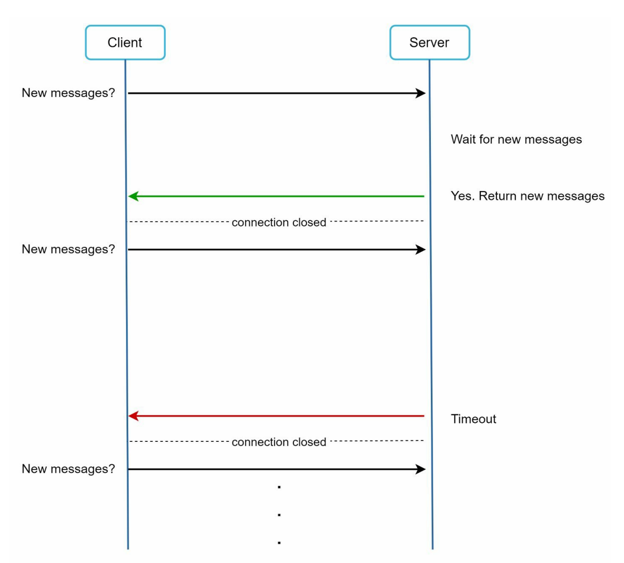

### WebSocket in a chat system

- `WebSocket` connection is initiated by the client. It is `bi-directional` and persistent.
- It starts its life as a HTTP connection and could be “upgraded” via some well-defined handshake to a WebSocket
  connection
- WebSocket is a `full-duplex protocol`. It allows both the client and the server to send messages at any time.
- By using `WebSocket` for both sending and receiving, it simplifies the design and makes implementation on both client
  and server more straightforward.

### High-level design for a chat system

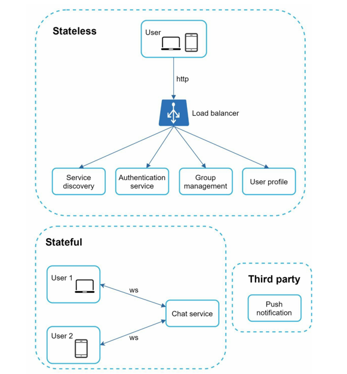

- `Stateless services`
    - Stateless services are traditional public-facing request/response services, used to manage the
      login, signup, user profile, etc. These are common features among many websites and apps.
- `Stateful Service`
    - The only stateful service is the chat service.
    - The service is stateful because each client maintains a persistent network connection to a chat server.
    - In this service, a client normally does not switch to another chat server as long as the server is still
      available.
    - The service discovery coordinates closely with the chat service to avoid server overloading.

### Adjusted high-level design for a chat system

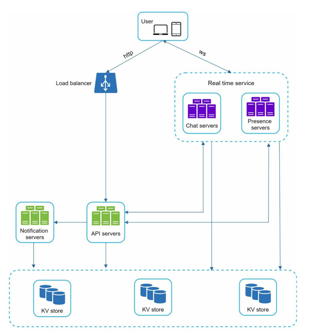

- The client maintains a persistent `WebSocket` connection to a chat server for real-time messaging.
- `Chat servers` facilitate message sending/receiving.
- `Presence servers` manage online/offline status.
- `API servers` handle everything including user login, signup, change profile, etc.
- `Notification servers` send push notifications.
- The `key-value store` is used to store chat history. When an offline user comes online, she will see all her previous
  chat history.

### Storage for a chat system

- `SQL` databases:
    - The first is generic data, such as user profile, setting, user friends list.
    - These data are stored in robust and reliable relational databases.
    - Replication and sharding are common techniques to satisfy availability and scalability
      requirements.
- `NoSQL` databases:
    - The second is chat history.
    - Chat history is stored in a key-value store.

### Message table for 1 on 1 chat in a chat system

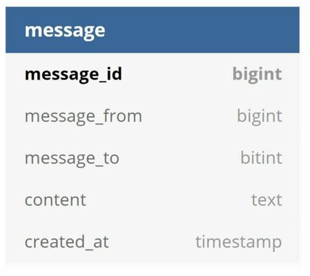

- The primary key is `message_id`, which helps to decide message sequence

### Message table for group chat in a chat system

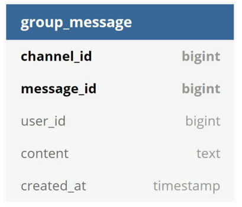

- The composite primary key is (`channel_id`, `message_id`).
- `Channel` and `group` represent the same meaning here.
- `channel_id` is the partition key because all queries in a group chat operate in a channel.

### Service discovery for a chat system

- The primary role of `service discovery` is to recommend the best chat server for a client based on the criteria like
  geographical location, server capacity, etc

1. `User A` tries to log in to the app.
2. The load balancer sends the login request to API servers.
3. After the backend authenticates the user, service discovery finds the best chat server for C. In this
   example, `server `2 is chosen and the server info is returned back to `User A`.
4. `User A` connects to chat server 2 through `WebSocket`

### 1 on 1 chat flow in a chat system

### Message synchronization across multiple devices in a chat system

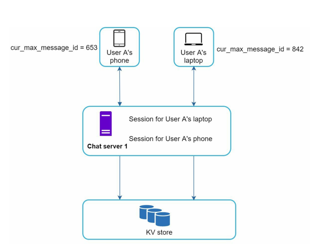

- Each device maintains a variable called `cur_max_message_id`, which keeps track of the latest
  message ID on the device.
- Messages that satisfy the following two conditions are considered as news messages:
    - The recipient ID is equal to the currently logged-in user ID.
    - Message ID in the key-value store is larger than `cur_max_message_id`

### Small group chat flow in a chat system

- First, the message from `User A` is copied to each group member’s message sync queue: one for `User B` and the second
  for `User C`.
- You can think of the message sync queue as an inbox for a recipient
- This design choice is good for small group chat because:
    - it simplifies message sync flow as each client only needs to check its own inbox to get new messages.
    - when the group number is small, storing a copy in each recipient’s inbox is not too expensive.

### User login flow in a chat system

- After a WebSocket connection is built between the client and the real-time service, `user A’s` online status
  and `last_active_at` timestamp are saved in the KV store.
- Presence indicator shows the user is online after she logs in.

### User logout flow in a chat system

- The online status is changed to offline in the KV store. The presence indicator shows a user is offline

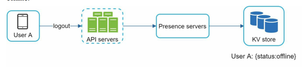

### User disconnection flow in a chat system

- We introduce a `heartbeat` mechanism to solve this problem.
- Periodically, an online client sends a heartbeat event to presence servers.
- If presence servers receive a heartbeat event within a certain time, say x seconds from the client, a user is
  considered as online.
- Otherwise, it is offline

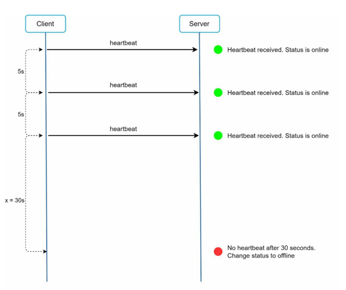

### Online status fanout in a chat system

- Presence servers use a `publish-subscribe model`, in which each friend pair maintains a channel.
- When `User A’s` online status changes, it publishes the event to three channels, channel `A-B`, `A-C`, and `A-D`.
- Those three channels are subscribed by User `B`, `C`, and `D`
- Thus, it is easy for friends to get online status updates.
- The communication between clients and servers is through real-time `WebSocket`

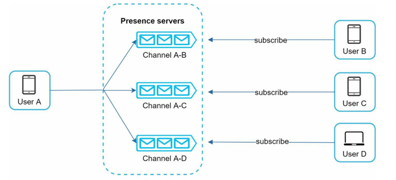

### End-to-end encryption in a chat system

- End-to-end encryption is a way to secure communications such that only the sender and the intended recipient(s) can
  access the content of the message.
- This is achieved by encrypting the message on the sender's device and decrypting it
  on the recipient's device, without any intermediate parties being able to access the content.
- Here's how end-to-end encryption works for messages:
    - Sender and recipient(s) agree on a `secret key` that will be used for encryption and decryption.
    - `The sender's device` encrypts the message using this `secret key`.
    - This can be done using a variety of encryption algorithms such as :
        - `AES` (Advanced Encryption Standard)
        - `RSA` (Rivest-Shamir-Adleman)
        - `ECC` (Elliptic Curve Cryptography)
    - The encrypted message is then transmitted over a network or communication channel.
    - `The recipient's device` receives the encrypted message and uses the same secret key to decrypt it.
    - The decrypted message is then displayed to the recipient, who can read it.
- The key point to remember is that the message is encrypted and decrypted at the endpoints (i.e., the sender and
  recipient devices), and the encryption key is not shared with any intermediaries or servers along the way.
- This means that even if the message is intercepted or hacked, it cannot be read without the secret key, which is known
  only to the sender and recipient.

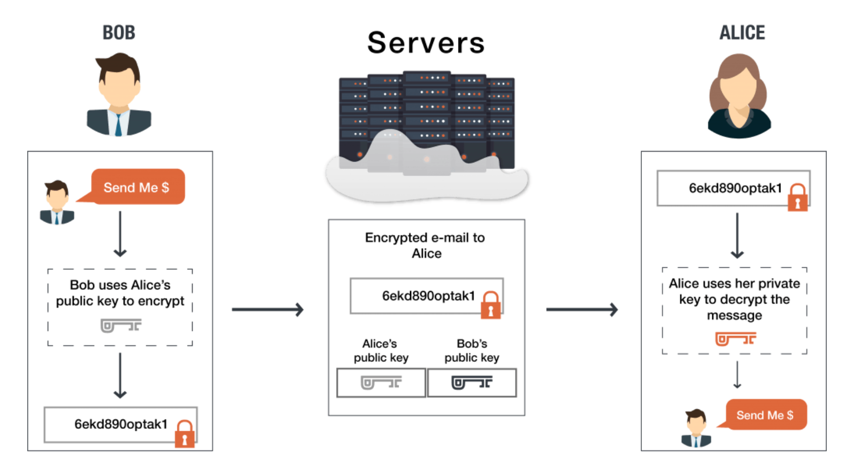

---

### Desing a search autocomplete system

### What is a search autocomplete system?

### Establish design scope for a search autocomplete system

- `Candidate`: Is the matching only supported at the beginning of a search query or in the middle as well?
- `Interviewer`: Only at the beginning of a search query.
- `Candidate`: How many autocomplete suggestions should the system return?
- `Interviewer`: 5
- `Candidate`: How does the system know which 5 suggestions to return?
- `Interviewer`: This is determined by popularity, decided by the historical query frequency.
- `Candidate`: Does the system support spell check?
- `Interviewer`: No, spell check or autocorrect is not supported.
- `Candidate`: Are search queries in English?
- `Interviewer`: Yes. If time allows at the end, we can discuss multi-language support.
- `Candidate`: Do we allow capitalization and special characters?
- `Interviewer`: No, we assume all search queries have lowercase alphabetic characters.
- `Candidate`: How many users use the product?
- `Interviewer`: 10 million DAU.

### Requirements for a search autocomplete system

- `Fast response time`: As a user types a search query, autocomplete suggestions must show
  up fast enough. An article about Facebook’s autocomplete system reveals that the
  system needs to return results within 100 milliseconds. Otherwise it will cause stuttering.
- `Relevant`: Autocomplete suggestions should be relevant to the search term.
- `Sorted`: Results returned by the system must be sorted by popularity or other ranking models.
- `Scalable`: The system can handle high traffic volume.
- `Highly available`: The system should remain available and accessible when part of the
  system is offline, slows down, or experiences unexpected network errors.

### Trie data structure for a search autocomplete system

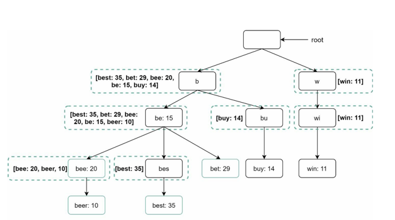

- To avoid traversing the whole trie, we store `top k most frequently` used queries at each node.
- Since 5 to 10 autocomplete suggestions are enough for users, `k` is a relatively small number.
- By caching top search queries at every node, we significantly reduce the time complexity to retrieve the top 5
  queries.
- However, this design requires a lot of space to store top queries at every node.
- Trading space for time is well worth it as fast response time is very important.
- `Time complexity` only `O(1)` to fetch `top k` queries.

### Data gathering service for a search autocomplete system

- To design a scalable data gathering service, we examine where data comes from and how data is used.
- Real-time applications like Twitter require up to date autocomplete suggestions.
- However, autocomplete suggestions for many Google keywords might not change much on a daily basis.
- Despite the differences in use cases, the underlying foundation for data gathering service
  remains the same because data used to build the trie is usually from analytics or logging
  services.

### Analytics Logs for a search autocomplete system

- It stores raw data about search queries
- Logs are append-only and are not indexed

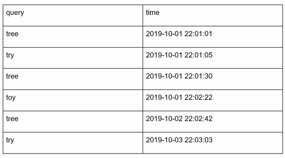

### Aggregators for a search autocomplete system

- The size of analytics logs is usually very large, and data is not in the right format.
- We need to aggregate data so it can be easily processed by our system.
- Depending on the use case, we may aggregate data `differently`.
- `For real-time applications` such as Twitter, we aggregate data in a shorter time interval as real-time results are
  important.
- On the other hand, aggregating data less frequently, say once per week, might be good enough for many use cases.
- _During an interview session, verify whether real-time results are important_.

### Aggregated Data for a search autocomplete system

- `time` field represents the start time of a week.
- `frequency` field is the sum of the occurrences for the corresponding query in that week.

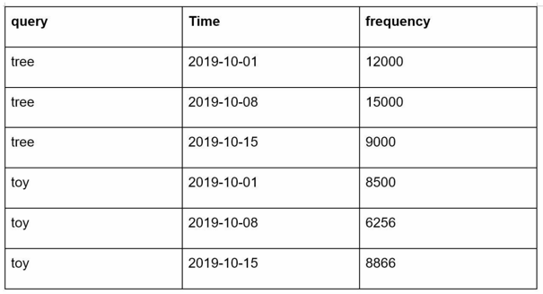

### Workers for a search autocomplete system

- Workers are a set of servers that perform asynchronous jobs at regular intervals.
- They build the trie data structure and store it in `Trie DB`

### Trie Cache for a search autocomplete system

- Trie Cache is a distributed cache system that keeps trie in memory for fast read.
- It takes a weekly snapshot of the DB.

### Trie DB for a search autocomplete system

- Trie DB is the persistent storage. Two options are available to store the data:
    - `Document store`: Since a new trie is built weekly, we can periodically take a snapshot of it,
      serialize it, and store the serialized data in the database. Document stores like `MongoDB`
      are good fits for serialized data.
    - `Key-value store`: A trie can be represented in a `hash table` form by applying the following logic:
        - Every prefix in the trie is mapped to a key in a hash table
        - Data on each trie node is mapped to a value in a hash table

### Create a trie for a search autocomplete system

- `Trie` is created by workers using aggregated data.
- The source of data is from `Analytics Log/DB`.

### Update a trie for a search autocomplete system

- Update the trie `weekly`. Once a new trie is created, the new trie replaces the old one
- Update individual trie node `directly` (slow)

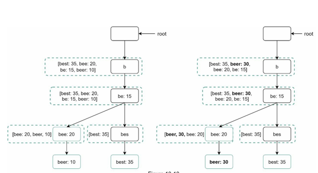

### Delete a trie for a search autocomplete system

- We have to remove hateful, violent, sexually explicit, or dangerous autocomplete suggestions.
- We add a `filter layer` in front of the `Trie Cache` to filter out unwanted suggestions.
- Having a filter layer gives us the flexibility of removing results based
  on different filter rules.
- Unwanted suggestions are removed physically from the database asynchronically so the correct data set will be used to
  build trie in the next update cycle.

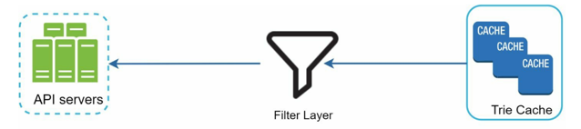

### Query service for a search autocomplete system

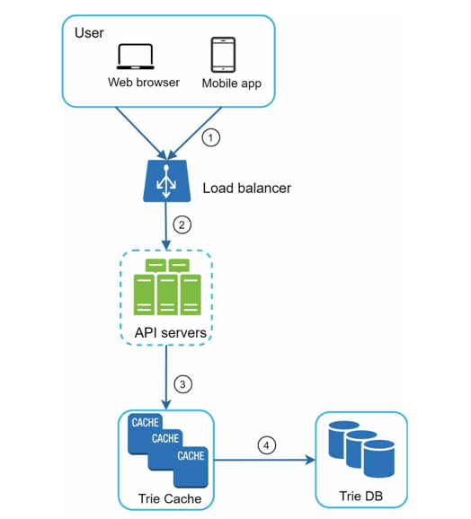

1. A search query is sent to the `load balancer`.
2. The load balancer routes the request to `API servers`.
3. API servers get trie data from Trie Cache and construct autocomplete suggestions for the client.
4. In case the data is not in `Trie Cache`, we replenish data back to the cache. This way, all
   subsequent requests for the same prefix are returned from the cache. A cache miss can
   happen when a cache server is out of memory or offline.

### Optimizations for Query service for a search autocomplete system

- `AJAX request` - no need to reload the page
- `Browser caching` - autocomplete suggestions can be saved in browser cache to allow subsequent requests to get results
  from the cache directly.

### Scale the storage tier for a search autocomplete system

- The `shard map manager` maintains a lookup database for identifying where rows should be stored.
- For example, if there are a similar number of historical queries for ‘s’ and for ‘u’, ‘v’, ‘w’, ‘x’, ‘y’ and ‘z’
  combined, we
  can maintain two shards: one for ‘s’ and one for ‘u’ to ‘z’.

### Follow-up questions for a search autocomplete system

- How do you extend your design to support multiple languages?
    - To support other non-English queries, we store Unicode characters in trie nodes
- What if top search queries in one country are different from others?
    - We might build different tries for different countries.
    - To improve the response time, we can store tries in CDNs.
- How can we support the trending (real-time) search queries?
    - Reduce the working data set by sharding.
    - Change the ranking model and assign more weight to recent search queries.
    - Data may come as streams, so we do not have access to all the data at once
    - Stream processing requires a different set of systems:
        - Apache Hadoop MapReduce
        - Apache Spark Streaming
        - Apache Storm
        - Apache Kafka

---

## Desing video sharing service

### Establish design scope for a video sharing service

- `Candidate`: What features are important?
- `Interviewer`: Ability to upload a video and watch a video.
- `Candidate`: What clients do we need to support?
- `Interviewer`: Mobile apps, web browsers, and smart TV.
- `Candidate`: How many daily active users do we have?
- `Interviewer`: 5 million
- `Candidate`: What is the average daily time spent on the product?
- `Interviewer`: 30 minutes.
- `Candidate`: Do we need to support international users?
- `Interviewer`: Yes, a large percentage of users are international users.
- `Candidate`: What are the supported video resolutions?
- `Interviewer`: The system accepts most of the video resolutions and formats.
- `Candidate`: Is encryption required?
- `Interviewer`: Yes
- `Candidate`: Any file size requirement for videos?
- `Interviewer`: Our platform focuses on small and medium-sized videos. The maximum
  allowed video size is 1GB.
- `Candidate`: Can we leverage some of the existing cloud infrastructures provided by Amazon,
  Google, or Microsoft?
- `Interviewer`: That is a great question. Building everything from scratch is unrealistic for most
  companies, it is recommended to leverage some of the existing cloud services.

### Video uploading flow for a video sharing service

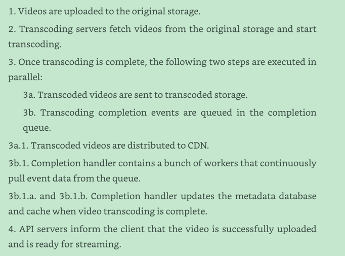

### Popular streaming protocols for a video sharing service

- MPEG–DASH. MPEG stands for “Moving Picture Experts Group” and DASH stands for "Dynamic Adaptive Streaming over HTTP".
- Apple HLS. HLS stands for “HTTP Live Streaming”.
- Microsoft Smooth Streaming.
- Adobe HTTP Dynamic Streaming (HDS).

### Pre-signed upload URL for a video sharing service

- Pre-signed upload URL is a URL that can be used to upload an object to a bucket.
- The client makes a HTTP request to API servers to fetch the `pre-signed URL`, which
  gives the access permission to the object identified in the URL.
- The term `pre-signed URL` is used by uploading files to Amazon S3.
- API servers respond with a `pre-signed URL`.
- Once the client receives the response, it uploads the video using the `pre-signed URL`

### Protect videos for a video sharing service

- To protect copyrighted videos, we can adopt one of the following three safety options:
    - `Digital rights management` (DRM) systems: Three major DRM systems are Apple
      FairPlay, Google Widevine, and Microsoft PlayReady.
    - `AES encryption`: You can encrypt a video and configure an authorization policy. The
      encrypted video will be decrypted upon playback. This ensures that only authorized users
      can watch an encrypted video.
    - `Visual watermarking`: This is an image overlay on top of your video that contains
      identifying information for your video. It can be your company logo or company name.

### Cost-saving optimization for a video sharing service

- CDN is a crucial component of our system.
- It ensures fast video delivery on a global scale.
- However, from the back of the envelope calculation, we know CDN is expensive, especially when the data size is large

- Only serve the most popular videos from CDN and other videos from our high capacity
- For less popular content, we may not need to store many encoded video versions. Short videos can be encoded on-demand.
- Some videos are popular only in certain regions. There is no need to distribute these videos to other regions.
- Build your own CDN

### Error handling for a video sharing service

- `Upload error`: retry a few times.
- `Split video error`: if older versions of clients cannot split videos by GOP alignment, the
  entire video is passed to the server. The job of splitting videos is done on the server-side.
- `Transcoding error`: retry.
- `Preprocessor error`: regenerate DAG diagram.
- `DAG scheduler error`: reschedule a task.
- `Resource manager queue down`: use a replica.
- `Task worker down`: retry the task on a new worker.
- `API server down`: API servers are stateless so requests will be directed to a different API server.
- `Metadata cache server down`: data is replicated multiple times. If one node goes down,
  you can still access other nodes to fetch data. We can bring up a new cache server to
  replace the dead one.
- `Metadata DB server down`:
    - `Master is down`. If the master is down, promote one of the slaves to act as the new master.
    - `Slave is down`. If a slave goes down, you can use another slave for reads and bring up another database server to
      replace the dead one.

---

## Design a google drive

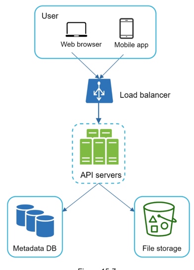

### Establish design scope for a google drive

- `Candidate`: What are the most important features?
- `Interviewer`: Upload and download files, file sync, and notifications.
- `Candidate`: Is this a mobile app, a web app, or both?
- `Interviewer`: Both.
- `Candidate`: What are the supported file formats?
- `Interviewer`: Any file type.
- `Candidate`: Do files need to be encrypted?
- `Interview`: Yes, files in the storage must be encrypted.
- `Candidate`: Is there a file size limit?
- `Interview`: Yes, files must be 10 GB or smaller.
- `Candidate`: How many users does the product have?
- `Interviewer`: 10M DAU.

### Upload a file to Google Drive

- Two types of uploads are supported:
    - `Simple upload`. Use this upload type when the file size is small.
    - `Resumable upload`. Use this upload type when the file size is large and there is high chance of network
      interruption
- Here is an example of resumable upload API:
    - https://api.example.com/files/upload?uploadType=resumable
    - Params:
        - `uploadType`:resumable
        - `data`: Local file to be uploaded

### Download a file from Google Drive

- Example API: https://api.example.com/files/download
- Params:
    - `path`: download file path.

### Sync conflicts for a google drive

- The `first version` that gets processed `wins`, and the version that gets processed later receives a conflict

### High-level design for a google drive

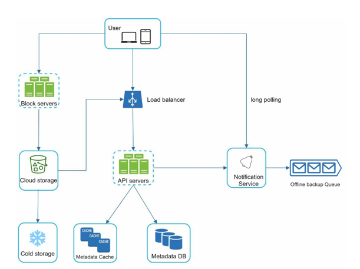

- `User`: A user uses the application either through a browser or mobile app.
- `Block servers`: Block servers upload blocks to cloud storage. Block storage, referred to as
  block-level storage, is a technology to store data files on cloud-based environments. A file
  can be split into several blocks, each with a unique hash value, stored in our metadata
  database. Each block is treated as an independent object and stored in our storage system
  (S3). To reconstruct a file, blocks are joined in a particular order. As for the block size, we
  use Dropbox as a reference: it sets the maximal size of a block to 4MB [6].
- `Cloud storage`: A file is split into smaller blocks and stored in cloud storage.
- `Cold storage`: Cold storage is a computer system designed for storing inactive data, meaning
  files are not accessed for a long time.
- `Load balancer`: A load balancer evenly distributes requests among API servers.
- `API servers`: These are responsible for almost everything other than the uploading flow. API
  servers are used for user authentication, managing user profile, updating file metadata, etc.
- `Metadata database`: It stores metadata of users, files, blocks, versions, etc. Please note that
  files are stored in the cloud and the metadata database only contains metadata.
- `Metadata cache`: Some of the metadata are cached for fast retrieval.
- `Notification service`: It is a publisher/subscriber system that allows data to be transferred
  from notification service to clients as certain events happen. In our specific case, notification
  service notifies relevant clients when a file is added/edited/removed elsewhere so they can
  pull the latest changes.
- `Offline backup queue`: If a client is offline and cannot pull the latest file changes, the offline
  backup queue stores the info so changes will be synced when the client is online

### Block servers for a google drive

- Block servers process files passed from clients by splitting a file into blocks, compressing each block, and
  encrypting them.

- A file is split into smaller blocks.
- Each block is compressed using compression algorithms.
- To ensure security, each block is encrypted before it is sent to cloud storage.
- Blocks are uploaded to the cloud storage.

### Metadata database for a google drive

- `User`: The user table contains basic information about the user such as username, email, profile photo, etc.
- `Device`: Device table stores device info. Push_id is used for sending and receiving mobile
  push notifications. Please note a user can have multiple devices.
- `Namespace`: A namespace is the root directory of a user.
- `File`: File table stores everything related to the latest file.
- `File_version`: It stores version history of a file. Existing rows are read-only to keep the integrity of the file
  revision history.
- `Block`: It stores everything related to a file block. A file of any version can be reconstructed by joining all the
  blocks in the correct order.

### Failure Handling for a google drive

- `Load balancer failure`: If a load balancer fails, the secondary would become active and
  pick up the traffic. Load balancers usually monitor each other using a heartbeat, a periodic
  signal sent between load balancers. A load balancer is considered as failed if it has not sent
  a heartbeat for some time.
- `Block server failure`: If a block server fails, other servers pick up unfinished or pending jobs.
- `Cloud storage failure`: S3 buckets are replicated multiple times in different regions. If
  files are not available in one region, they can be fetched from different regions.
- `API server failure`: It is a stateless service. If an API server fails, the traffic is redirected
  to other API servers by a load balancer.
- `Metadata cache failure`: Metadata cache servers are replicated multiple times. If one node
  goes down, you can still access other nodes to fetch data. We will bring up a new cache
  server to replace the failed one.
- `Metadata DB failure`:
    - `Master down`: If the master is down, promote one of the slaves to act as a new master and bring up a new slave
      node.
    - `Slave down`: If a slave is down, you can use another slave for read operations and bring another database server
      to replace the failed one.
- `Notification service failure`: Every online user keeps a long poll connection with the
  notification server. If a server goes down, all the long poll connections are lost so clients must reconnect to a
  different server. Even though one server can keep many open connections, it cannot
  reconnect all the lost connections at once. Reconnecting with all the lost clients is a
  relatively slow process.
- `Offline backup queue failure`: Queues are replicated multiple times. If one queue fails,
  consumers of the queue may need to re-subscribe to the backup queue.

---

## Distributed Message Queue

### Distributed Message Queue Requirements

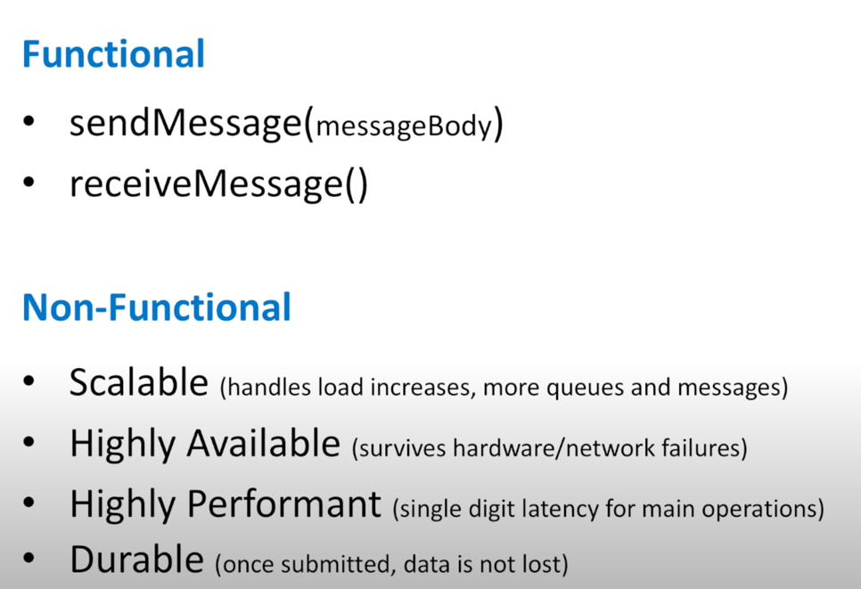

### High-level architecture for Distributed Message Queue

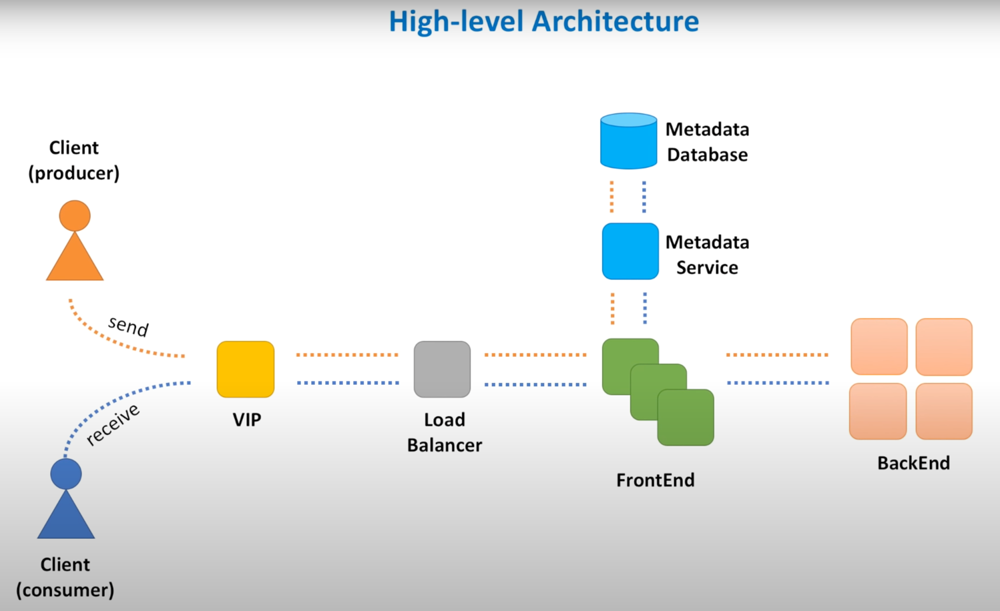

### VIP and Load balancer for Distributed Message Queue

- `VIP` - virtual IP

### FrontEnd service for Distributed Message Queue

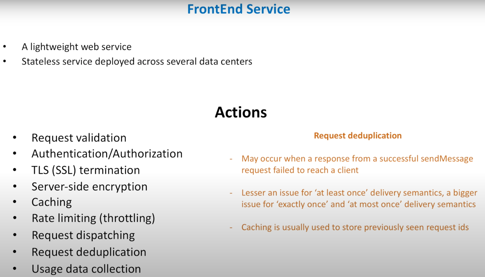

### Metadata service for Distributed Message Queue

### Backend service for Distributed Message Queue

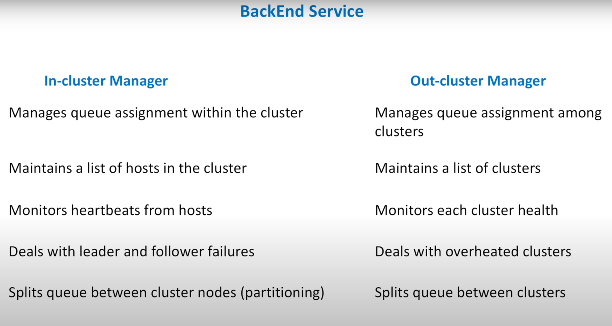

### Other discussion topics for Distributed Message Queue

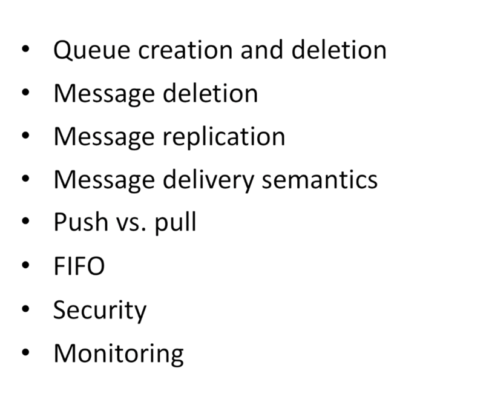

---

## Desing a notification service #2

### Requirements for a notification service

### High-level architecture for a notification service

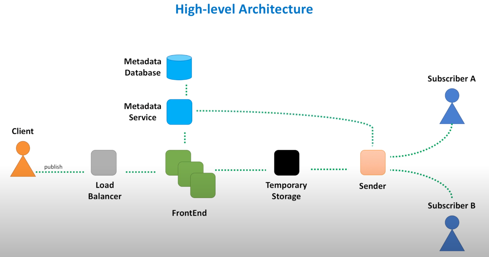

### Frontend service for a notification service

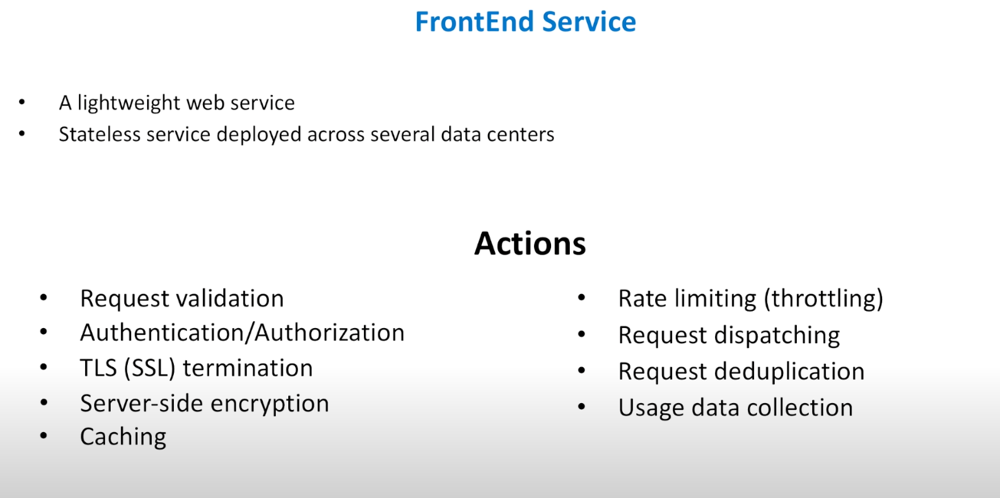

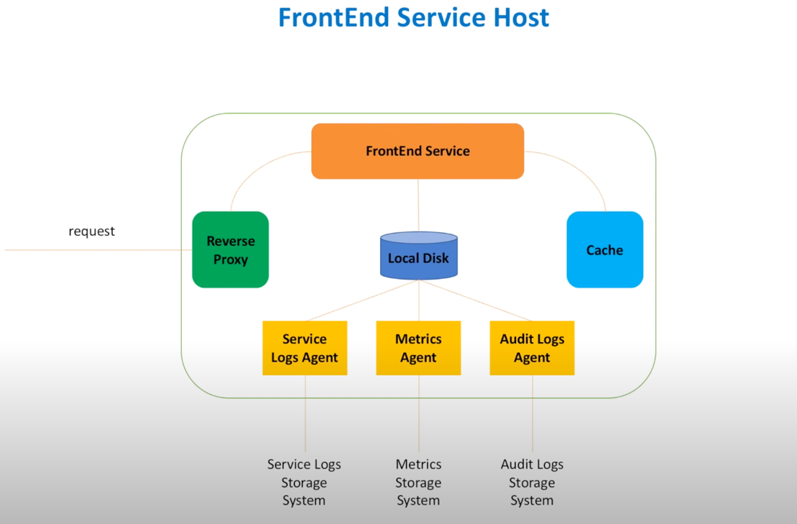

### Metadata service for a notification service

- Responsible for storing metadata such as topics, subscriptions in the database.

### Temporary storage for a notification service

- Temporary storage is used to store messages that are not yet delivered to subscribers.

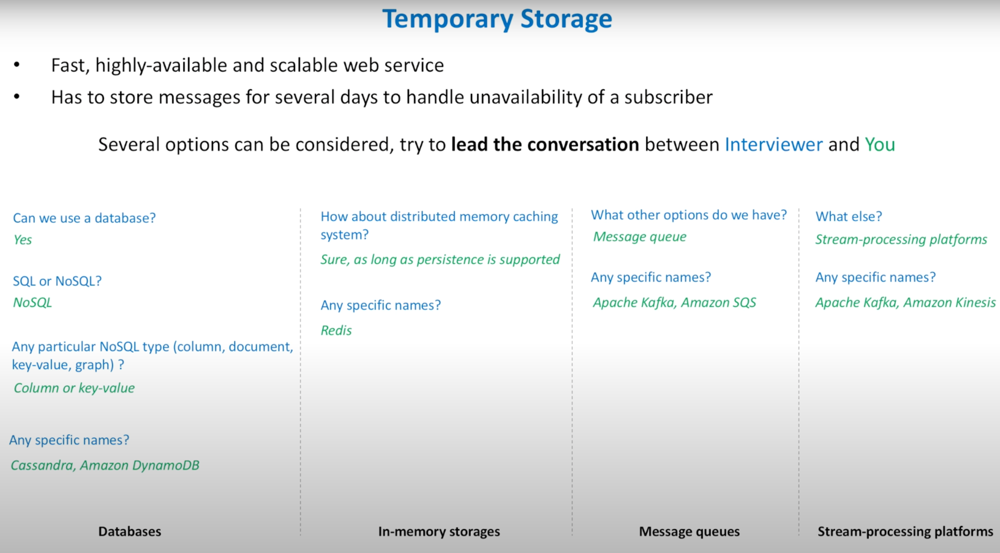

### Sender service for a notification service

### Other discussion topics for a notification service

---

## Design Rate Limiter #2

### Requirements for a rate limiter

### Simple solution for a rate limiter

### Token bucket algorithm for a rate limiter

### Token bucket algorithm code for a rate limiter

### Token bucket algorithm classes for a rate limiter

### Message broadcasting for a rate limiter

### How to integrate a rate limiter to a system

---

## Design a distributed cache system

### Requirements for a distributed cache system

### How to organise distributed cache system

### Choosing a cache host for a distributed cache system

- Significantly smaller fraction of keys is rehashed when a new host is added or removed.

### Maitaining a list of caches for a distributed cache system

- It's ok to have not up-to-date data on the replicas, due to partition, because we are building `fast` cache, so it's
  being only a cache miss.

### What else to consider for a distributed cache system

### High level architecture for a distributed cache system

---

## Top K Problem #2

### Requirements for a top k problem

### Single host solution for a top k problem

### Multiple hosts solution for a top k problem

### Count-min sketch for a top k problem

### High level architecture for a top k problem

### Data flow fast path for a top k problem

### Data flow slow path for a top k problem

### Map reduce jobs for a top k problem

### Data retrieval for a top k problem

---

## Desing a system to count videos views

### 1. Requirements clarifications for a system to count videos views

### 2. Functional requirements API for a system to count videos views

### 3. Non-functional requirements for a system to count videos views

- The most important requirements (should be focused first):
    - `scalability`
    - `performance`
    - `availability` or `consistency`
- Others (should be focused later):
    - `consistency`
    - `cost`

### 4. High-level architecture diagram for a system to count videos views

### 5. Define data model for a system to count videos views

- Clarify assumptions with interviewer what is better for the system
- Or combine both approaches

### 6. Define databases for a system to count videos views

#### SQL

- `Normalization` - minimise a data duplication across different tables

#### NoSQL

- `Gossip protocol` is a process of computer peer-to-peer communication that is based on the way epidemics
  spread. It is a communication protocol in which nodes periodically `exchange state` information about themselves and
  about other nodes they know about. Each node in the cluster knows about every other node in the cluster.
- `Quorum writes/reads` define a minimum number of nodes that must agree on the response
- NoSQL provides `availability` and `partition tolerance` (AP) guarantees, but no consistency guarantee

#### How to store data

### 7. Processing service for a system to count videos views

### 8. Design diagram for data ingestion path for a system to count videos views

### 9. Design diagram for data retrival path for a system to count videos views

### 10. Details design diagram for a system to count videos views

### 11. Technology stack for a system to count videos views

### 12. Summary for a system to count videos views

---

## URL shortening system questions about system

- How to ensure uniqueness of short URLs?
    - Database will help. We first check if the generated short URL is already present in the database, and return a new
      URL to the client only when the uniqueness constraint is honored. To check URL presence in the database quickly
      and cheaply, we should utilize a Bloom filter, a memory-efficient probabilistic data structure to quickly (O(1))
      check whether an element is present in a set.
- SQL or NoSQL database to store the mapping between long and short URLs?
    - The URL shortening system is read-heavy. Any database that scales well for reads will work. And as we already
      know, both SQL databases (e.g. using solutions like Vitess) and NoSQL databases can scale reads very well. NoSQL
      database (e.g. MongoDB) will be a better choice. Why? Let’s discuss it in the second module of the course.
- How to retrieve long URLs quickly?
    - The cache will store the mapping between short URLs and long URLs. We can use either cache-aside
      and read-through pattern for updating the cache. With read-through being a better option. As for the eviction
      policy, the Least Recently Used (LRU) eviction policy is a good choice.
- Should we have a separate component for handling read requests?
    - Yes, we should introduce a separate web service for handling read requests. Let’s call it a Read service. Having a
      separate component will allow us scale read requests independently of write requests and we can make this service
      act as a read-through cache.
- How to scale read requests?
    - We are going to use horizontally scalable distributed cache solutions (Memcached, Redis) and add more read
      replicas to the database when needed. As mentioned earlier, we can also utilize Bloom filters to reduce the load
      on both the cache and the database.
- How to properly handle large spikes or read requests (popular URLs)?
    - We should utilize the local cache on Read service machines to store the same hot URL on multiple machines. This
      way, read requests can be handled by any of the Read service machines in the cluster, avoiding heavy load on one
      particular machine.
- How to achieve high availability?
    - As we already know, achieving high availability requires both architecture and processes. In our system, each
      individual component should be highly available. Which means we have redundancy for every component in the system,
      heavily rely on load balancing, protect our components from atypical behaviors of clients and downstream
      dependencies, quickly detect and resolve failures.
- How to ensure high durability?
    - By copying data at multiple different levels. Specifically, we rely on database data replication and backups.

---

## Fraud detection system

### Functional requirements

- I think accuracy and speed are important for such systems. Here are a few functional requirements for these
  characteristics:
    - The system should take no more than 5 seconds to evaluate each transaction.
    - If a transaction is flagged as `potentially fraudulent`, it should take no more than several hours to make the
      final decision on the transaction.
    - No more than X% (configurable, for example, 1%) should be flagged as `potentially fraudulent` by the system.

### Non-functional requirements

- High scalability (to support both long-term and short-term increases in incoming transactions).
- High availability (to be always up and running so that all transactions are evaluated and fraudulent transactions are
  not missed).
- High durability (transactions flagged as `fraudulent` should never be lost).
- High extensibility (we should be able to integrate the system with additional data sources (e.g. user’s past payment
  history) that allow to more accurately evaluate transactions).

### Key actors

- `User`, a person who makes an online purchase.
- `Fraud analyst`, a person who evaluates potentially fraudulent transactions to make a final decision.

### Key components

- `API gateway`, a web service that represents an entry point to the system.
- `Fraud analyst admin tool`, a web application that is used by fraud analysts to review potentially fraudulent
  transactions and make a decision.
- `Data aggregator`, a web service that collects additional information about a transaction.
- `Scoring service`, a web service that calculates a score for a transaction (think of this score as the likelihood that
  a transaction is fraudulent).
- `Messaging system`, middleware that helps transfer potentially fraudulent transactions to fraud analysts in an
  asynchronous manner.
- `Database`, a persistent storage for potentially fraudulent transactions.
- `Machine learning model training pipeline`, a pipeline consisting of batch jobs that help train a machine learning
  model used by the scoring service.
- `User profile service`, payment history service, geo service, a set of web services that provide additional
  information about a transaction.

### High-level architecture

1. `API gateway` is a single entry point for all requests. It is a common component of many modern architectures.
   Classic API gateway performs many different functions: authentication, authorization, request routing, response
   aggregation, protocol translation, load balancing, TLS termination, IP listing, rate limiting, response caching,
   response compression, logging, monitoring, and a few more. We will cover API gateways in more detail in the second
   module of the course.
2. `Data aggregator` calls a bunch of other services to retrieve additional information about the transaction. We want
   to know more about who makes the transaction, how many transactions this user made in the past, whether the user’s IP
   address location matches shipping address, and so on. All auxiliary services are called in parallel to reduce total
   latency of transaction processing. Retrieved information will be sent to the scoring service to calculate the fraud
   score for this transaction.
3. `Scoring service uses machine learning models` to calculate a score for every transaction. If the score is below a
   predefined threshold, the transaction is considered non-fraudulent and the payment processing is initiated. If the
   score exceeds the threshold, the transaction is considered potentially fraudulent and is submitted to a fraud analyst
   for review. Payment processing is also initiated in this case, but later, if the transaction is flagged as fraudulent
   by the analyst, the payment will be canceled.
4. `Messaging system (e.g. Kafka)` is used to transfer potentially fraudulent transactions to persistent storage. This
   model helps to deal with spikes in fraudulent transactions. The messaging system will help absorb these spikes and
   the database will not be impacted.
5. All potentially fraudulent transactions are stored in the `database`. Both SQL and NoSQL databases can be used.
6. `Fraud analysts` use an admin tool (web application) to review transactions. They can either pass or fail every
   transaction. The admin tools can be quite sophisticated, allowing fraud analysts to view much more additional
   information about a transaction. It is important to implement a locking mechanism for transactions so that when a
   transaction is under review, other analysts should not see it.
7. `Model training pipeline` uses final decisions to train machine learning models. The pipeline consists of multiple
   batch jobs that are used to train, test, and deploy models to production.

---

## Authentication and authorization system

### Functional requirements

- I think that such a system should be easy to use and integrate with. Here are a few functional requirements for these
  characteristics:
    - The system should allow to easily manage users, groups, roles, and policies.
    - The system should provide an SDK for various programming languages so that other systems can easily integrate with
      it

### Non-functional requirements

- High availability (since every request must be authenticated/authorized).
- High performance (low latency when processing requests).
- High scalability (to support both long-term and short-term increases in incoming requests).

### Key actors

- Here are the key actors in the system:
    - Resource admin, a person who manages policies.
    - User, a person who tries to access a resource (e.g. read an S3 object).
    - Services, programs (web services, applications, batch jobs, etc.) that try to access a resource (e.g. they produce
      and write logs to an S3 bucket).

### Key components

- `API gateway`, a web service that represents an entry point to the system.
- `Admin tool`, a web application that is used by resource administrators to perform CRUD operations on policies.
- `Poller service`, a service responsible for retrieving all the recent updates for policies.
- `Database`, persistent storage for policies.
- `Auth service`, a web service responsible for handling authentication and authorization requests.
- `Auth service client`, a client application for the auth service.
- `Messaging system`, middleware that helps asynchronously load recently updated policies into a cache.

### High-level architecture

- `API gateway` is a single entry point for all write requests. It is a common component of many modern architectures.
  Classic API gateway performs many different functions: authentication, authorization, request routing, response
  aggregation, protocol translation, load balancing, TLS termination, IP listing, rate limiting, response caching,
  response compression, logging, monitoring, and a few more. You might be wondering if read (is authorized) requests
  should go through API gateway as well. It depends on whether the auth system is internal to target services or not. If
  the auth system and target services all live within a trusted environment, we can ignore this extra hop to reduce
  latency and overall complexity.
- `Admin tool` acts as a facade for write requests to the database. It is a stateless web service. This chain of
  services:
  API gateway -> web service acting as a database facade -> database is a common pattern for microservice architecture.
- `Policies` are stored in the database. Both SQL and NoSQL databases can be used. If we decide to avoid an additional
  caching layer and serve read requests directly by the database (which is fine for low to medium scale), we should
  scale read requests by introducing more read replicas.
- `Poller service` is a component similar to Rule Checker. It polls
  for all the new and modified policies and sends this data to the messaging system. Alternatively, we could avoid this
  component entirely by having the Admin Tool write to both the database and the messaging system. A challenge with this
  option though is how to keep both the database and the messaging system in sync, especially when one of these systems
  becomes unavailable.
- We use the `messaging system` as a transport for policies to update the cache (auth service) asynchronously.
- `Auth service` represents a distributed cache. This allows to handle a large number of read requests. All policies are
  parsed and stored in a way that guarantees O(1) time complexity (think, hashmaps). And we use servers with a lot of
  CPU and memory.
- If the scale is huge (millions requests per second) and/or latency requirements are very aggressive (a single digit
  milliseconds), server side alone (auth service) is not enough. We also need to cache aggressively on the client side.
  In the case of multiple requests coming from the same user, we don't even need to call the auth service. A simple
  read-through cache implemented in the auth client will be enough. A further optimization is to use the target service
  fleet of machines as a consistent hashing ring. When all auth clients know about each other, and every client’s local
  cache stores its own chunk of data. Basically, in this case, we have three layers of caching: a local cache in the
  client, a distributed cache represented by all clients in the target service fleet, and a distributed cache
  represented by the auth service.

---

## Monitoring system

### Functional requirements

- Here are a few functional requirements for these characteristics:
    - The system should store metrics at one-minute granularity.
    - Older data should be stored at lower granularity (e.g. 1 hour).
    - The system should provide an SDK for various programming languages and/or a software agent so that other systems
      can easily integrate with it.

### Non-functional requirements

- High scalability (the total number of metrics will grow rapidly over time).
- High availability (keep in mind that latest data is typically more important than old data).
- High read performance (especially important for high resolution alerts configured on top of metrics).
- Low dollar cost (especially for storing less relevant/old data).

### Key actors

- `Metric producer services`, `programs` (web services, applications, batch jobs, etc.) that emit performance metrics.
- `User`, typically an owner of the service, a person who watches the metrics.
- `Metric consumer services`, programs that read metrics on a regular basis to timely react to their changes (e.g. alert
  generation systems, autoscaling systems, anomaly detection systems).

### Key components

- `API gateway`, a web service that represents an entry point to the system.
- `Metric aggregator`, a service that aggregates metric values in memory over a short period of time and stores the
  aggregated values in persistent storage.
- `Metric partitioner`, a service responsible for partitioning metrics. This allows for more efficient aggregation of
  metric values.
- `Messaging system`, a temporary buffer for metric data that helps parallelise metric processing.
- `Monitoring client`, a client application for a monitoring system that helps to aggregate data on the client side and
  send aggregated data for further aggregation on the server side.
- `Hot storage`, read-optimized storage.
- `Cold storage`, persistent storage for metric values.
- `Read service`, a web service responsible for serving read requests by retrieving metric data from multiple
  locations (hot and cold storage).****

### High-level architecture

- `Monitoring client` is a daemon process that runs locally on every metric producer service machine. It reads data from
  service logs and aggregates data in a local memory. Think of it as a hashmap where a metric name represents a key (
  e.g. "total request count") and value represents a count (of requests, errors, etc.) or a sum (of response times,
  request bytes, etc.). Periodically, for example, at the end of every minute, all accumulated values are sent to the
  monitoring system.
- `API gateway` is a single entry point for all requests. It is a common component of many modern architectures. Classic
  API gateway performs many different functions: authentication, authorization, request routing, response aggregation,
  protocol translation, load balancing, TLS termination, IP listing, rate limiting, response caching, response
  compression, logging, monitoring, and a few more. If the monitoring system and metric consumer services all live
  within a trusted environment and read latency is critical, we can have metric consumer services call the read service
  directly.
- Each `producer service` can produce thousands of different metrics. And there can be thousands of producer services.
  Which can lead to high cardinality of metrics. To aggregate data on the server side, which means calculating the total
  count or the total sum for each metric for every 1-minute interval, we need to partition metrics first. This allows us
  to split all metrics into several disjoint groups, and then aggregate metric values within each group. We can use a
  unique metric name (metric name + service name) as a partition key. We can avoid partitioning metrics if metric
  cardinality is low.
- Incoming metric data is buffered in a `messaging system`. Each metric goes to its own shard/partition inside the
  messaging system. There will be a separate consumer (metric aggregator service instance) for each shard.
- `Metric aggregator service` aggregates metric values. Which basically means it sums up the incoming values for a
  metric. It does it for a predefined duration (e.g. 5-10 seconds) and sends the accumulated value to persistent
  storage. If we need to scale and/or speed up data aggregation, we first add more shards/partitions to the messaging
  system and then add the same number of machines/instances to the service. So that each new shard gets its own
  dedicated consumer.
- `Hot storage` represents a distributed cache (e.g. Redis) or a key-value database (e.g. DynamoDB) and stores the last
  N days of data. In monitoring systems, the most recent data is more important and read frequently, while older data is
  usually less important and read less frequently. Therefore, this storage has two key requirements: high read
  throughput and low read latency.
- `Cold storage` represents persistent storage for data. We can store all data there (if our hot storage is not
  persistent) or only data older than N days (if our hot storage is persistent). As discussed in the course, object
  storage (e.g. S3) is a good option. Data in hot and cold storage is stored at some granularity, for example, 1 minute.
  But on a large scale (from millions to billions of metrics), storing such a large amount of per-minute data is costly.
  In addition, as we have already mentioned, the value of monitoring data decreases over time. For this reason, it makes
  sense to aggregate data over time into 5-minute intervals, 1-hour intervals, and so on. The system should have a
  separate component responsible for aggregating data from shorter time intervals to longer time intervals and purging
  data for shorter time intervals from the storage.
- `Read service` has three primary functions: route read requests to the appropriate storage, stitch data from hot and
  cold storage when both new and old data is requested, cache responses. The most recent monitoring data is not well
  suited for caching because it changes frequently. But old data can be effectively cached. When there is a read request
  that spans both storages, we will fetch new data from hot storage and old data from an internal cache of the read
  service.

---

## Design TicTok/Instagram reels system

---

## Online Judge for coding contests

---

### Design an Amazon S3 or Object Storage

- https://www.youtube.com/watch?v=vTPR6fIgC-I&ab_channel=CrushingTechEducation

#### Upload

#### Download

---

### Design a Dropbox

- https://www.youtube.com/watch?v=lamooN_E5aY&ab_channel=CrushingTechEducation

---

## Design Reddit home page feed

### Non functional requirements

### Design

---

## Design Parking Garage

### Requirements

### API

### Data types

### Design

---

## Design TicTok

### Requirements

### Design

---

## Design Facebook Messenger

### Requirements

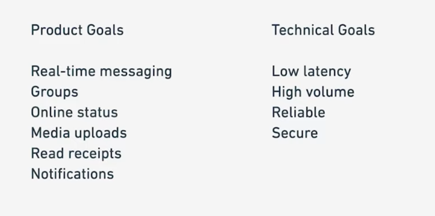

### Design

---

## Design Instagram

### Requirements

### Data types

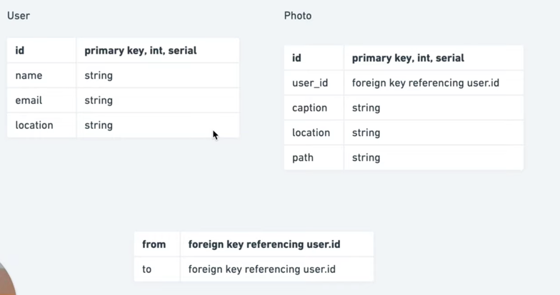

### Design

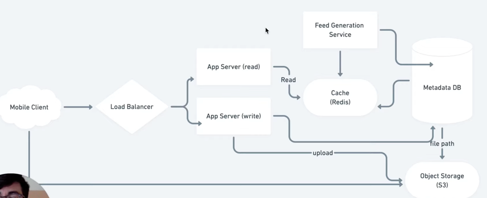

---

## Design Amazon Kindle Payments

### Requirements

### API

### Data model

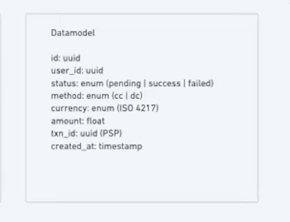

### Design

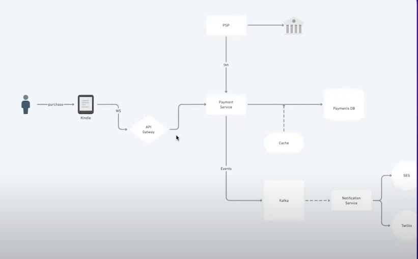

---

## Design Amazon Prime Video

### Requirements

### Design

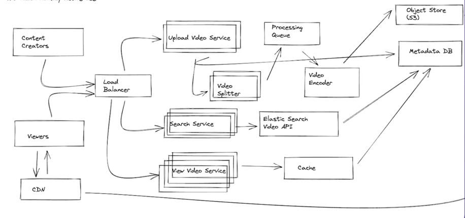

---

## Downloading User Data

### Design

---

## Design Calendar data entities mapping

### Functional Requirements

- User can create calendar
- User can create event in calendar
- User can invite other users to event
- Notification for event
- Timezone support

### Non Functional Requirements

- High availability
- Low latency
- Durability
- Scalability

### Data base design

---

## Twitter API

---

## System Design template

> Do not jump right in to give a solution. Slow down.
> Think deeply and ask questions to clarify requirements and assumptions.
> This is extremely important.

- **𝐑𝐞𝐪𝐮𝐢𝐫𝐞𝐦𝐞𝐧𝐭 𝐂𝐥𝐚𝐫𝐢𝐟𝐢𝐜𝐚𝐭𝐢𝐨𝐧𝐬 (3-5 𝐦𝐢𝐧)**
    - Ask clarifying questions to understand the problem and expectations of the interviewer.
        - Use cases
        - Scenarios that will not be covered
        - Who will use
        - How many will use
        - Usage patterns
        - Technology stack
    - **𝐅𝐮𝐧𝐜𝐭𝐢𝐨𝐧𝐚𝐥 𝐑𝐞𝐪𝐮𝐢𝐫𝐞𝐦𝐞𝐧𝐭𝐬**
        - Start with the customer and work backwards
        - Who will use the system
        - How the system will be used
        - Platform (Mobile, Web, Desktop)
    - **𝐍𝐨𝐧 𝐅𝐮𝐧𝐜𝐭𝐢𝐨𝐧𝐚𝐥 𝐑𝐞𝐪𝐮𝐢𝐫𝐞𝐦𝐞𝐧𝐭𝐬**
        - `High availability` system uptime in percentage
            - 99 % => 3.65 days of downtime per year
            - 99.9% => 8.76 hours of downtime per year
            - 99.99% => 52 minutes 35 seconds of downtime per year
            - 99.999% => 5 minutes 15 seconds of downtime per year
            - 99.9999% => 31 seconds of downtime per year
        - `Scalability` needs to handle peak load
        - `Performance` in terms of latency and throughput
        - `Durability` - data should not be lost
        - `Consistency` - data should not be corrupted
            - Strong consistency
            - Weak consistency
        - `Maintainability`
            - Failure modes and mitigations
            - Monitoring
            - Testing
            - Deployment
        - `Security`
        - `Cost`
- **𝐄𝐬𝐭𝐢𝐦𝐚𝐭𝐢𝐨𝐧𝐬 (3-5 𝐦𝐢𝐧)**
    - Latency/Throughput expectations
    - QPS (Queries Per Second) Read/Write ratio
    - Total/Daily active users
        - Traffic estimates
            - Write (QPS, Volume of data)
            - Read  (QPS, Volume of data)
        - Storage estimates
        - Memory estimates
            - If we are using a cache, what is the kind of data we want to store in cache
            - How much RAM and how many machines do we need for us to achieve this ?
            - Amount of data you want to store in disk/ssd
            - Number of users/tweets/likes etc
- **Start with something simple**
    - Single machine solution only
    - Single service solution
    - Design monolith service and then break it into microservices
- **High level design (5-10 min)**
    - APIs for Read/Write scenarios for crucial components
    - Database schema
    - Basic algorithm
    - High level design for Read/Write scenario
    - High level design for `Read heavy` scenario
    - High level design for `Write heavy` scenario
- **𝐃𝐞𝐬𝐢𝐠𝐧 details (15-20 min)**
    - Scaling the algorithm
    - Scaling individual components:
        - Availability, Consistency and Scale story for each component
        - Consistency and availability patterns
    - Think about the following components, how they would fit in and how it would help
        - Client (Mobile, Browser)
        - DNS
        - CDN (Push vs Pull)
        - Load Balancers (Active-Passive, Active-Active, Layer 4, Layer 7)
        - Reverse Proxy
        - Blob / Object Storage
        - Application layer scaling (Microservices, Service Discovery)
        - DB (RDBMS, NoSQL)
            - RDBMS
                - Master-slave, Master-master, Federation, Sharding, Denormalization, SQL Tuning
            - NoSQL
                - Key-Value, Wide-Column, Graph, Document
                    - Fast-lookups:
                        - RAM (Bounded size) => Redis, Memcached
                        - AP (Unbounded size) => Cassandra, RIAK, Voldemort
                        - CP (Unbounded size) => HBase, MongoDB, Couchbase, DynamoDB
                - Read heavy: MongoDB, Couchbase
                - Write heavy: Cassandra, ScyllaDB
        - Caches
            - Client caching, CDN caching, Webserver caching, Database caching, Application caching, Cache @Query level,
              Cache @Object level
            - Eviction policies:
                - Cache aside
                - Write through
                - Write behind
                - Refresh ahead
            - Asynchronism
                - Message queues
                - Task queues
                - Back pressure
        - Communication
            - TCP
            - UDP
            - REST
            - RPC
            - Web Sockets
            - HTTP/S
    - Logging, Metrics and Automation
- **Justify (5 min)**
    - Throughput of each layer
    - Latency caused between each layer
    - Overall latency justification
- **𝐑𝐞𝐬𝐨𝐥𝐯𝐞 𝐛𝐨𝐭𝐭𝐥𝐞𝐧𝐞𝐜𝐤𝐬 𝐚𝐧𝐝 𝐟𝐨𝐥𝐥𝐨𝐰-𝐮𝐩 𝐪𝐮𝐞𝐬𝐭𝐢𝐨𝐧𝐬 (2-3 𝐦𝐢𝐧𝐮𝐭𝐞𝐬)**
    - Error cases (server failure, network loss, etc.) and how to handle them
    - Bottlenecks
    - How to monitor the system and what metrics to collect
    - How to scale the system to the next level

---

## Five common system design interview mistakes

---

## System requirements

- **𝐅𝐮𝐧𝐜𝐭𝐢𝐨𝐧𝐚𝐥 𝐑𝐞𝐪𝐮𝐢𝐫𝐞𝐦𝐞𝐧𝐭𝐬**
    - Start with the customer and work backwards
    - Who will use the system
    - How the system will be used
    - Platform (Mobile, Web, Desktop)
- **𝐍𝐨𝐧 𝐅𝐮𝐧𝐜𝐭𝐢𝐨𝐧𝐚𝐥 𝐑𝐞𝐪𝐮𝐢𝐫𝐞𝐦𝐞𝐧𝐭𝐬**
    - `High availability` system uptime in percentage
        - 99 % => 3.65 days of downtime per year
        - 99.9% => 8.76 hours of downtime per year
        - 99.99% => 52 minutes 35 seconds of downtime per year
        - 99.999% => 5 minutes 15 seconds of downtime per year
        - 99.9999% => 31 seconds of downtime per year
    - `Scalability` needs to handle peak load
    - `Performance` in terms of latency and throughput
    - `Durability` - data should not be lost
    - `Consistency` - data should not be corrupted
        - Strong consistency
        - Weak consistency
    - `Maintainability`
        - Failure modes and mitigations
        - Monitoring
        - Testing
        - Deployment
    - `Security`
    - `Cost`

## System Design Blueprint: The Ultimate Guide

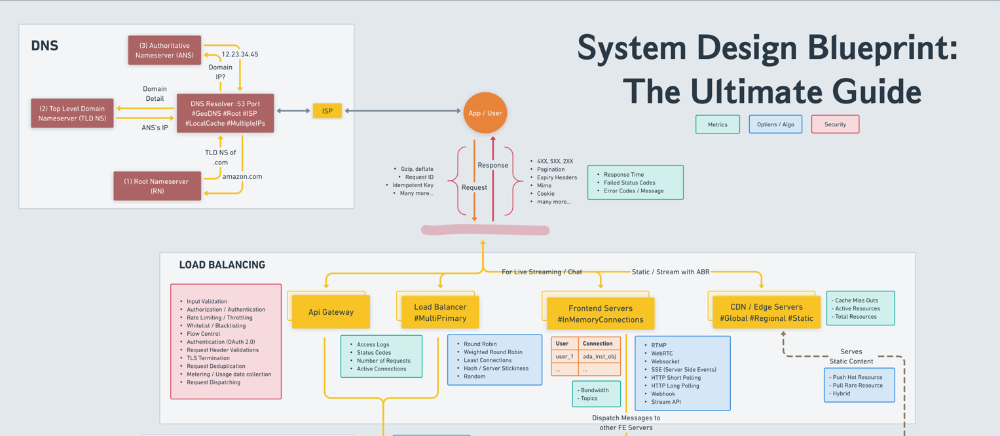

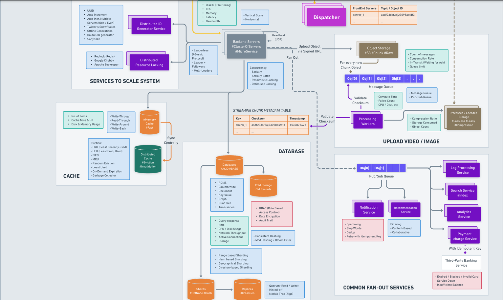

--- 

## Cloud design patterns

---

## System Design resources

