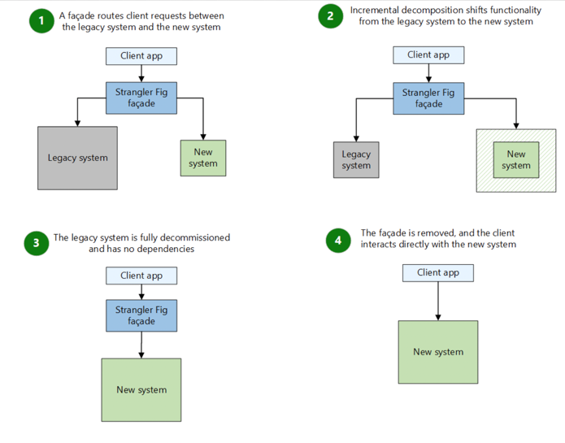

# Awesome System Design 

> - This is a collection of personal notes from various courses, articles, and books on system design. 
> - The goal is to share a comprehensive guide to system design that can be used as a reference for real-world projects.
> - The notes are organized by topics and include diagrams, code snippets, and examples to help understand the concepts better.
> - The notes are a work in progress and will be updated regularly with new information and resources.

## 📈 Resources:

### 💽 Courses:

- [x] [System Design course on neetcode.io ($100)](https://neetcode.io)
- [x] [System Design from Mikhail Smarshchok ($75)](https://leetcode.com/explore/interview/card/system-design-for-interviews-and-beyond)
- [x] [Highload Software Architecture on Projector ($600)](https://prjctr.com/course/highload-software-architecture)
- [x] [Learn System Design in a Hurry](https://www.hellointerview.com/learn/system-design/in-a-hurry/introduction)
- [x] Courses on `designgurus` ($95 yearly subscription): 
  - [x] [Grokking Microservices Design Patterns](https://www.designgurus.io/course/grokking-microservices-design-patterns)
  - [x] [Grokking the System Design](https://www.designgurus.io/course/grokking-the-system-design-interview)
  - [x] [Grokking the Advanced System Design Interview](https://www.designgurus.io/course/grokking-the-advanced-system-design-interview)
- [ ] [System Design Simplified on interviewready.io](https://interviewready.io/course-page/system-design-course)
- [ ] [AWS certification](https://aws.amazon.com/certification)

### 📝 Articles:

- [x] [Helpful list of LeetCode Posts on System Design at Facebook, Google, Amazon, Uber, Microsoft](https://leetcode.com/discuss/interview-question/1140451/helpful-list-of-leetcode-posts-on-system-design-at-facebook-google-amazon-uber-microsoft)
- [x] [My System Design Template](https://leetcode.com/discuss/career/229177/My-System-Design-Template)
- [x] [Latency Numbers Every Programmer Should Know](https://colin-scott.github.io/personal_website/research/interactive_latency.html)
- [x] [Real-time Messaging in Slack](https://slack.engineering/real-time-messaging)
- [x] [How Discord Stores Billions of Messages](https://discord.com/blog/how-discord-stores-billions-of-messages)
- [x] [How Discord Stores Trillions of Messages](https://discord.com/blog/how-discord-stores-trillions-of-messages)
- [x] [Meta Onsite System Design Questions](https://leetcode.com/discuss/interview-experience/4428743/Meta-Onsite-System-Design-Questions)
- [x] [A Senior Engineer's Guide to the System Design](https://interviewing.io/guides/system-design-interview)
- [x] [System design interview guide for Software Engineers](https://www.techinterviewhandbook.org/system-design/)
- [x] [ByteByteGo Newsletter](https://blog.bytebytego.com/)
- [x] [Netflix’s interview process and questions](https://interviewing.io/guides/hiring-process/netflix)
- [x] [How software engineering behavioral interviews are evaluated at Meta](https://interviewing.io/blog/how-software-engineering-behavioral-interviews-are-evaluated-meta)
- [x] [Designing a Payment System](https://newsletter.pragmaticengineer.com/p/designing-a-payment-system)
- [ ] [How Figma’s databases team lived to tell the scale](https://www.figma.com/blog/how-figmas-databases-team-lived-to-tell-the-scale)
- [ ] [27 Fundamental Techniques for Software Architects](https://www.workingsoftware.dev/fundamental-techniques-for-software-architects/)

### 📚 Books:

- [x] [System Design Interview – An insider's Guide by Alex Xu](https://www.amazon.com/System-Design-Interview-insiders-Second/dp/B08CMF2CQF?tag=interior0d3-20)
- [x] [Microservices patterns](https://microservices.io/patterns)
- [x] [Microservices Patterns: With examples in Java by Chris Richardson](https://www.amazon.com/Microservices-Patterns-examples-Chris-Richardson/dp/1617294543?tag=interior0d3-20)
- [ ] [Designing Data-Intensive Applications by Martin Kleppmann](https://www.amazon.com/Designing-Data-Intensive-Applications-Reliable-Maintainable/dp/1449373321?tag=interior0d3-20)
- [ ] [Distributed Systems 4 by Maarten van Steen](https://www.amazon.com/Distributed-Systems-Maarten-van-Steen/dp/9081540637?tag=interior0d3-20)
- [ ] [System Design Interview – An Insider's Guide Volume 2 by Alex Xu, Sahn Lam](https://www.amazon.com/System-Design-Interview-Insiders-Guide/dp/1736049119?tag=interior0d3-20)

### 🎬 Videos:

- [x] [!!! Most Tech Interview Prep is GARBAGE. (From a Principal Engineer at Amazon)](https://www.youtube.com/watch?v=0Z9RW_hhUT4&ab_channel=ALifeEngineered)
- [x] [System Design Interview – An insider's Guide discussion](https://youtube.com/playlist?list=PLlghaO_0b1OcY4yfpwGUOcFlnU7LpIkhC&si=Y7OqweK6rEgtaZUw)
- [x] [Videos System Design for Interviews and Beyond videos](https://www.youtube.com/c/SystemDesignInterview/videos)
- [x] [System design playlist #1 on YouTube](https://www.youtube.com/playlist?list=PLMCXHnjXnTnvo6alSjVkgxV-VH6EPyvoX)
- [x] [System design playlist #2 on YouTube](https://www.youtube.com/playlist?list=PLrtCHHeadkHp92TyPt1Fj452_VGLipJnL)
- [x] [System Design Interview - Designing Google Docs](https://www.youtube.com/watch?v=9VUnUtPZ8xg&t=1s&ab_channel=%D0%90%D0%BB%D0%B5%D0%BA%D1%81%D0%B0%D0%BD%D0%B4%D1%80%D0%91%D0%B0%D1%80%D0%BC%D0%B8%D0%BD)
- [ ] [Systems Design Questions 3.0 by Jordan has no life](https://www.youtube.com/playlist?list=PLjTveVh7FakLGZ36GbWAk_DMf_0xBZpGv)
- [ ] [System design playlist #3 on YouTube](https://www.youtube.com/playlist?list=PLm6XThSMgu_FFth3WUNBKnz_1dG3BKdBn)
- [ ] [Google SWE teaches systems design](https://www.youtube.com/playlist?list=PLjTveVh7FakKjb4UYzUazqBNNF-WGurXp)
- [ ] [System design mocks](https://www.youtube.com/playlist?list=PLf3F6FcQwgqEpnucyupbIqzxyvFOz9uDq)

### 🐈 GitHub Repositories:

- [ ] [https://github.com/InterviewReady/system-design-resources](https://github.com/InterviewReady/system-design-resources)
- [ ] [https://github.com/donnemartin/system-design-primer](https://github.com/donnemartin/system-design-primer)
- [ ] [https://github.com/karanpratapsingh/system-design](https://github.com/karanpratapsingh/system-design)
- [ ] [https://github.com/charlax/professional-programming](https://github.com/charlax/professional-programming)

### ✍️ Excalidraw system designs:

1. **URL Shortener** - [image](excalidraw/images/url-shortener.png) | [diagram](excalidraw/url-shortener.excalidraw)
2. **Dropbox** - [image](excalidraw/images/dropbox.png) | [diagram](excalidraw/dropbox.excalidraw)
3. **Local delivery service** - [image](excalidraw/images/local-delivery-service.png) | [diagram](excalidraw/local-delivery-service.excalidraw)
4. **Ticketmaster** - [image](excalidraw/images/ticketmaster.png) | [diagram](excalidraw/ticketmaster.excalidraw)
5. **News feed** - [image](excalidraw/images/news-feed.png) | [diagram](excalidraw/news-feed.excalidraw)
6. **Tinder** - [image](excalidraw/images/tinder.png) | [diagram](excalidraw/tinder.excalidraw)
7. **Leetcode** - [image](excalidraw/images/leetcode.png) | [diagram](excalidraw/leetcode.excalidraw)
8. **Messenger** - [image](excalidraw/images/messenger.png) | [diagram](excalidraw/messenger.excalidraw)
9. **Rate limiter** - [image](excalidraw/images/rate-limiter.png) | [diagram](excalidraw/rate-limiter.excalidraw)
10. **Logging system** - [image](excalidraw/images/logging-system.png) | [diagram](excalidraw/logging-system.excalidraw)
11. **Live comments** - [image](excalidraw/images/live-comments.png) | [diagram](excalidraw/live-comments.excalidraw)
12. **Post search** - [image](excalidraw/images/post-search.png) | [diagram](excalidraw/post-search.excalidraw)
13. **Top K** - [image](excalidraw/images/top-k.png) | [diagram](excalidraw/top-k.excalidraw)
14. **Uber** - [image](excalidraw/images/uber.png) | [diagram](excalidraw/uber.excalidraw)

### ⚙️ Tech Blogs:

- https://newsletter.pragmaticengineer.com
- https://blog.bytebytego.com
- https://netflixtechblog.com
- https://www.uber.com/en-IN/blog/engineering
- https://blog.cloudflare.com
- https://www.akamai.com/blog
- https://www.linkedin.com/blog/engineering
- https://www.grammarly.com/blog
- https://discord.com/category/engineering
- https://eng.lyft.com
- https://medium.com/tinder
- https://newsletter.systemdesign.one
- https://www.allthingsdistributed.com
- https://engineering.fb.com
- https://www.notion.so/blog/topic/tech
- https://stripe.com/blog
- https://medium.com/airbnb-engineering
- https://medium.com/pinterest-engineering
- https://www.figma.com/blog/engineering
- https://engineering.atspotify.com
- https://slack.engineering
- https://stackoverflow.blog/engineering
- https://medium.com/paypal-tech
- https://medium.engineering
- https://dropbox.tech
- https://medium.com/strava-engineering
- https://www.toptal.com/developers/blog
- https://github.blog/engineering
- https://devblogs.microsoft.com/engineering-at-microsoft
- https://blogs.nvidia.com
- https://highscalability.com

---

## 🌐 Navigation:

- [A Senior Engineer's Guide to the System Design Interview](#a-senior-engineers-guide-to-the-system-design-interview)
  - [System Design Interview Requirements](#system-design-interview-requirements)
    - [Availability](#availability)
- [Microservices Design Patterns](#microservices-design-patterns)
- [System Design Blueprint: The Ultimate Guide](#system-design-blueprint-the-ultimate-guide)
  - [High Load Applications Architecture](#high-load-applications-architecture)
- [System Design Basics](#system-design-basics)
  - [Networking](#networking)
    - [Web servers](#web-servers)
    - [TCP vs UDP vs HTTP](#tcp-vs-udp-vs-http)
    - [OSI Model](#osi-model)
    - [DNS](#dns)
    - [Network protocols](#network-protocols)
  - [CDN](#cdn)
    - [Principal scheme](#principal-scheme)
    - [Edge computing](#edge-computing)
  - [Security](#security)
  - [Proxies](#proxies)
    - [Forward Proxy and Reverse Proxy](#forward-proxy-and-reverse-proxy)
    - [Service discovery](#service-discovery)
    - [Load Balancing stategies](#load-balancing-stategies)
  - [Consistent Hashing](#consistent-hashing)
  - [Databases](#databases)
    - [SQL Database](#sql-database)
      - [ACID](#acid)
      - [Explain](#explain)
      - [Views](#views)
      - [Transactions, Isolations, Locks](#transactions-isolations-locks)
        - [Types of locks](#types-of-locks)
        - [Isolation levels](#isolation-levels)
      - [Replication](#replication)
        - [Replication stategies](#replication-stategies)
      - [Sharding](#sharding)
        - [Sharding strategies](#sharding-stategies)
      - [Indexing](#indexing)
        - [B-tree](#b-tree)
        - [When to create indexes](#when-to-create-indexes)
        - [Specialized Indexes](#specialized-indexes)
      - [Optimization](#optimization)
    - [NoSQL Database](#nosql-database)
      - [BASE](#base)
      - [Simple key-value store](#simple-key-value-store)
      - [Cassandra](#cassandra)
      - [ElasticSearch](#elasticsearch)
    - [SQL vs NoSQL](#sql-vs-nosql)
      - [LSM-tree vs B-tree](#lsm-tree-vs-b-tree)
    - [OLTP vs OLAP](#oltp-vs-olap)
    - [Quorum](#quorum)
    - [Consensus](#consensus)
    - [Strategies for Merging Data After a Partition](#strategies-for-merging-data-after-a-partition)
    - [Cache](#cache)
      - [Cache types](#cache-types) 
        - [Cache aside](#cache-aside)
        - [Read-Write through](#read-write-through)
        - [Write-Back](#Write-Back)
      - [Deduplication Cache](#deduplication-cache)
      - [Redis](#redis)
    - [CAP Theorem](#cap-theorem)
      - [PACELC Theorem](#pacelc-theorem)
  - [Queue](#queue)
    - [Log file](#log-file) 
    - [Index for log files](#index-for-log-files) 
    - [Message delivery guarantees](#message-delivery-guarantees)
    - [Kafka](#kafka)
  - [Bloom filter](#bloom-filter)
  - [Autoscaling](#autoscaling)
  - [How to avoid cascading failures in a distributed system](#how-to-avoid-cascading-failures-in-a-distributed-system)
  - [Region vs Availability Zone](#region-vs-availability-zone)
  - [Resource monitoring](#resource-monitoring)
  - [Stress Testing](#stress-testing)
  - [Locking](#locking)
  - [Numbers every programmer should know](#numbers-every-programmer-should-know)
  - [Operational transformation and CRDT](#operational-transformation)
  - [Rest API Example](#rest-api-example)
  - [DDOS attacks](#ddos-attacks)
  - [Storages Physics](#storages-physics)
  - [Backups](#backups)
- [System Design Interview Questions](#system-design-interview-questions)
  - [Design Rate Limiter #1](#design-rate-limiter-1)
  - [Design Rate Limiter #2](#design-rate-limiter-2)
  - [Desing Consistent hashing](#desing-consistent-hashing)
  - [Desing a key-value store](#desing-a-key-value-store)
  - [Desing a unique ID generator in distributed systems](#desing-a-unique-id-generator-in-distributed-systems)
  - [Design a URL shortening service like TinyURL](#design-a-url-shortening-service-like-tinyurl)
  - [Design a web crawler](#design-a-web-crawler)
  - [Design a notification system #1](#design-a-notification-system-1)
  - [Design a notification system #2](#design-a-notification-system-2)
  - [Design a news feed system](#design-a-news-feed-system)
  - [Design a chat system](#design-a-chat-system)
  - [Desing a search autocomplete system](#desing-a-search-autocomplete-system)
  - [Desing video sharing service](#desing-video-sharing-service)
  - [Design a Google Drive](#design-a-google-drive)
  - [Distributed Message Queue](#distributed-message-queue)
  - [Design a distributed cache system](#design-a-distributed-cache-system)
  - [Top K Problem #2](#top-k-problem-2)
  - [Desing a system to count video views](#desing-a-system-to-count-videos-views)
  - [URL shortening system questions about system](#url-shortening-system-questions-about-system)
  - [Fraud detection system](#fraud-detection-system)
  - [Authentication and authorization system](#authentication-and-authorization-system)
  - [Monitoring system](#monitoring-system)
  - [Design TicTok/Instagram reels system](#design-tictokinstagram-reels-system)
  - [Design TicTok #2](#design-tictok)
  - [Online Judge for coding contests](#online-judge-for-coding-contests)
  - [Design an Amazon S3 or Object Storage](#design-an-amazon-s3-or-object-storage)
  - [Design a Dropbox](#design-a-dropbox)
  - [Design Reddit home page feed](#design-reddit-home-page-feed)
  - [Design Parking Garage](#design-parking-garage)
  - [Design Facebook Messenger](#design-facebook-messenger)
  - [Design Instagram](#design-instagram)
  - [Design Amazon Kindle Payments](#design-amazon-kindle-payments)
  - [Design Amazon Prime Video](#design-amazon-prime-video)
  - [Downloading User Data](#downloading-user-data)
  - [Design Calendar data entities mapping](#design-calendar-data-entities-mapping)
  - [Twitter API](#twitter-api)
  - [Design architecture for Instagram likes and comments](#design-architecture-for-instagram-likes-and-comments)
  - [Design instagram #2](#design-instagram-2)
  - [Instagram stories system](#instagram-stories-system)
- [Cloud design patterns](#cloud-design-patterns)
- [Five common system design interview mistakes](#five-common-system-design-interview-mistakes)

---

## [A Senior Engineer's Guide to the System Design Interview](https://interviewing.io/guides/system-design-interview)

### Part 1:

- Do not panic!
- Don’t think like a coder. Think like a Tech Lead.
  - During the interview, you’ll spend an hour playing the role of a `Tech Lead`, so just pretend that the interviewer is a junior engineer who will be implementing your design.
- There are no optimal solutions in system design interviews.
- It’s your responsibility to leave breadcrumbs for the interviewer to `go where you want them to go`. That way you have them walk you down the road where you are at your best
- You do not need to display deep expertise in the given problem domain. 
- Interviewers want to see that you have a broad, base-level understanding of system design fundamentals.
- Interviewers want to engage you in a back-and-forth conversation about problem constraints and parameters, so avoid making assumptions about the prompt.
- Interviewers are not looking for specific answers with ironclad certainty. They want to see well-reasoned, qualified decisions based on engineering trade-offs.
- Interviewers are not looking for a predefined path from the beginning to end of the problem. They want to see the unique direction your experience and decisions take them.
- Interviewers seek a holistic view of a system and its users.
- `Communicate honestly` about what you know and what you don’t.
- For senior role, it’s a good sign if you direct more of the interview
- A common failure point occurs when candidates don’t make decisions
- Not being familiar with specific databases or other components is fine. Be smart and don’t say brand names just for the sake of saying them.
  - _"I’m going to use Cassandra ..."_ unless you are VERY familiar with that, because the next question will be: _"Why Cassandra and not some_other_db?"_
  - _"I will use Kafka ..."_ unless you’re prepared to explain how Kafka works. Don’t say _"I will use Kafka"_ unless you are prepared to talk about other types of queues, because they may ask you: _"Oh, Kafka, interesting choice. Why that instead of [some other queue]?"_

### Part 2:

- There’s no right way to design a system.
- If the interviewer interrupts you, it's probably because you’re going off track.
- It’s fine if the interviewer asks you questions, but it’s a bad sign if the interviewer starts telling you how to do things.
- It's more important to cover everything broadly than it is to explain every small thing in detail.
- Whatever decision you make, explain why. In a system design interview, why is more important than what. For anything you say, be prepared to explain why.
- Mock interviews with different types of interviewers are `the best solution we’ve found to refining your communication skills`, or working with a dedicated coach who can get to know you (and your areas of expertise and improvement) very well.
- There is no strictly wrong answer for which database to use, as long as you can justify yourself and demonstrate an understanding of the alternative options.

### Part 3:

- You should start with the functional requirements first—that is, the core product features and use cases that the system needs to support.
- What makes these questions difficult or complicated is not the fact that they are inherently complicated. It's because the interviewer intentionally chooses to withhold information. Information that you can only get if you ask the right questions.
- Treat the system as a black box. No thinking about design, implementation, or pretty much anything technical. The sole goal of this first step is to specify what needs to be built. Not how. Not the scale. Focus on the “what.”
- Consider mutability.  Can tweets be edited after they’re published? Can tweets be deleted?
  - It might sound like a small detail at first, but `mutability can limit our ability` to use caching in our design
- Your interviewer cares less about your decisions, and more about whether you are able to talk about the trade-offs (positives and negatives) of your decisions
- We measure availability by the percentage of the time the system is up and running. A common goal is to aim for five nines, i.e., 99.999% availability—that’s less than 6 minutes of downtime a year.
- Whenever there is user-generated code execution involved (aka low trust code), running it in isolation should be a non-functional security requirement.
- Want speed, use a cache. Want availability, put in some redundancy. Want fast reads to db, use a read replica. Want fast writes to db, use sharding.
- Consider using caching when all three of these are true:
  - Computing the result is costly
  - Once computed, the result tends to not change very often (or at all)
  - The objects we are caching are read often

### Part 4:

- System Design problems are almost always easier in the immutable case (compared to the mutable one).
- `How to Get Yourself Unstuck – Tip #1` - To simplify the problem, think about the data in the problem as immutable. You can choose to add mutability back in later after you have an initial working design.
- `How to Get Yourself Unstuck – Tip #2` - Ask your interviewer: “Are there any important requirements you have in mind that I’ve overlooked?”
- `How to Get Yourself Unstuck – Tip #3` - Ask your interviewer if they’d like to see some calculations before jumping in and starting them—you might be able to skip these entirely if the interviewer doesn’t care about it!
- `How to Get Yourself Unstuck – Tip #4` - Follow these rough guides to get the basic estimates for any system
  - `Storage` Estimation: Storage = daily data used by 1 user * DAU count * length of time to store data
  - `Bandwidth` Estimation: Bandwidth per second = (daily data used by 1 user * DAU count ) / total seconds in a day
- `How to Get Yourself Unstuck – Tip #5` “Would it be fine if the data in my system was occasionally wrong for a split second or so?” 
  - If the answer is **yes**, then you probably want `eventual consistency`. 
  - If the answer is **no**, then you’re looking for a `strong consistency` called linearizability.

---

## System Design interview requirements

> Do not jump right in to give a solution. Slow down.
> Think deeply and ask questions to clarify requirements and assumptions.
> This is extremely important.


- `Requirements (3-5 min)`
    - `Functional`
        - Start with the customer and work backwards
        - **Who** will use the system
        - **How** the system will be used
        - Choosing just the `top 3` features 
        - Adding features that are out of scope is a _nice to have_, it shows product thinking
        - Ask your interviewer: _“Are there any important requirements you have in mind that I’ve overlooked?”_
    - `Non functional` (use **why** you used such NFR)
        - **High availability** system uptime in percentage
            - 99% ⇒ 3.65 days of downtime per year
            - 99.9% ⇒ 8.76 hours of downtime per year
            - 99.99% ⇒ 52 minutes 35 seconds of downtime per year
            - 99.999% ⇒ 5 minutes 15 seconds of downtime per year
            - 99.9999% ⇒ 31 seconds of downtime per year
        - **Scalability** the property of a system to handle a growing load
          - Vertical 
          - Horizontal
          - Elastic — ability to scale up and down
          - Auto-scaling
        - **Performance** in terms of latency and throughput
        - **Rezilience** is how quickly the system can recover from failures
        - **Durability** - data should not be lost
          - Backups (full, differential, incremental)
          - RAID
          - Replication
        - **Consistency** - data should not be corrupted
          - Strong consistency
          - Eventual consistency
          - Causal Consistency — correct order of events
        - **Maintainability**
          - Failure modes and mitigations
          - Monitoring
          - Testing
          - Deployment
        - **Security**
          - Authentication and Authorization
          - DDOS protection
          - SQL injection
          - Data protection in transit and storage
        - **Cost**
          - Engineering cost
          - Maintenance cost
          - Resource cost
- `Core entities (2 min)`
  - Example: User, Post, Comment, Like, Event, Ticker, etc.
- `API design (5–7 min)`
  - Putting sensitive information like `userId` in the request body is a security risk, put it in the request headers instead
  - It's ok to have simple APIs from the start that you evolve as your design progresses
  - Public endpoints
    - CRUD
  - Private endpoints
- `High level design (10–15 min)`
  - Start with something simple (_Focus on a relatively simple design that meets the core functional requirements, and then layer on complexity to satisfy the non-functional requirements in your deep dives section_)
      - Single service solution
      - Design monolith service and then break it into microservices
   - APIs for Read/Write scenarios for crucial components
   - Simple `database schema` next to the database components, according to the **core entities**
   - High level design for a Read/Write scenario
     - High level design for `Read heavy` scenario
     - High level design for `Write heavy` scenario
- `Deep dives (15-20 min)`
    - Scaling the high-level design
    - Scaling individual components:
        - Availability, Consistency and Scale story for each component
        - Consistency and availability patterns
    - Think about the following components, how they would fit in and how it would help:
        - Client (Mobile, Browser)
        - DNS
        - CDN (Push vs Pull)
        - Load Balancers (Active-Passive, Active-Active, Layer 4, Layer 7)
        - Reverse Proxy
        - Blob Storage
        - Application layer scaling (Microservices, Service Discovery, N tier)
        - Database:
          - **SQL**
            - Replication, Sharding, Indexing, Denormalization, SQL Tuning
          - **NoSQL**
            - Types: Key-Value, Wide-Column, Graph, Document, Geospatial, Vector, Full-Text scanning
            - Read heavy: MongoDB, Couchbase
            - Write heavy: Cassandra, ScyllaDB
          - Cold/Hot storage
        - Cache:
            - Client caching, CDN caching, Webserver caching, Database caching, Application caching
            - Eviction policies:
              - LRU, LFU
            - Types: 
              - Cache aside, Write through, Write behind
        - Queue:
          - Message queues
          - Task queues
          - Back pressure
        - Communication:
          - HTTP/S, TCP, UDP, RPC, Web Sockets
    - Logging, Metrics and Automation
- `Estimations (3–5 min)` (_ask interviewer if needed_)
    - Latency/Throughput expectations
    - QPS (Queries Per Second) Read/Write ratio
    - Total/Daily active users
        - Traffic estimates
            - Write (QPS, Volume of data)
            - Read  (QPS, Volume of data)
        - Storage estimates
        - Memory estimates
            - If we are using a cache, what is the kind of data we want to store in cache
            - How much RAM and how many machines do we need for us to achieve this?
            - Amount of data you want to store in disk/ssd
- `Follow-up (2–3 min)`
    - Bottlenecks
    - SPOF
    - Latency (use other protocols, cache, multi-threading, faster algorithms, compression, cdn)
    - Security
    - Cost
    - Error cases (server failure, network loss, etc.) and how to handle them
    - Monitoring
    - How to scale the system to the next level


### Availability


---

## System Design Blueprint: The Ultimate Guide


## High Load Applications Architecture

### Problems

- `Single point of failure` - `SPOF` is a part of a system that, if it fails, will stop the entire system from working. SPOFs are undesirable in any system with a goal of high availability or reliability.
- `Bottlenecks` - Bottleneck occurs when the capacity of an application or a computer system is severely limited by a single component. It has lowest throughput of all parts of the transaction path. **System works as fast as the slowest part of the system**.

### Main principles

- Reliability
- Scalability
- Efficiency
- Performance

### Simplicity is a key

- It is better to have a bunch of simple components in the system.
- Simple things are easier to understand, analyze, improve, replace.
- Look at `SOLID`. `S` there stands exactly for that - `Single Responsibility Principle`. Each component in the system should serve one and only one goal.

### Proper approach for building High Load Applications

- Always keep in mind what is your main goal
- Start with `simplest` solution (**Simple is not weak**)
- Continuously look for `bottlenecks` and `SPOFs` - improve first and avoid second
- Split complex things into `simple` ones

### Architecture Patterns


#### Load Balancer

- This pattern is used to distribute incoming traffic evenly across multiple servers to prevent overload and improve the system's overall performance. Load balancing patterns can be applied at different levels, including network, transport, application, and database.

#### N Tier

- This pattern involves dividing an application into separate tiers, each responsible for a different aspect of the application, making it easier to scale and manage


#### Event Notification

- Is a pattern in which a system sends an event in order to notify other systems of a change.
- A defining feature of this architecture is that the system doesn't expect a response from the event at all.
- There should be a separation between the logic that sends the event and any logic that get triggered by it.
- This pattern is handy because it makes a lower level of coupling simple.


#### Event-carried State Transfer

- The event-carried state transfer pattern is very similar to the event notification pattern.
- It often shows up when you're looking for less communication between systems.
- This is achieved by duplicating data across multiple systems
- Write operations are done on the `master`, and then the `replica` can be accessed by other systems.


#### Event Sourcing

- This pattern is less commonly used but the main idea of event sourcing all changes to a systems state is recorded as an event.
- You should be able to recreate the current state by replaying all previous events.
- This is a fundamentally different way of looking at a system because the event store is the source of truth, not the database.
- A commonly used example for describing this pattern is a version control system like git where each commit is an event.
- Built for `audit` and `replay` purposes. Finance systems use this pattern a lot.

#### CQRS

- `Command Query Responsibility Segregation` Pattern: This pattern separates read and write operations, allowing for the scaling and optimization of each independently.


#### Map-Reduce

- This pattern is commonly used in big data processing and involves splitting large data sets into smaller chunks, processing them independently, and then combining the results.


#### Microservices

- It is a variant of the service-oriented architecture (`SOA`) architectural style that structures an application as a collection of loosely coupled services.
- In a microservices architecture, services are fine-grained and the protocols are lightweight.


[//]: # (## System Desing resources)

[//]: # (![dZEbZaT.png]&#40;./images/system.design/dZEbZaT.png&#41;)

---

## System Design Basics

## Networking

### Web Servers

- A web server is a software application or a hardware device that caches static content and proxies dynamic content to application servers.
- It listens for requests on a specific port (usually port 80 for HTTP or 443 for HTTPS) and responds with the requested content.

https://trends.builtwith.com/web-server


#### Webservers in High Load

- `Handling High Traffic`: In high-load applications, web servers must efficiently handle a large number of concurrent requests without significant delays or downtime.
- `Scalability`: Web servers should be scalable, meaning they can handle increasing loads by adding resources (such as memory, CPU, or additional servers) without requiring significant changes to the architecture.
- `Performance Optimization`: High-load applications often require optimizations such as `caching`, `load balancing`, and `content compression` to ensure that the web server can handle the traffic without compromising on performance.

#### Nginx

- Load balancer
- Web server
- Cache server
- Static content server
- No dynamic content handling
- Compression (_this is very useful because the internet is slow but the CPU is fast_)

```nginx configuration
user www-data;
worker_processes 4;
pid /run/nginx.pid;
daemon off;

events {
  worker_connections  2048;
  multi_accept on;
  use epoll;
}

http {
  server_tokens off;
  sendfile on;
  tcp_nopush on;
  tcp_nodelay on;
  keepalive_timeout 15;
  types_hash_max_size 2048;
  client_max_body_size 20M;
  include /etc/nginx/mime.types;
  default_type application/octet-stream;
  access_log /dev/stdout;
  error_log /dev/stderr;
  gzip on;
  gzip_disable "msie6";
  gzip_comp_level 5;
  gzip_min_length 256;
  gzip_proxied any;
  gzip_vary on;

  gzip_types
  application/atom+xml
  application/javascript
  application/json
  application/rss+xml
  application/vnd.ms-fontobject
  application/x-font-ttf
  application/x-web-app-manifest+json
  application/xhtml+xml
  application/xml
  font/opentype
  image/svg+xml
  image/x-icon
  text/css
  text/plain
  text/x-component;
  
  ssl_protocols TLSv1.2 TLSv1.3;
  ssl_ciphers 'ECDHE-ECDSA-CHACHA20-POLY1305:ECDHE-RSA-CHACHA20-POLY1305:ECDHE-ECDSA-AES128-GCM-SHA256:ECDHE-RSA-AES128-GCM-SHA256:ECDHE-ECDSA-AES256-GCM-SHA384:ECDHE-RSA-AES256-GCM-SHA384:DHE-RSA-AES128-GCM-SHA256:DHE-RSA-AES256-GCM-SHA384:ECDHE-ECDSA-AES128-SHA256:ECDHE-RSA-AES128-SHA256:ECDHE-ECDSA-AES128-SHA:ECDHE-RSA-AES256-SHA384:ECDHE-RSA-AES128-SHA:ECDHE-ECDSA-AES256-SHA384:ECDHE-ECDSA-AES256-SHA:ECDHE-RSA-AES256-SHA:DHE-RSA-AES128-SHA256:DHE-RSA-AES128-SHA:DHE-RSA-AES256-SHA256:DHE-RSA-AES256-SHA:ECDHE-ECDSA-DES-CBC3-SHA:ECDHE-RSA-DES-CBC3-SHA:EDH-RSA-DES-CBC3-SHA:AES128-GCM-SHA256:AES256-GCM-SHA384:AES128-SHA256:AES256-SHA256:AES128-SHA:AES256-SHA:DES-CBC3-SHA:!DSS';
  
  include /etc/nginx/conf.d/*.conf;
  include /etc/nginx/sites-available/*.conf;
  open_file_cache off; 
  charset UTF-8;
}
```

- Examples:
  - https://github.com/linnykoleh/nginx
  - https://github.com/laradock/laradock/tree/master/nginx
  - https://medium.com/@jituboss/nginx-and-php-fpm-optimization-for-high-traffic-web-applications-f790bf1b30fb


### TCP vs UDP vs HTTP


#### TCP 

- `TCP` is a connection-oriented protocol, which means that before data can be transferred, two computers must first
  establish a connection.
    - Reliable
    - Connection-oriented
    - Slow
    - Used for HTTP, emails, file transfers, SSH.


#### UDP

- `UDP` is a connectionless protocol, which means that data can be transferred as soon as you have the IP address and
  port number of the destination computer.
    - Unreliable
    - Connectionless
    - Fast
    - Used for DNS, streaming, video, online gaming.


#### TCP vs UDP


#### HTTP


### Blocking vs non-blocking I/O

#### Sockets


#### Connection


#### Blocking/Non blocking sockets


#### Thread per connection vs Thread per request vs Event loop


[Spring WebFlux Internals: How Netty’s Event Loop & Threads Power Reactive Apps](https://medium.com/@gourav20056/spring-webflux-internals-how-nettys-event-loop-threads-power-reactive-apps-4698c144ef68)


### Network protocols


### OSI Model


### DNS


- DNS is one potential bottleneck that is often overlooked. 
- If we're using a 3rd party DNS provider, we'll want to make sure they can handle the load. 
- Most 3rd party providers have rate limits that can be increased by throwing money at them. 
- While this is certainly an option, especially given our time constraints, it's worth considering other optimizations:
  - `DNS caching`: We can cache DNS lookups in our crawlers to reduce the number of DNS requests we need to make. This way all URLs to the same domain will reuse the same DNS lookup.
  - `Multiple DNS providers`: We can use multiple DNS providers and round-robin between them. This can help distribute the load across multiple providers and reduce the risk of hitting rate limits.
- `ISP` - internet service provider


---

## CDN


- `CDN` is a system of distributed servers (network) that deliver webpages and other web content to a user based on the
  geographic locations of the user, the origin of the webpage and a content delivery server.
- `Edge server` is a server that is located at the edge of the network and is responsible for caching content. It is
  usually located in a data center that is close to the user. The edge server caches content from the origin server and
  serves it to users when requested. The edge server can also serve static content directly to users without
  contacting the origin server. This reduces the load on the origin server and improves performance.
- `Origin server` is a server that stores the original, definitive versions of web pages and other files. It is usually
  located in a data center that is far from the user. The origin server receives requests from edge servers and
  fulfills them by sending the appropriate content.
- CDN works as a work-through cache. It caches the content from the origin server and serves it to the user. If the
  content is not in the cache, the CDN will `PULL` it from the origin server and cache it for future requests.


### Principal scheme

- GeoDNS
- Load balancers
- Caching servers


### Edge computing

- `Edge computing` is a networking philosophy focused on bringing computing as close to the source of data as possible
  in order to reduce latency and bandwidth use. In simpler terms, edge computing means running fewer processes in the
  cloud and moving those processes to local places, such as on a user’s computer, an IoT device, or an edge server.
  Bringing computation to the network’s edge minimizes the amount of long-distance communication that has to happen
  between a client and server.


---

## Security

- `Authentication` - figuring out who you're talking to
- `Authorization` - figuring out what they're allowed to do
- `Secure password storage` is the use of a cryptographic hash function to store passwords in a way that makes it difficult
  for an attacker to recover the original password.


- `Salting` is the process of adding a random string of characters to a password before hashing it. This makes it more
  difficult for an attacker to crack the password using a precomputed hash table or rainbow table.
- `Session Tokens` are used to authenticate users and authorize access to resources. A session token is a unique string
  of characters that is generated when a user logs in and is stored in a cookie or in the URL. The session token is
  sent with each request to the server to identify the user and authorize access to resources.
  - Session tokens should also come with an expiration date, as short as feasible.
  - Session token is equivalent to a password, so it should be stored securely.
- `JSON Web Tokens` (JWT) are a standard for representing claims securely between two parties. JWTs are signed using a
  secret key or a public/private key pair, which makes them secure and tamper-proof. JWTs can be used to authenticate
  users and authorize access to resources.


- `Cookies` - by storing a session token or JWT in a cookie, we can ensure that all subsequent requests will include it and allow the server to validate the current user session.

### Summary of web authentication and basic security

1. The user signs up. At this point, we need to salt and hash their password and store those values (but not the password itself!).
2. The user logs in with their username and password. We verify the password by hashing it with the stored salt and checking to see if it matches the stored hash (ideally using a secure library to make the comparison). We then send some kind of identifying token, either a simple session token or a JWT or similar token, back to the client in a cookie set header.
3. On subsequent requests, the browser sends the cookie back to the server, where we can verify the session token or check the signature on/decrypt a JWT.
4. Periodically, the session token or JWT should be expired and a new one generated and sent down to the client with a cookie set header.
5. Eventually, the user's session may expire from inactivity. In this case, we go back to step 2.

### Non-functional requirements for security


---

## Proxies

### Forward Proxy and Reverse Proxy

- `Forward proxy` and a reverse proxy are two types of proxies used to provide additional security, anonymity, and
  caching for web traffic. A forward proxy acts as an intermediary between clients and servers on the Internet. When a
  client requests a web page or other resources from a server, the request is first sent to the forward proxy. The
  forward proxy then retrieves the requested content on behalf of the client and returns it to the client. This can
  provide additional security and privacy for clients by hiding their IP addresses and location information from the
  server. Forward proxies are often used in corporate networks to control access to the Internet and to improve
  performance by caching frequently accessed content. `forward proxy` is used to provide security and caching for client
  requests
- `Reverse proxy`, on the other hand, sits between the client and the server, intercepting requests from the client
  and forwarding them to the appropriate server. The client believes it is communicating directly with the server, but
  in reality, it is communicating with the reverse proxy. The reverse proxy can provide additional security by filtering
  requests and blocking malicious traffic. It can also improve performance by caching frequently accessed content and
  distributing traffic across multiple servers. `reverse proxy` is used to provide security, load balancing, and caching
  for server requests.


### Service discovery


### Load Balancing stategies

- **Round Robin** - The simplest load balancing method. The load balancer cycles through the available servers, and
  each server handles an equal number of requests. If one of the servers goes down, the load balancer stops sending
  requests to that server.
- **Least Connections** - Each server is assigned a number of current connections. When a new request comes in, the
  load balancer sends it to the server with the fewest connections. This method works well if the work each server does
  is roughly the same. If one server is handling twice as many connections as the others, it will get twice as many
  new requests as the others. This will quickly overload the server.
- **IP Hash** - Each request from a client is always sent to the same server. This is based on the client's IP
  address. If a server goes down, the load balancer will send requests from that server's IP address to the remaining
  servers, which could overload those servers. If a new server is added, the load balancer may send some requests from
  existing servers to the new server, which would cause a performance hit.
- **Weighted Round Robin** - Similar to round robin, but some servers are weighted more heavily than others. This
  allows you to balance the load between servers based on their capabilities. For example, you might have one
  powerful server and three smaller servers. You could set the weights so that the powerful server handles 60% of
  the requests and each of the smaller servers handles 20%.
- **Least Response Time** - Each server is assigned an estimated average response time. When a new request comes in,
  the load balancer sends it to the server with the lowest average response time. This method works well if the work
  each server does is roughly the same. If one server is much faster or slower than the others, this method will not
  work well.


---

## Consistent Hashing

- `Consistent hashing` is a special kind of hashing such that when a hash table is resized, only `K/n` keys need to
  be remapped on average, where `K` is the number of keys, and `n` is the number of slots. `Consistent hashing` is
  useful in situations where we need to add or remove nodes without significant reorganization of the data. It is
  also useful for caching, where we need to store cached data on multiple machines, and we want to add or remove
  machines without invalidating all the cached data.
- Servers put in `circle` placed by key hash of their `IP address`. When we need to add new server, we just add it to
  circle and place it by hash of its IP address. When we need to remove server, we just remove it from circle.
- We move `clockwise` from the hash of the key we are looking for. The first server we come to is the server that
  stores the value for that key.
- The idea of `consistent hashing` is to distribute the load evenly across the servers. When a new server is added,
  only a small portion of the keys need to be remapped. When a server is removed, the keys that were assigned to
  that server are evenly distributed among the remaining servers.


---

## Databases

### SQL Database


- `Relational database` is a database that stores and provides access to data points that are related to one another.
  Relational databases are based on the relational model, an intuitive, straightforward way of representing data in
  tables. Each row in the table is a record with a unique ID called the key. The columns of the table hold attributes
  of the data, and each record usually has a value for each attribute, making it easy to establish the relationships
  among data points.
- `Advantages of SQL Databases`:
  - SQL offers more powerful querying out of the box
  - SQL has stronger ACID guarantees out of the box
- `Disadvantages of SQL Databases`:
  - B-Trees, used in SQL DBs, are slower to write into
  - Strong consistency is expensive to reduce latency for
  - SQL does *not* work well for mixed schema data
  - SQL databases are hard to scale horizontally
- `Common problems`:
  - Writing to HDD is slow
  - No indexes for fast reading
  - No enough RAM for caching 
  - Slow writing because of not correct indexes
  - Full scan of the table
  - Locking in transactions

#### ACID

- **Atomicity** 
  - The transaction must function as a single, indivisible unit of work such that the entire transaction is either committed or cancelled. 
  - When transactions are atomic, there is no such thing as a partially completed transaction: all or nothing.
- **Consistency** 
  - The database must always transition from one consistent state to another.
- **Isolation**
  - The results of a transaction are `usually` invisible to other transactions until it is completed.
  - This occurs because changes made by a transaction are directly written to the database and are visible to other transactions `without using snapshots`.
- **Durability** 
  - Once committed, the changes made during the transaction become permanent. 
  - This means that changes must be recorded so that data cannot be lost in the event of a system failure.


##### !!! ACID relates to transactions

#### Explain

- The `EXPLAIN` command is the primary way to find out what decisions the query optimizer is making. It has a lot of limitations and doesn't always tell the truth, but since there's no better one anyway, it makes sense to learn how to use it so you can make educated guesses about how queries are executed.
- Explain vs Explain Analyze 
  - `Explain` - just gives you the query plan, but doesn't actually run the query
  - `Explain Analyze` - actually **runs** the query and gives you the actual time it took to run the query (`turn off the cache` to get the real time)


- With index, we are using `B-Tree` type of data structure 
  - Because of that, we have `O(log(n))` complexity for searching, inserting, deleting. 
- If we have a lot of indexes, it can slow down the writing because we need to update all indexes
- If we are using `WHERE` in the query we need to check if we have an index for that column, this can improve the
  performance of the query (`O(log(n))` complexity)
- Index can be not used if the query contains a big range of data or when using `functions` for the column

#### Views

- `view`
    - virtual table based on the result-set of an SQL statement.
    - A view contains rows and columns, just like a real table.
    - The fields in the view are fields from one or more real tables in the database.
    - `reactively` updated when the data in the base tables changes
    - cannot have indexes
- `materialized view`
    - a database object that contains the results of a query.
    - this is a snapshot of the data, and it is not updated automatically when the base table is updated.
    - can have indexes

#### Transactions, Isolations, Locks

- Links:
  - https://dev.mysql.com/doc/refman/8.4/en/innodb-enabling-monitors.html
  - https://dev.mysql.com/doc/refman/8.4/en/innodb-standard-monitor.html
- `Read locks` on a resource are `shared` or mutually non-blocking: any number of clients can read from a resource at the same time without affecting each other.
- `Write locks`, on the other hand, are `exclusive`. They exclude the possibility of setting a read lock and other write locks, since the only safe policy is to have only one client writing at a time and prevent all reads of the resource's content for the duration of the write.
  - Always working with `indexes` not with snapshots.
- Different systems have different concurrent access management strategies.
  - `InnoDb` system is great for concurrent access, it has locking on `row` and `table` level
- How to search locks:
  - Execute `SET autocommit=0;` disable auto commit after each request
  - Execute `SET GLOBAL innodb_status_output=ON;` enable InnoDB standard Monitor
  - Execute `SET GLOBAL innodb_status_output_locks=ON;` enable Locks Monitor
  - Execute `SHOW ENGINE INNODB STATUS` - to see the transaction, locks
  - Look for `Transaction` section


- `Сonsistent Read`
  - At the time of the first request in a transaction, a `snapshot` of the database data (read view) is created, which `is not affected by changes in parallel transactions`, but is affected by changes in the current one
  - Reading from such a snapshot is called a `non-blocking consistent read`.
    - non-blocking - because no locks are required to create a snapshot
    - consistent — because no operations in the outside world (except DROP TABLE and ALTER TABLE) will affect the snapshot.
  - InnoDB can be asked to take a snapshot before the first request in a transaction, for this you need to mention this at the time of the start of the transaction - `START TRANSACTION WITH CONSISTENT SNAPSHOT`.
  - For 10 parallel transactions, 10 snapshots will be created, and each transaction will work with its own snapshot.

#### Types of Locks

- **Shared lock** `(S)` - shared lock, allows other transactions to read the row and set the same shared lock on it, but does not allow changing the row or setting an exclusive lock
  - `SELECT ... LOCK IN SHARE MODE` - Locks affected rows for writing. Other sessions can read, but wait for the end of the transaction to modify the affected rows
- **Exclusive lock** `(X)` - exclusive lock, prohibits other transactions from locking the row, and can also lock the row for both writing and reading, depending on the current isolation level
  - `SELECT... FOR UPDATE` - locks read rows for reading.
- **Intention Locks** - locks on locks. `table-level locks` and only block other locks and operations on the entire table of type LOCK TABLE
  - Types:
    - **Intention shared lock** `(IS)` - blocks only the creation of other shared locks and LOCK TABLE operations. Ex: `SELECT ... LOCK IN SHARE MODE`
    - **Intention exclusive lock** `(IX)` - blocks only the creation of other exclusive locks and LOCK TABLE operations. Ex: `SELECT ... FOR UPDATE`
  - Intentions Locks Protocol
    - Before a transaction can acquire a `shared lock` on a row in a table, it must first acquire an `IS lock` or stronger on the table.    
    - Before a transaction can acquire an `exclusive lock` on a row in a table, it must first acquire an `IX lock` on the table.
- **Gap Locks**
  - Gap lock is needed in order `to avoid the appearance of phantom records`, when, for example, between two identical readings of a range, a neighboring transaction manages to insert a record into this range.
  - A gap lock is a lock between index records, or a gap lock before the first or after the last entry in the index. 
  - For example, `SELECT c1 FROM t WHERE c1 BETWEEN 10 and 20 FOR UPDATE;` prevents other transactions from inserting the value 15 into column t.c1, regardless of whether any such value was already in the column, because gaps between all existing values in the range are locked


##### Isolation levels

- InnoDB allows you to set the isolation level globally and per session.
  - `SET GLOBAL TRANSACTION ISOLATION LEVEL`
  - `SET SESSION TRANSACTION ISOLATION LEVEL`
- **Levels**:
  - `Read Uncommitted`:
    - All SELECT queries are read in a `non-blocking manner`.
    - Not snapshots at all, reads and writes to the database.
    - Changes to an incomplete transaction can be read in other transactions, and these changes can also be rolled back later.
    - This is the so-called `dirty read`
  - `Read Committed`:
    - Each consistent read, even within the same transaction, sets and reads its own `snapshot`.
    - Within the same transaction, for every `SELECT`, the snapshot is created anew, and works with it.
    - Example:
        - Start Transaction
        - Select 1 — Creating snapshot 1
        - Insert or Update index (snapshots are for reading only)
        - Select 2 — Creating snapshot 2, and we can see the changes from previous insert or update
        - Commit transaction
  - `Repeatable Read`:
    - **Default** isolation level in InnoDB.
    - A `consistent read` (`SELECT`) doesn't block anything, it reads rows `from a snapshot` that is created **on the first read in a transaction**. 
      - The same queries will always return the same result.
    - For `blocking reads` (`SELECT ... FOR UPDATE/LOCK IN SHARE MODE`), UPDATE and DELETE, the lock will depend on the condition type. 
      - If the condition is unique (`WHERE id = 42`), then only the found record `in the index` is locked (record lock). 
      - If the condition is with a range (`WHERE id > 42`), then the `entire range is blocked in the index` (gap lock or next-key lock).
    - Example:
      - Start Transaction 
      - Select 1 — Creating snapshot 1
      - Insert or Update index (snapshots are for reading only)
      - Select 2 — Using snapshot 1
      - Commit transaction
  - `Serializable`:
    - Completely similar to `REPEATABLE READ`, except for one moment. 
    - If autocommit is disabled (and it is disabled when a transaction is explicitly started), then all simple SELECT queries are implicitly converted into `SELECT ... LOCK IN SHARE MODE`, if enabled, each SELECT goes into a separate transaction. 
    - It is used, as a rule, to turn all read requests into `SELECT ... LOCK IN SHARE MODE`, if this cannot be done in the application code.
    - If after select request is insert request, this insert request will wait when the select is finished.
    - This level quarantees that the data will be the same, all requests will be done `in the same order`.
    - Read is possible.
- Considerations
  - `Performance vs Consistency`: 
    - Higher isolation levels like Serializable provide more consistency but at the cost of performance and scalability. 
    - They increase the likelihood of transaction conflicts and can lead to higher rates of transaction rollbacks in high-concurrency environments.
  - `Database Specifics`:
    - Different databases implement these isolation levels in different ways
  - `Deadlocks and Concurrency`: 
    - Higher isolation levels can increase the risk of deadlocks, which your application must handle
  - `Default Settings`: 
    - Be aware of your database's default transaction isolation level and how it affects your application.

#### Replication


- Some key terms to understand for `replication`:
    - `Replica`: Copy of data
    - `Leader`: Machine that handles write requests to the data store.
    - `Followers`: Machines that are replicas of the leader node, and cater to read requests.
- `Replication` is the process of copying data from one database to another. Replication is used to increase
  availability and reliability of data. It is also used to distribute data geographically so that it can be
  accessed locally from various places.
- Replication fixes the problem of `slow reading`.


- A `master database` generally only supports `write` operations. A `slave database` gets copies of
  the data from the master database and only supports read operations. All the data-modifying
  commands like insert, delete, or update must be sent to the master database. Most
  applications require a much higher ratio of reads to writes; thus, the number of slave
  databases in a system is usually larger than the number of master databases.


##### Replication stategies

- **Master-slave replication** - In this strategy, all writes are done to the master database, and the slave
  databases are updated with the changes. If the master database goes down, one of the slave databases can be
  promoted to be the new master. This strategy is simple and easy to implement, but it does not scale well.
    - Example how-to setup master-slave replication: https://github.com/linnykoleh/mysql-replication-demo

  

- **Master-master replication** - In this strategy, both master databases are writable and both read from the
  slave databases. This strategy can scale well, but it is more complex to implement and it can lead to conflicts
  when the same data is modified concurrently on both master databases.
    - When happened network partitioning with concurrent access, can be a problem with the `data consistency` with this type of replication. This leads to the `hand fixing` of the database.

  

#### Sharding

- Links:
  - https://www.notion.so/blog/sharding-postgres-at-notion
  - https://onesignal.com/blog/lessons-learned-from-5-years-of-scaling-postgresql


- `Sharding` is a scaling technique, when we split our database into smaller parts. Sometimes these parts can be stored on  several servers. We use this technique when trying to solve problem of slow writing or slow reading. 
  - Sharding helps to fix a problem with `slow writing`(after write, we need to update indexes) 
  - When we have sharding, `master-slave replication` is not needed, because they both are fixing the problem of `slow writing`.
- There are two different kinds of sharding: 
  - `vertical sharding` (also known as partitioning)
  - `horizontal sharding`


##### Sharding stategies

- **Hash-based sharding** - Hash-based sharding is the most common sharding strategy. In this strategy, each
  shard is responsible for a range of the hash values. For example, if we have three shards, one shard may be
  responsible for hash values 0-33, the second shard may be responsible for hash values 34-66, and the third shard
  may be responsible for hash values 67-99. When a new record is inserted into the database, the hash value of the
  key is computed, and the record is inserted into the shard that is responsible for that hash value range.
- **Range-based sharding** - Range-based sharding is similar to hash-based sharding, except that the shards are
  responsible for a range of the actual values of the keys. For example, if we have three shards, one shard may
  be responsible for keys a-m, the second shard may be responsible for keys n-z, and the third shard may be
  responsible for keys 0-9. When a new record is inserted into the database, the key is compared against the
  ranges, and the record is inserted into the shard that is responsible for that key range.
- **List sharding** - List sharding is similar to range-based sharding, except that the shards are responsible
  for a list of the actual values of the keys. For example, if we have three shards, one shard may be responsible
  for keys a, d, g, j, m, p, s, v, y, and the second shard may be responsible for keys b, e, h, k, n, q, t, w, z,
  and the third shard may be responsible for keys c, f, i, l, o, r, u, x. When a new record is inserted into the
  database, the key is compared against the lists, and the record is inserted into the shard that is responsible
  for that key.
- **Directory sharding** - Directory sharding is similar to list sharding, except that the shards are
  responsible for a directory of the actual values of the keys. For example, if we have three shards, one shard
  may be responsible for keys starting with a-m, the second shard may be responsible for keys starting with n-z,
  and the third shard may be responsible for keys starting with 0-9. When a new record is inserted into the
  database, the key is compared against the directories, and the record is inserted into the shard that is
  responsible for that key.

#### Indexing

- For every write, indexes need to be updated. This can slow down the write operation.
  - This is an important trade-off in storage systems: well-chosen indexes speed up read queries, but every index slows down writes. For this reason, databases don’t usually index everything by default,
    but require you—the application developer or database administrator—to choose indexes manually, using your knowledge of the application’s typical query patterns. You can then choose the
    indexes that give your application the greatest benefit, without introducing more overhead than necessary.
- If a lot of `reads` and not many writes, indexes has to be everywhere.
- If a lot of `writes` then wrap this operation in chunk and write in one transaction to update indexes only once. 
  - Or use sharding to reduce the number of indexes that need to be updated.
- Index can be hash or tree based. Hash is faster but tree is more flexible.

##### B-tree

- `B-trees` are self-adjusting trees that can achieve multilevel indexing. They are a generalized form of Binary Search Trees. The data is stored in sorted order in the B-trees. B-tree achieves the efficient utilization of space in nodes, along with keeping the height of the tree small.
- `B+ trees` are an extension of B-trees. The major differences in the data structure are:
  - Only the leaf nodes store the record or reference to the record.
  - All the leaf nodes are connected to form a linked list. This enables sequential access along with direct access.
- Adaptive Hash Index — https://dev.mysql.com/doc/refman/8.4/en/innodb-adaptive-hash.html
  - Even when you have a hash index, you still have a B-tree index.  


##### When to create indexes

- Indexes should be created as soon as slow queries are detected. The slow log in MySQL can help with this.
- Queries that take more than 1 second to execute are the first candidates for optimization.
- Start creating indexes with the most frequent queries.
- A query that takes a second to execute 1000 times a day does more damage than a 10-second query that is executed several times a day.
- Do not create indexes on tables with fewer than a few thousand records. For such sizes, the benefit from using an index will be almost imperceptible.
- Do not create indexes in advance, for example, in a development environment. Indexes should be installed exclusively for the shape and type of workload of the running system.
- Remove unused indexes.

##### Specialized Indexes

- In addition to the basic indexing strategies, there are many specialized indexes that are used to solve specific problems. 
- `Geospatial indexes` are used to index location data. This is useful for systems that need to do things like find the nearest restaurant or the nearest gas station. 
- `Vector databases` are used to index high-dimensional data. This is useful for systems that need to do things like find similar images or similar documents. 
- `Full-text indexes` are used to index text data. This is useful for systems that need to do things like search for documents or search for tweets.

#### Optimization

##### Common ideas for optimization

- Saving data in one transaction by `chunks`, this will reduce the time of rebuilding the indexes. This is possible because of the `atomicity` of the transaction.
- Scan database with https://github.com/major/MySQLTuner-perl
- Use indexes if not used
- Use `show full processlist` to see hosts connected to the database and queries they are running
- Set connection timeout to avoid the situation when the connection is not closed and the database is overloaded
- Use optimize tables - `OPTIMIZE TABLE foo;` - this is a process of defragmenting the space on disc

##### Using RAM more than HDD

- For `InnoDB` set buffer size `innodb_buffer_pool_size`
    - https://dev.mysql.com/doc/refman/8.4/en/innodb-buffer-pool-resize.html
    - https://dev.mysql.com/doc/refman/8.4/en/innodb-buffer-pool.html
    - `show variables like '%innodb_buffer_pool_size%';`
    - `SET GLOBAL innodb_buffer_pool_size=402653184;`
- The `InnoDB` buffer uses for:
    - indexes
    - cache
    - temporary tables

##### Increase the size of your `redo log` files

- It’s a special log that stores all changes made to the database before they are permanently written to disk
- If the server unexpectedly shuts down, any changes that were made but not yet saved to the main database can be recovered from the redo log.
- Instead of writing each operation directly to the main database, MySQL first writes changes to the redo log
- During a MySQL restart, the redo log is used to recover any changes that were planned but hadn’t yet been written to the main database.
- Small redo log files cause many unnecessary disk writes.
    - `innodb_log_file_size = 512M`

##### Define how frequently the data in the `redo log` is flushed to disk during transaction commits

- Use `innodb_flush_log_at_trx_commit` parameter
    - This parameter in MySQL controls how frequently the data in the `redo log` is flushed to disk during transaction commits.
- `0` - writes to the log and flushes to disk once per second, but does nothing for each commit
- `1` - writes to the log and flushes the log to disk every transaction. Default value
- `2` - writes to the log every commit, flushes to disk once a second

##### Use batching for reducing I/O operations


##### Use zero-copy read (avoid page-cache)


### NoSQL Database

- `NoSQL database` is a database that stores and provides access to data that does not have a predefined data
  model. NoSQL databases are highly scalable and are designed to handle large amounts of data and high user
  traffic. They are well suited for storing large sets of user data, such as social media profiles, product
  catalogs, and inventory records. NoSQL databases are also well suited for storing large sets of time series data
  such as clickstreams and location tracking data. NoSQL databases are not good at handling complex queries that
  require joins.

- `Advantages of NoSQL Database`:
    - NoSQL is faster for writes but slower to query.
        - `Log-structured merge tree` is much faster for writes since you don't do anything to maintain structure when you add to it
    - NoSQL has sharding and scaling out of the box
    - Shema is easily changeable

- `Disadvantages of NoSQL Database`:
    - NoSQL databases are more limited in the types of efficient queries that can be done
    - They are less suitable for circumstances where strong consistency is required,
    - Cannot have transactions
    - Joins are hard

#### BASE

##### ACID related to transactions and BASE related to distributed systems

- **Basically Available** - The system guarantees availability.
- **Soft state** - The state of the system may change over time.
- **Eventual consistency** - The system will become consistent over a period of time.
- **Consistency** - The system will become consistent over a period of time.

#### Simple key-value store


### Cassandra

- [How are Cassandra transactions different from RDBMS transactions?](https://docs.datastax.com/en/cassandra-oss/2.2/cassandra/dml/dmlTransactionsDiffer.html)
- [Top 23 Cassandra Interview Questions and Answers](https://www.guru99.com/cassandra-interview-questions.html)

> Cassandra supports atomicity and isolation at the row-level, but trades transactional isolation and atomicity for high availability and fast write performance. Cassandra writes are durable.

> Cassandra uses client-side timestamps to determine the most recent update to a column. The latest timestamp always wins when requesting data, so if multiple client sessions update the same columns in a row concurrently, the most recent update is the one seen by readers.

> The idea behind column-oriented storage is simple: don’t store all the values from one row
together, but store all the values from each column together instead. If each column is stored in
a separate file, a query only needs to read and parse those columns that are used in that query,
which can save a lot of work.

#### Data model

- `Keyspace` - Keyspaces are basically data containers, and can be likened to "databases" in relational systems like Postgres or MySQL
- `Table` - A table is container for your data, in the form of rows
- `Row` - A row is a container for data. It is represented by a primary key and contains columns.
- `Column` - A column contains data belonging to a row
- `Partition Key` - One or more columns that are used to determine `what partition` the row is in
- `Clustering Key` - Zero or more columns that are used to determine `the sorted order of rows` in a table


#### Partitioner


#### Coordinator node

- A client may connect to any node in the cluster to initiate a read or write query. 
- This node is known as the coordinator node. 
- The coordinator identifies the nodes responsible for the data that is being written or read and forwards the queries to them.


#### Replication

- The `replication factor` is the number of nodes that will receive the copy of the same data
- `Replication strategy`:
  - `Simple replication strategy` - his strategy is used only for a single data center cluster
  - `Network topology strategy` - This strategy is used for multiple data-centers. This enables us to specify how many replicas will be placed in each data center.


#### Write


1. Write Request → `Commit Log`:
   - The incoming data is first written to the commit log (a disk-based transaction log) to ensure durability.
   - This guarantees that even if the node crashes, the data can be recovered from the commit log.
2. Simultaneously, the data is added to the `Memtable`: 
   - The same data is stored in the `memtable`, which resides in memory. The `memtable` is a temporary in-memory structure where Cassandra writes data for fast access and updates.
3. When the `Memtable` reaches its size threshold: 
   - The memtable is flushed to disk as a new `SSTable` (Sorted Strings Table),
      which is an immutable, disk-based structure.
   - At this point, the associated entries in the commit log for the flushed `memtable` are deleted,
      as the data is now durably stored in the `SSTable` (Sorted String Table).

#### Read


#### LSM-tree (Compaction)

- SSTables are immutable, which helps Cassandra achieve such high write speeds. 
- Flushing of MemTable to SStable is a continuous process. This means we can have a large number of SStables lying on the disk. 
- While reading, it is tedious to scan all these SStables. So, to improve the read performance, we need compaction. 
- `Compaction` in Cassandra refers to the operation of merging multiple related SSTables into a single new one. 
- During compaction, the data in SSTables is merged: the keys are merged, columns are combined, obsolete values are discarded, and a new index is created.
- On compaction, the merged data is sorted, a new index is created over the sorted data, and this freshly merged, sorted, and indexed data is written to a single new SSTable.
- Tombstones are removed as part of compaction
  - A tombstone is similar to the idea of a "soft delete" from the relational database world. When we delete data, Cassandra does not delete it right away, instead associates a tombstone with it, with a time to expiry. 
  - In other words, a tombstone is a marker that is kept to indicate data that has been deleted.
  - Each tombstone has an expiry time associated with it, representing the amount of time that nodes will wait before removing the data permanently. By default, each tombstone has an expiry of `ten days`.


### Elasticsearch


#### Inverted Index


### SQL vs NoSQL


### OLTP vs OLAP


#### OLTP (Online Transaction Processing) databases 

`OLTP` — for operational systems: storing and processing transactions in real time (banking, e-commerce orders, ticket booking). For many short transactions. Typical operations:` INSERT INTO orders`, `UPDATE balance`.

- MySQL
- Oracle
- PostgreSQL
- MongoDB

In most `OLTP` databases, storage is laid out in a row-oriented fashion: all the values from one row  of a table are stored next to each other. Document databases are similar: an entire document is typically stored as one contiguous sequence of bytes

#### OLAP (Online Analytical Processing) databases

`OLAP` — for analytics: complex queries, aggregations, and analysis of large datasets (BI, reporting, forecasting). For few long-running, heavy queries. Typical operations: `SELECT SUM(sales) GROUP BY region`.

- ClickHouse
- Apache Druid
- Apache Pinot
- Snowflake

Bank data warehouse where analysts calculate regional spending, yearly trends, fraud patterns.

#### LSM-tree vs B-tree


- `LSM-tree` (log-structured merge-tree) databases use optimizations to speed up reads (bloom filters, internal cache, read-only memtables)
- sharding helps to increase write throughput for both LSM-tree and B-tree databases
- distributed cache in front of an `LSM` or `B-tree` database helps to increase read throughput and reduce latency

### Quorum

- `Quorum` ensures that a sufficient number of nodes agree on a value to maintain consistency and allow the system to progress even if some nodes are unavailable.
- `Quorum` refers to a mechanism used to ensure consistency and availability of data in distributed systems. It is commonly used in databases with replication, such as Cassandra, MongoDB, or systems that implement consensus protocols like Paxos or Raft.
- The basic idea behind Quorum is that for an operation (such as a write or read) to be considered successful, a majority of replicas in the system must agree. The number of replicas required for the operation to succeed is known as the quorum.
- `Quorum Read`: If you have 5 replicas, and 3 of them must return the latest data for the read to be considered successful, this is called a quorum read.
- `Quorum Write`: For a write operation to be successful, it must be acknowledged by a majority of replicas.
- Quorum ensures that any read will always retrieve the most up-to-date replica. The general formula is:
  - `W + R > N`:
    - `W` — the number of replicas to which a write operation must be applied (write quorum).
    - `R` — the number of replicas from which a read operation must be successful (read quorum).
    - `N` — the total number of replicas.
- Advantages of using Quorum:
  - `High availability`: The system can continue to operate even if some replicas are unavailable.
  - `Consistency`: Data remains consistent across the majority of replicas.
  - `Scalability`: It is easier to scale the number of replicas in distributed systems.
- `Consensus` requires all (or a majority) of nodes to agree, while `Quorum` only requires agreement from a subset, leading to lower latency in Quorum.

### Consensus

- `Consensus` is a fundamental problem in distributed systems that requires multiple nodes to agree on a single value or a sequence of values. 
- In distributed systems, consensus is critical to keep data consistent across nodes. 
- For example:
  - In a distributed database, consensus helps ensure that all replicas agree on updates or state changes, allowing users to see consistent data even if nodes go offline temporarily.
  - Consensus algorithms ensure that all nodes agree on the leader or primary data source.
- `Consensus` requires all (or a majority) of nodes to agree, while `Quorum` only requires agreement from a subset, leading to lower latency in Quorum.
- `Consenses` helps slaves to assign a new master if the old one is down. 

### Strategies for Merging Data After a Partition

1. `Last Write Wins (LWW)` – The Most Recent Update Prevails
   - Each update is assigned a `timestamp`.
   - After reconnection, nodes keep the version with the most recent `timestamp`.
   - Problem: This can lead to data loss if multiple updates occur in parallel.
   - Example: 
     - Two users modify a bank balance: one decreases it by 10, another increases it by 20. `LWW` might keep only one of these updates, causing incorrect data.
2. `CRDT (Conflict-Free Replicated Data Types) `– Automatic Merging
   - Uses associative, commutative, and idempotent `structures` to ensure all nodes reach the same final state without conflicts.
   - Data is aggregated so that no updates are lost.
   - Example:
     - For numeric fields, a `PN-Counter` keeps track of increments and decrements separately to merge balance changes.
     - For sets, a `G-Set` ensures added elements are never lost.
   - Where is it used? CRDTs power Riak, Redis CRDT, AntidoteDB, and Akka Distributed Data.
3. `Version Vector (VV)` – Tracking Changes Per Node
   - Each node maintains a `counter of changes` for every key.
   - If two nodes have different versions, they can determine if one is a descendant of the other.
   - If versions conflict, the system may store both versions (as seen in Amazon DynamoDB).
   - Example: 
     - DynamoDB keeps multiple conflicting versions of an object, allowing the client to resolve them manually.

### CAP Theorem

- `CAP theorem` states that it is impossible for a distributed data store to simultaneously provide `more than two`
  out of the following three guarantees:
    - **Consistency** - Every read receives the most recent write or an error.
    - **Availability** - Every request receives a (non-error) response, without the guarantee that it contains the
      most recent write.
    - **Partition tolerance** - The system continues to operate despite an arbitrary number of messages being
      dropped (or delayed) by the network between nodes.


- In a distributed system, `partitions` cannot be avoided, and when a partition occurs, we must
  choose between `consistency` and `availability`. `n3` goes down and cannot
  communicate with `n1` and `n2`. If clients write data to `n1` or `n2`, data cannot be propagated to
  `n3`. If data is written to n3 but not propagated to `n1` and `n2` yet, `n1` and `n2` would have stale
  data.
- If we choose `consistency` over `availability` (`CP` system), we must block all write operations to
  `n1` and `n2` to avoid data inconsistency among these three servers, which makes the system
  unavailable. Bank systems usually have extremely high consistent requirements. For
  example, it is crucial for a bank system to display the most up-to-date balance info. If
  inconsistency occurs due to a network partition, the bank system returns an error before the
  inconsistency is resolved
- If we choose `availability` over `consistency` (`AP` system), the system keeps accepting
  reads, even though it might return `stale` data. For writes, `n1` and `n2` will keep accepting writes,
  and data will be synced to `n3` when the network partition is resolved.

For some systems like financial systems, consistency is very important. For others like TikTok, where it is OK if some users get access to certain videos later than the rest, we try to aim for availability over consistency. Even in these cases, we want our system to eventually have the same view of the data. And that is called eventual consistency, where systems become consistent eventually, if not immediately.

#### PACELC Theorem


In case of **network partitioning** `P` in a distributed computer system, one has to choose between **availability** `A` and **consistency** `C` (as per the CAP theorem), but else `E`, even when the system is running normally in the absence of partitions, one has to choose between **latency** `L` and **loss of consistency** `C`.

- `P + A` = in case of network partitioning system will prefer availability over consistency - in other words we will allow to write even if connectivity between segments is lost
- `P + C` = n case of network partitioning system will prefer consistency over availability - in other words - we will prohibit to write if there is no connectivity between segments
- `E + L` = in case when there is no network partitioning system will wait ( `add latency` ) until data will be written to all nodes
- `E + C` = in case when there is no network partitioning system will return response to write operations even though data is not synced across all nodes ( `loss of consistency` )

### Cache

- `Cache` is a temporary storage area for data that is accessed very frequently. It is used to increase the
  performance of data retrieval operations. It is also used to reduce the load on the database by storing
  frequently accessed data in the cache.
- Types (_It’s a good practice to include a brief point about cache invalidation during system design interviews_):
    - `LRU Cache` - Least Recently Used Cache
    - `LFU Cache` - Least Frequently Used Cache
- Generally, caching is used for read-heavy systems.


- https://codeahoy.com/2017/08/11/caching-strategies-and-how-to-choose-the-right-one

#### Cache types:


##### Cache-Aside
 
- The cache sits on the side and the application directly talks to both the cache and the database.
  There is no connection between the cache and the primary database. All operations to cache and the database are
  handled by the application. Cache-aside caches are usually general purpose and work best for `read-heavy`
  workloads.
    1. The application first checks the cache.
    2. If the data is found in cache, we’ve cache hit. The data is read and returned to the client.
    3. If the data is not found in cache, we’ve cache miss. The application has to do some extra work. It
       queries the database to read the data, returns it to the client and stores the data in cache so the
       subsequent reads for the same data results in a cache hit.


##### Read-Write-Through

- `Read-through cache` sits in-line with the database. When there is a cache miss, it loads
  missing data from database, populates the cache and returns it to the application. Read-through caches work best
  for `read-heavy` workloads when the same data is requested many times. For example, a news story.
    1. In cache-aside, the application is responsible for fetching data from the database and populating the cache.
       In read-through, this logic is usually supported by the library or stand-alone cache provider.
    2. Unlike cache-aside, the data model in read-through cache cannot be different than that of the database.

- `Write-Through Cache` - data is first written to the cache and then to the database. The cache sits in-line with
  the database and writes always go through the cache to the main database. This helps cache maintain consistency
  with the main database.
    1. The application writes the data directly to the cache.
    2. The cache updates the data in the main database. When the write is complete, both the cache and the database
       have the same value and the cache always remains consistent.


##### Write-Back

- `Write-Back` or `Write-Behind` - Here, the application writes data to the cache which `stores the data in queue` and
  acknowledges to the application immediately. Then later, the cache writes the data back to the database. Here, the
  application writes data to the cache which stores the data and acknowledges to the application immediately. Then
  later, the cache writes the data back to the database. Write back caches improve the write performance and are
  good for `write-heavy` workloads.


#### Deduplication cache


#### Redis

- In-memory data structure store, used as a database, cache, and message broker
- Redis is single threaded, means operations are `atomic` and there is no race condition 
- Need to think about adding random value to the key to avoid `hot key issue` to evenly distribute the load among the nodes
- Support `TTL` - time to live, when the key is expired, it will be removed from the cache
- Structure:
    - `String` - simple key-value pairs
    - `Hash` - map between string fields and string values
    - `List` - collection of strings, sorted by insertion order
    - `Set` - collection of unique strings
    - `Sorted Set` - collection of unique strings with scores
    - `HyperLogLog` - probabilistic data structure used to estimate the cardinality of a set
    - `Geospatial` - store geospatial data
- Patterns:
     - `Pub/Sub`
     - `Streams`


- Persistence:
    - `RDB` - snapshot of the dataset in memory at a given point in time, `2x` of memory
    - `AOF` - log only commands that change the dataset, slow restart, because we need to execute all commands


- Keys Eviction — sometimes you are facing up with the situation, when you trying to put in more keys then system allows (maxmemory limit). Redis can handle this in 6 different ways. This process is controlled by eviction policy. Available modes:
  - `volatile-lru` Evict using approximated LRU among the keys with an expire set.
  - `allkeys-lru` Evict any key using approximated LRU.
  - `volatile-lfu` Evict using approximated LFU among the keys with an expire set.
  - `allkeys-lfu` Evict any key using approximated LFU.
  - `volatile-random` Remove a random key among the ones with an expire set.
  - `allkeys-random` Remove a random key, any key.
  - `volatile-ttl` Remove the key with the nearest expire time (minor TTL)
  - `noeviction` Don't evict anything, just return an error on write operations.
- `LRU` means Least Recently Used LFU means Least Frequently Used


##### Cache problems

- `Cache stampede` - when a cache is invalidated, and multiple requests try to repopulate the cache at the same time.
  - It can be solved by using random for every request before cache invalidation.
  - https://en.wikipedia.org/wiki/Cache_stampede

---

## Queue

### Log file


### Index for log files


### Time series data


### Push vs pull


### Sharding


### Message delivery guarantees

- At-most-once guarantee
- At-least-once guarantee
- Exactly-once guarantee


### Kafka

- https://www.hellointerview.com/learn/system-design/deep-dives/kafka


#### Terminology

- `Brokers` - a Kafka cluster is made up of multiple `brokers`. These are just individual servers (they can be physical or virtual). Each broker is responsible for storing data and serving clients. The more brokers you have, the more data you can store and the more clients you can serve.
- `Partitions` - each broker has a number of `partitions`. Each partition is an ordered, immutable sequence of messages that is continually appended to - think of like a log file. `Partitions` are the way Kafka scales as they allow for messages to be consumed in parallel.
- `Topic` is just a logical grouping of partitions. `Topics` are the way you publish and subscribe to data in Kafka. When you publish a message, you publish it to a topic, and when you consume a message, you consume it from a topic. Topics are always multi-producer; that is, a topic can have zero, one, or many producers that write data to it.
- `Producers` are the ones who write data to topics
- `Consumers` are the ones who read data from topics.
- You can use Kafka as either a `message queue` or a `stream`. Frankly, the distinction here is minor. The only meaningful difference is with how consumers interact with the data. In a `message queue`, consumers read messages from the queue and then acknowledge that they have processed the message. In a `stream`, consumers read messages from the stream and then process them, but they don't acknowledge that they have processed the message. This allows for more complex processing of the data.
- `Single broker` can store around `1TB` of data and handle around `10,000` messages per second
- `Message` consists of one required field, the `value`, and three _optional_ fields: 
  - `Partition key` is used to determine which partition the message is sent to
  - `Timestamp` is used to order messages within a partition. 
  - `Headers`, like HTTP headers, are key - value pairs that can be used to store metadata about the message.
- The biggest impact you can have to `performance` comes back to your choice of `partition key`. The goal is to maximize parallelism by ensuring that messages are **evenly** distributed across partitions

#### Example how consumers consume messages from topic

1. Let’s take topic T1 with four partitions. Now suppose we created a new consumer, C1, which is the only consumer in group G1, and use it to subscribe to topic T1. Consumer C1 will get all messages from all four t1 partitions. 


2. If we add another consumer, C2, to group G1, each consumer will only get messages from two partitions. Perhaps messages from partition 0 and 2 go to C1 and messages from partitions 1 and 3 go to consumer C2


3. If G1 has four consumers, then each will read messages from a single partition.


4. If we add more consumers to a single group with a single topic than we have partitions, some of the consumers will be idle and get no messages at all


5. If we add a new consumer group G2 with a single consumer, this consumer will get all the messages in topic T1 independent of what G1 is doing. G2 can have more than a single consumer, in which case they will each get a subset of partitions, just like we showed for G1, but G2 as a whole will still get all the messages regardless of other consumer groups.


---

## Bloom filter

- `Bloom filter` is a space-efficient probabilistic data structure, that is used to test whether an element is a member
  of a set.
- `False positive` matches are possible
- `False negatives` are not – in other words, a query returns either **possibly in set** or **definitely not in set**
- Elements can be added to the set, but not removed (though this can be addressed with a "counting" filter);
- the more elements that are added to the set, the larger the probability of false positives.


---


## Autoscaling

- Scaling policies (metric-based, schedule-based, predictive)


---

## How to avoid cascading failures in a distributed system


- `Caching` - key value store
- `Gradual deploy`

---

## Region vs Availability Zone

- `Region` is a geographical area. Each region consists of availability zones. Each region is completely independent.
    - Example: us, uk, eu
- `Availability zone` is one or more data centers in region:
    - Example: 3 data centers in one availability zone or 2 data centers in another availability zone


---

## Resource monitoring

### Metrics

###### Load average

- `LA` is a measure of the amount of computational work that a computer system performs. The load average represents the average system load over a period of time
- System Load average is the average number of processes either in a `runnable` or `uninterruptible` sleep state
- Normal when it less than amount of CPU cores, e.g.
    - 8 core CPU, load average is 8 this is ok
    - 1 core CPU, load average is 8 this is bad


###### RAM usage

- Running out of RAM indicates that the server is under severe load and application performance will almost certainly be noticeable to end users.
- Database uses RAM for load `indexes` and cache data


###### SWAP usage

- Swap is a space on a disk that is used when the amount of physical RAM memory is full. When a Linux system runs out of RAM, inactive pages are moved from the RAM to the swap space.
- When available RAM is short or totally maxed out, Linux moves data from RAM to SWAP. 
- High SWAP usage means that you don’t have enough RAM
- Server might reboot if you will run out of SWAP

###### Disc usage

- Track current disk space used
- Monitor `Docker` images (prune unused images)
- Monitor logs if they are stored on the disk, because HDD is slower than this is the slower part of the system


###### CPU usage

- `Idle` - idle task - when nothing to do
- `User` - running user space processes
- `System` - running the kernel
- `Iowait` - idle, while system making disk I/O request (_if this is high, it means that the disk is not enough, need to look at IO requests to HDD_)
- `Steal` - virtual CPU waits for a real CPU while the hypervisor is servicing another virtual processor
- `Softirq` - processor swtches context
- `Nice`  - users' priority processes that have been `niced`


### Thread pool


### Monitoring systems

- `Agents` - Software on every machine for collecting and reporting metrics and events
  - Telegraf
  - Zabbix
- `Storages` - Database with metrics and events
   - InfluxDB
   - ElasticSearch
   - Graphite
   - MySQL
   - Zabbix Server
   - Prometheus
- `Dashboards` - Visualization of metrics and events
   - Grafana
   - Kibana
   - Zabbix Frontend
   - Datadog

### Systems

- `TIG` - Telegraf, InfluxDB, Grafana
- `ELK` - ElasticSearch, Logstash, Kibana

---

## Stress testing

- `Stress testing` is a type of performance testing that verifies the stability and reliability of the system under extreme conditions. 
- The purpose of `stress testing` is to ensure that the system or application can handle the expected and unexpected load
- Stress testing can help to identify and fix performance issues, such as slow response times, high CPU or memory usage, database connectivity problems, or network latency.
- Can help find `bottlenecks` because the _system's speed depends on the slowest part of the system_
- `Tools`:
  - Apache JMeter
  - Siege
  - ab (Apache Benchmark)
  - Gatling
- `Approaches`:
  - **Load Testing** - Load testing is the most common approach to stress testing, which involves simulating the `expected user load` on a system or application and measuring its performance
  - **Performance Testing** - Performance testing is a stress testing approach that focuses on `measuring the response time of a system or application under different loads` and scenarios
  - **Spike Testing** - Spike testing is a stress testing approach that involves `simulating sudden spikes` in user activity or load on a system or application. Spike testing is used to evaluate the behavior of the system `under sudden and unexpected increases` in traffic, such as during a marketing campaign or product launch
  - **Endurance Testing** - Endurance testing is a stress testing approach that involves `measuring the performance` of a system or application `over an extended period of time`, usually several hours or days. Endurance testing is used to evaluate the system's ability to maintain its performance under a sustained load or stress
  - **Worsening Tests** - We create high load in part of production environment. Results affect real users. By observing the change in hardware metrics we can judge how these changes affect user metrics. So instead of spending weeks on improving something it’s easier to artificially slow down (worsen) that part and see if there is any impact

---

## Locking

- You'll be forced to contend with locks when you consider race conditions. 
- A race condition is a situation where multiple clients are trying to access the same resource at the same time. 
- This can lead to data corruption, lost updates, and other bad things.
- In many cases, we can avoid locking by employing an "optimistic" concurrency control strategy, especially if the work to be done is either read-only or can be retried. 
- In an optimistic strategy we're going to assume that we can do the work without locking and then check to see if we were right. 
- In most systems, we can use a "compare and swap" operation to do this.


---

## Numbers every programmer should know

- [Latency Numbers Every Programmer Should Know](https://colin-scott.github.io/personal_website/research/interactive_latency.html)

- `ns` = nanosecond, `µs` = microsecond, `ms` = millisecond
    - `1 ns` = 10^-9 seconds
    - `1 µs`= 10^-6 seconds = 1,000 ns
    - `1 ms` = 10^-3 seconds = 1,000 µs = 1,000,000 ns


- By analyzing the numbers we get the following conclusions:
    - Memory is fast but the disk is slow.
    - Avoid disk seeks if possible.
    - Simple compression algorithms are fast.
    - Compress data before sending it over the internet if possible.
    - Data centers are usually in different regions, and it takes time to send data between them.

---

## Operational transformation

- Links:
  - https://medium.com/coinmonks/operational-transformations-as-an-algorithm-for-automatic-conflict-resolution-3bf8920ea447
  - https://en.wikipedia.org/wiki/Operational_transformation
  - https://en.wikipedia.org/wiki/Conflict-free_replicated_data_type


- `Operational Transformation` (OT) is an algorithm that allows multiple users to edit the same document simultaneously without conflicts. Simply put, it ensures that all changes to the document are applied in the correct order, even if they arrive with a delay or in a different sequence.
- How it works:
  1. Each user makes changes. For example, two users are editing a text document:
    - User A inserts the letter "X" at position 2.
    - User B deletes a letter at position 5. 
  2. The system sends the changes to the server
     - A’s operation looks like "insert 'X' at position 2".
     - B’s operation looks like "delete character at position 5".
  3. The server transforms the changes if they conflict
     - If the changes don’t interfere with each other, the server simply applies them.
     - If they affect the same positions (e.g., A inserted a letter before B deleted a character), the server adjusts them so that all clients see a consistent version.
  4. Clients receive updates and apply them
     - Thanks to OT, all users see the same final text, regardless of the order in which their changes arrived.
- The core principle of OT:
  - If two users work independently, their changes can be reordered so that the final result is as if they had been applied sequentially, without losing any data.

---

## Rest api example


---

## DDOS attacks

> DDoS - Distributed Denial of Service. DDoS is a type of DoS attack where multiple compromised systems are used to target a single system causing a Denial of Service (DoS) attack. In doing so, the attacker hopes to exhaust the target’s Internet bandwidth and RAM. The ultimate goal is to crash the target’s system and disrupt its business.

### Kinds Of DDoS Attacks

- Volume-based:
  - UDP flood
  - ICMP (ping) flood
- Application
  - HTTP flood
  - Slowloris
- Protocol
  - SYN flood
  - Ping of Death

### UDP flood

> User Datagram Protocol (UDP) floods attack random ports on a remote server with requests called UDP packets. The host checks the ports for the appropriate applications. When no application can be found, the system responds to every request with a “destination unreachable” packet. The resulting traffic can overwhelm the service.


### ICMP (ping) flood

> An Internet Control Message Protocol (ICMP) flood sends ICMP echo request packets (pings) to a host. Pings are common requests used to measure the connectivity of two servers. When a ping is sent, the server quickly responds. In a ping flood, however, an attacker uses an extensive series of pings to exhaust the incoming and outgoing bandwidth of the targeted server.


### DNS Amplification Attack

> In this attack an attacker sends requests to a DNS server with a spoofed IP address (the victim's), causing the DNS server to send large amounts of data to the victim’s real address.


### HTTP flood

> An HTTP flood is a Layer 7 application attack that uses botnets, often referred to as a “zombie army.” In this type of attack, standard GET and POST requests flood a web server or application. The server is inundated with requests and may shut down. These attacks can be particularly difficult to detect because they appear as perfectly valid traffic.


### Slowloris Attack

> Slowloris - attack tool invented by Robert "RSnake" Hansen which allows a single machine to take down another machine's web server with minimal bandwidth and side effects on unrelated services and ports. Slowloris tries to keep many connections to the target web server open and hold them open as long as possible. It accomplishes this by opening connections to the target web server and sending a partial request.
> 
> Periodically, it will send subsequent HTTP headers, adding to, but never completing the request. Affected servers will keep these connections open, filling their maximum concurrent connection pool, eventually denying additional connection attempts from clients.


### SYN flood

> In a SYN flood attack, the attacker sends seemingly normal SYN requests to a server, which responds with a SYN-ACK (synchronized-acknowledgment) request. Typically, a client then sends back an ACK request, and a connection is made. In a SYN flood attack, the attacker does not respond with a final ACK. The server is left with a large number of unfinished SYN-ACK requests that burden the system.


### Ping of Death Attack

> PoD is caused by an attacker deliberately sending an IP packet larger than the 65,536 bytes allowed by the IP protocol. Can be executed by running
> 
> ping -l 65610 somesite.com
> 
> Before 1997 many operating systems didn't know what to do when they received an oversized packet, so they froze, crashed, or rebooted.

### How to make DOS/DDOS Attack

https://linux.die.net/man/8/hping3

- For this you will need **hping3**:
    - _docker pull utkudarilmaz/hping3:latest_
- With this tool you can launch: HTTP Flood, TCP SYN Flood, UDP Flood, TCP FIN FLood, TCP RST Flood, PUSH and ACK Flood, ICMP Flood. And here is how:
- **HTTP flood**:
  - _docker run utkudarilmaz/hping3:latest --rand-source --flood [TARGET IP] -p [TARGET PORT]_
- **TCP SYN flood**
  - _docker run utkudarilmaz/hping3:latest --rand-source -S -q -n --flood [TARGET IP] -p [TARGET PORT]_
- **UDP flood**:
  - _docker run utkudarilmaz/hping3:latest --rand-source --udp --flood [TARGET IP] -p [TARGET PORT]_
- **TCP FIN Flood**
  - _docker run utkudarilmaz/hping3:latest --rand-source -F --flood [TARGET IP] -p [TARGET PORT]_
- **TCP RST Flood**
  - _docker run utkudarilmaz/hping3:latest --rand-source -R --flood [TARGET IP] -p [TARGET PORT]_  
- **PUSH and ACK Flood**
  - _docker run utkudarilmaz/hping3:latest --rand-source -PA --flood [TARGET IP] -p [TARGET PORT]_  
- **ICMP Flood**
  - _docker run utkudarilmaz/hping3:latest --rand-source -1 --flood [TARGET IP] -p [TARGET PORT]_

### How to protect NGINX?

https://blog.nginx.org/blog/mitigating-ddos-attacks-with-nginx-and-nginx-plus

- Limit the Rate of Requests
- Limit the Number of Connections
- Closing Slow Connections
- Blacklist suspicious IP Addresses
- Whitelist trusted IP Addresses
- Use Cache to Smooth Traffic Spikes
- Block suspicious Requests

---

## Storages Physics

### HDD 

https://en.wikipedia.org/wiki/Hard_disk_drive

- `Magnetic storage` is a common storage technology used in many types of devices, including hard disk drives (`HDDs`). At its core, magnetic storage relies on the principles of `magnetism` to encode and store data on a rotating disk.
- Basic principles of magnetism and magnetic storage
- The basic components of a hard disk drive include one or more magnetic platters, a read/write head for each platter, and a spindle motor that rotates the platters at high speeds (usually between 5400 and 15000 revolutions per minute). The read/write head is mounted on a moving arm that can position it above the surface of the platter to read or write data.
- Data is written to the platter by encoding it as a series of magnetic bits, which are tiny areas of the platter that can be magnetized in either direction. The read/write head uses an electromagnet to create a magnetic field that magnetizes the appropriate bits to store the data. To read the data, the read/write head detects the magnetic field of the bits as they pass beneath it while the platters spin. The read/write head converts the magnetic signals into electrical signals that can be interpreted by the computer's processor
- A hard disk drive consists of:
  - `Platters` – magnetic disks where data is stored.
  - `Tracks` – concentric circles on the surface of the platters.
  - `Sectors` – small sections on the tracks (usually 512 or 4096 bytes).
  - `Clusters` – groups of sectors used by the file system.
-   The coordinates of a file are determined by the platter number, track, sector, and cluster where its data is located.


### RAM

- `Random Access Memory` (RAM) is a type of memory that is used to temporarily store data that the computer is currently
  using. RAM is different from permanent storage devices, such as hard disk drives and solid-state drives, in that it is
  volatile, meaning that the data it stores is lost when the computer is turned off.
- RAM is kind of volatile memory with O(1) ability to read and write
- How RAM designed? A single RAM cell, specifically in dynamic random-access memory (DRAM), works using a combination
  of a capacitor and a transistor to store a bit of data (either 0 or 1). Here's a breakdown of how it operates:
    - `Capacitor`:
        - The capacitor stores electric charge. If the capacitor is charged, it represents a binary "1." If it is not
          charged, it represents a binary "0." However, capacitors naturally discharge over time, which is why DRAM
          cells need to be refreshed regularly.
    - `Transistor`:
        - The transistor acts as a switch that controls access to the capacitor. It connects or disconnects the
          capacitor from the read/write circuitry.
        - When a word line is activated, it turns on the transistor, allowing data to be written to or read from the
          capacitor through a bit line.
- `Write Operation`. To write data, the word line activates the transistor, and the bit line sets the charge in the
  capacitor.
    - If a "1" is being written, the bit line applies a charge to the capacitor.
    - If a "0" is being written, no charge is applied (or the capacitor is discharged).
- `Read Operation`. During a read operation, the word line activates the transistor, connecting the capacitor to the bit
  line.
    - If the capacitor is charged (holding a "1"), some charge is transferred to the bit line, and a sense amplifier
      detects this as a "1."
    - If the capacitor is not charged (holding a "0"), no charge is transferred, and the sense amplifier detects a "0."


### SSD

- SSDs use NAND flash memory to store data, which is a type of non-volatile memory that retains data even when power is removed. Unlike traditional magnetic storage devices, SSDs have no moving parts, which means they are less prone to mechanical failure and are more durable in general. They also have faster access times and transfer rates, which makes them ideal for applications that require high-speed data transfer, such as gaming, video editing, and virtualization.
- To write data to an SSD, the computer sends an electrical signal to the NAND flash memory, which changes the state of the memory cells to store the data. To read the data, the computer reads the electrical charge stored in the memory cells.
- While SSDs have many advantages over traditional magnetic storage devices, they also have some limitations. One of the main challenges with SSDs is that the memory cells have a limited lifespan, and can only be written to and erased a finite number of times before they wear out. This can lead to a phenomenon known as "write amplification", where the SSD must move data around to ensure that all the memory cells wear out at the same rate. Additionally, SSDs can be more expensive than traditional magnetic storage devices, especially at higher capacities.

### Comparison of HDD, SSD, and RAM


---

## Backups

### Unstructured

- An unstructured repository may simply be a stack of DVD-Rs or HDDs with minimal information about what was backed up and when. 
- This is the easiest to implement, but probably the least likely to achieve a high level of recoverability as it lacks automation.

### Full

- Also known as System Imaging. 
- Contains complete system images taken at specific points in time. 
- This technology is frequently used to record known good configurations. 
- Imaging is generally more useful for deploying a standard configuration to many systems rather than as a tool for making ongoing backups of diverse systems.

### Incremental

- An incremental style repository aims to make it more feasible to store backups from more points in time by organizing the data into increments of change between points in time.
- This eliminates the need to store duplicate copies of unchanged data


### Differential

- Each differential backup saves the data that has changed since the last full backup. 
- It has the advantage that only a maximum of two data sets are needed to restore the data. 
- One disadvantage, compared to the incremental backup method, is that as time from the last full backup increases, so does the time to perform the differential backup.


### Reverse Delta

- A reverse delta type repository stores a recent "mirror" of the source data and a series of differences between the mirror in its current state and its previous states. 
- A reverse delta backup will start with a normal full backup. 
- After the full backup is performed, the system will periodically synchronize the full backup with the live copy, while storing the data necessary to reconstruct older versions

### Continuous Data Protection

- Instead of scheduling periodic backups, the system immediately logs every change on the host system. 
- This is generally done by saving byte or block-level differences rather than file-level differences.

---

# System Design Interview Questions

---

## Design Rate Limiter #1

### Requirements for a rate limiter


### Simple solution for a rate limiter


### Token bucket algorithm for a rate limiter


### Token bucket algorithm code for a rate limiter


### Token bucket algorithm classes for a rate limiter


### Message broadcasting for a rate limiter


### How to integrate a rate limiter to a system


## Design Rate Limiter #2

### What is Rate Limiter?

- In a network system, a rate limiter is used to control the rate of traffic sent by a client or a
  service. In the HTTP world, a rate limiter limits the number of client requests allowed to be
  sent over a specified period. If the API request count exceeds the threshold defined by the
  rate limiter, all the excess calls are blocked. Here are a few examples:
    - A user can write no more than 2 posts per second.
    - You can create a maximum of 10 accounts per day from the same IP address.
    - You can claim rewards no more than 5 times per week from the same device.

### Establish design scope for rate limiter

- `Candidate`: What kind of rate limiter are we going to design? Is it a client-side rate limiter or server-side API
  rate limiter?
- `Interviewer`: Great question. We focus on the server-side API rate limiter.
- `Candidate`: Does the rate limiter throttle API requests based on IP, the user ID, or other properties?
- `Interviewer`: The rate limiter should be flexible enough to support different sets of throttle rules.
- `Candidate`: What is the scale of the system? Is it built for a startup or a big company with a large user base?
- `Interviewer`: The system must be able to handle a large number of requests.
- `Candidate`: Will the system work in a distributed environment?
- `Interviewer`: Yes.
- `Candidate`: Is the rate limiter a separate service or should it be implemented in application code?
- `Interviewer`: It is a design decision up to you.
- `Candidate`: Do we need to inform users who are throttled?
- `Interviewer`: Yes.

### Requirements for rate limiter

- Accurately limit excessive requests.
- Low latency. The rate limiter should not slow down HTTP response time.
- Use as little memory as possible.
- Distributed rate limiting. The rate limiter can be shared across multiple servers or
  processes.
- Exception handling. Show clear exceptions to users when their requests are throttled.
- High fault tolerance. If there are any problems with the rate limiter (for example, a cache server goes offline), it
  does not affect the entire system.

### Rate limiter types

- Client-side rate limiter
- Server-side rate limiter
- Middleware rate limiter

### Algorithms for rate limiting

- Token bucket
- Leaking bucket
- Fixed window counter
- Sliding window log
- Sliding window counter

### Token bucket algorithm

- This algorithm has a centralized bucket host where you take tokens on each request, and slowly drip more tokens into
  the bucket. If the bucket is empty, reject the request
- A `token bucket` is a container that has pre-defined capacity.
- Tokens are put in the bucket at preset rates periodically
- Once the bucket is full, no more tokens are added
- Each request consumes one token. When a request arrives, we check if there are enough tokens in the bucket.
    - If there are enough tokens, we take one token out for each request, and the request goes through.
    - If there are not enough tokens, the request is dropped


- The token bucket algorithm takes two parameters:
    - `Bucket size`: the maximum number of tokens allowed in the bucket
    - `Refill rate`: number of tokens put into the bucket every second
- Pros:
    - The algorithm is easy to implement.
    - Memory efficient.
    - Token bucket allows a burst of traffic for short periods. A request can go through as long
      as there are tokens left.
- Cons:
    - Two parameters in the algorithm are bucket size and token refill rate. However, it might
      be challenging to tune them properly.

### Leaking bucket algorithm

- The `leaking bucket algorithm` is similar to the token bucket except that requests are processed
  at a fixed rate. It is usually implemented with a first-in-first-out (FIFO) `queue`.
  The algorithm works as follows:
    - When a request arrives, the system checks if the queue is full. If it is not full, the request is added to the
      queue.
    - Otherwise, the request is dropped.
    - Requests are pulled from the queue and processed at regular intervals.


- Leaking bucket algorithm takes the following two parameters:
    - `Bucket size`: it is equal to the queue size. The queue holds the requests to be processed at
      a fixed rate.
    - `Outflow rate`: it defines how many requests can be processed at a fixed rate, usually in
      seconds.
- Pros:
    - Memory efficient given the limited queue size.
    - Requests are processed at a fixed rate therefore it is suitable for use cases that a stable
      outflow rate is needed.
- Cons:
    - A burst of traffic fills up the queue with old requests, and if they are not processed in
      time, recent requests will be rate limited.
    - There are two parameters in the algorithm. It might not be easy to tune them properly

### Fixed window counter algorithm

- `Fixed window counter algorithm` works as follows:
    - The algorithm divides the timeline into fix-sized time windows and assign a counter for
      each window.
    - Each request increments the counter by one.
    - Once the counter reaches the pre-defined threshold, new requests are dropped until a new time window starts

- Example:
    - The time unit is 1 second
    - The system allows a maximum of 3 requests per second.
    - In each second window, if more than 3 requests are received, extra requests are dropped


- A major problem with this algorithm is that a burst of traffic at the edges of time windows
  could cause more requests than allowed quota to go through
    - The system allows a maximum of 5 requests per minute, and the available quota
      resets at the human-friendly round minute.
    - As seen, there are five requests between 2:00:00 and 2:01:00 and five more requests between 2:01:00 and 2:02:00.
    - For the one-minute window between 2:00:30 and 2:01:30, 10 requests go through.
    - That is twice as many as allowed requests.


### Sliding window log algorithm

- `Sliding window log algorithm` works as follows:
    - The algorithm keeps track of request timestamps. Timestamp data is usually kept in
      cache, such as sorted sets of Redis.
    - When a new request comes in, remove all the outdated timestamps. Outdated timestamps are defined as those older
      than the start of the current time window.
    - Add timestamp of the new request to the log.
    - If the log size is the same or lower than the allowed count, a request is accepted. Otherwise, it is rejected


- Example:
    - In this example, the rate limiter allows 2 requests per minute. The time unit is 1 minute.
    - The log is empty when a new request arrives at `1:00:01`. Thus, the request is allowed.
    - A new request arrives at `1:00:30`, the timestamp `1:00:30` is inserted into the log. After the
      insertion, the log size is `2`, not larger than the allowed count. Thus, the request is allowed.
    - A new request arrives at `1:00:50`, and the timestamp is inserted into the log. After the
      insertion, the log size is `3`, larger than the allowed size `2`. Therefore, this request is rejected
      even though the timestamp remains in the log.
    - A new request arrives at `1:01:40`. Requests in the range `[1:00:40,1:01:40)` are within the
      latest time frame, but requests sent before `1:00:40` are outdated.
    - Two outdated timestamps, `1:00:01` and `1:00:30`, are removed from the log.
    - After the remove operation, the log size becomes `2`; therefore, the request is accepted

- Pros:
    - Rate limiting implemented by this algorithm is very accurate. In any rolling window,
      requests will not exceed the rate limit.
- Cons:
    - The algorithm consumes a lot of memory because even if a request is rejected, its
      timestamp might still be stored in memory.

### Sliding window counter algorithm

- The `sliding window counter algorithm` is a hybrid approach that combines the fixed window counter and sliding window
  log.


- Example:
    - Let’s say I set a limit of `50` requests per minute on an API endpoint. The counter can be thought of like this:
    - In this situation, I did `18` requests during the current minute, which started `15` seconds ago, and `42`
      requests during the entire previous minute.
    - Based on this information, the rate approximation is calculated like this:
        - rate = `42 * ((60-15)/60) + 18` = `42 * 0.75 + 18` = `49.5` requests
- Pros:
    - Tiny memory usage: only two numbers per counter
    - Incrementing a counter can be done by sending a single `INCR` command
    - Calculating the rate is reasonably easy: one GET command and some very simple, fast math
- Cons:
    - It only works for not-so-strict look back window. It is an approximation of the actual rate
      because it assumes requests in the previous window are evenly distributed. However, this
      problem may not be as bad as it seems.

### Detailed design for rate limiter


- The rate limiter is implemented as a `middleware`. It is placed in front of the API server.
- `Rules` are stored on the disk. Workers frequently pull rules from the disk and store them in the cache.
- When a client sends a request to the server, the request is sent to the rate limiter middleware first.
- Rate limiter `middleware` loads rules from the `cache`. It fetches counters and last request
  timestamp from `Redis` cache. Based on the response, the rate limiter decides:
    - if the request is not rate limited, it is forwarded to API servers.
    - if the request is rate limited, the rate limiter returns `429` too many requests error to
      the client. In the meantime, the request is either dropped or forwarded to the `queue`.

### Synchronization issue


- `Synchronization issue` can be solved by using centralized data stores like `Redis`.

---

## Desing Consistent hashing

- `Consistent hashing` is a special kind of hashing such that when a
  hash table is re-sized and consistent hashing is used, only `k/n` keys need to be remapped on
  average, where `k` is the number of keys, and `n` is the number of slots. In contrast, in most
  traditional hash tables, a change in the number of array slots causes nearly all keys to be
  remapped
- The basic steps are:
    - Map servers and keys on to the ring using a uniformly distributed hash function.
    - To find out which server a key is mapped to, go clockwise from the key position until the
      first server on the ring is found

### Server lookup in Consistent hashing

- To determine which server a key is stored on, we go clockwise from the key position on the ring until a server is
  found.
- Going clockwise, `key0` is stored on server 0; `key1` is stored on server 1; `key2` is stored on server 2
  and `key3` is stored on server 3


### Add a server in Consistent hashing

- After a new server 4 is added, only `key0` needs to be redistributed.
- `k1`, `k2`, and `k3` remain on the same servers. Let us take a close look at the logic.
- Before server 4 is added, `key0` is stored on server 0. Now, `key0` will be stored on server 4 because server 4 is
  the first
  server it encounters by going clockwise from `key0`’s position on the ring.
- The other keys are not redistributed based on consistent hashing algorithm.


### Remove a server in Consistent hashing

- When a server is removed, only a small fraction of keys require redistribution with consistent hashing.
- When server 1 is removed, only `key1` must be remapped to server 2. The rest of the keys are unaffected.


### Virtual nodes in Consistent hashing

- A `virtual node` refers to the real node, and each server is represented by multiple virtual nodes on the ring.
- The 3 is arbitrarily chosen; and in real-world systems, the number of virtual nodes is much larger.
- Instead of using `s0`, we have `s0_0`, `s0_1`, and `s0_2` to represent `server 0` on the ring.
- Similarly, `s1_0`, `s1_1`, and `s1_2` represent `server 1` on the ring.
- With virtual nodes, each server is responsible for multiple partitions.
- Partitions (edges) with label `s0` are managed by `server 0`. On the other hand, partitions with label `s1` are
  managed by `server 1`.
- As the number of `virtual nodes` increases, the distribution of keys becomes more balanced.


- To find which server a key is stored on, we go `clockwise` from the key’s location and find the first `virtual node`
  encountered on the ring.


### Redestribution when added server in Consistent hashing

- When a server is added or removed, a fraction of data needs to be redistributed
- `server 4` is added onto the ring. The affected range starts from `s4` (newly added node) and
  moves `anticlockwise`
  around the ring until a server is found (`s3`).
- Thus, keys located between `s3` and `s4` need to be redistributed to `s4`


### Redestribution when removed server in Consistent hashing

- When a server (s1) is removed, the affected range starts from `s1` (removed node) and moves `anticlockwise` around
  the ring until a server is found (s0).
- Thus, keys located between s0 and s1 must be redistributed to s2.


### Data replication in Consistent hashing

- To achieve high availability and reliability, data must be replicated asynchronously over `N`
  servers, where `N` is a configurable parameter.
- These `N` servers are chosen using the following logic:
    - after a key is mapped to a position on the hash ring, `walk clockwise` from that position
      and choose the first `N` servers on the ring to store data copies.
    - `key0` is replicated at `s1`, `s2`, and `s3`


---

## Desing a key-value store

- A `key-value` store, also referred to as a key-value database, is a non-relational database. Each
  unique identifier is stored as a key with its associated value.
- This data pairing is known as a `key-value` pair.
- `Cassandra`:
    - `Reads` are more expensive than writes.
    - `Writes` are appended to a commit log and written to an in memory structure called a memtable that is eventually
      flushed to disk.
    - `Reads`, however, need to query the memtable and potentially multiple SSTables (on-disk files), a more expensive
      operation


### Data partitioning in key-value store

- `Data partitioning` is a technique used to distribute data across multiple machines. It is used to
  scale the storage and retrieval of data.
- `Data partitioning` can be achived by `consistent hashing`

### Consistency in key-value store

- Since data is replicated at multiple nodes, it must be synchronized across replicas. `Quorum
  consensus` can guarantee consistency for both read and write operations. Let us establish a
  few definitions first.
    - `N` = The number of `replicas`
    - `W` = A `write quorum` of size `W`. For a `write` operation to be considered as successful, write operation must
      be acknowledged from `W` replicas.
    - `R` = A `read quorum` of size `R`. For a `read` operation to be considered as successful, read operation must wait
      for responses from at least `R` replicas.
- The configuration of `W`, R and `N` is a typical tradeoff between latency and consistency
    - If `W = 1 or R = 1`, an `operation is returned quickly` because a coordinator only needs to wait for a
      response from any of the replicas.
    - If `W or R > 1`, the system offers `better consistency`; however, the `query will be slower` because the
      coordinator must wait for the response from the slowest replica.
    - If `W + R > N`, `strong consistency` is guaranteed because there must be at least one overlapping node that has
      the latest data to ensure consistency.
- How to configure N, W, and R to fit our use cases? Here are some of the possible setups:
    - If `R = 1 and W = N`, the system is optimized for a `fast read`.
    - If `W = 1 and R = N`, the system is optimized for `fast write`.
    - If `W + R > N`, strong `consistency` is `guaranteed` (Usually N = 3, W = R = 2).
    - If `W + R <= N`, strong `consistency` is `not guaranteed`.
- Consistency models:
    - `Strong consistency`: any read operation returns a value corresponding to the result of the
      most updated write data item. A client never sees out-of-date data.
    - `Weak consistency`: subsequent read operations may not see the most updated value.
    - `Eventual consistency`: this is a specific form of weak consistency. Given enough time, all
      updates are propagated, and all replicas are consistent.


### Handling temporary failures for key-value store

- If a server is unavailable due to network or server failures, another server will process requests temporarily.
- When the down server is up, changes will be pushed back to achieve data consistency.
- This process is called `hinted handoff`.
- Since `s2` is unavailable, reads and writes will be handled by `s3` temporarily.
- When `s2` comes back online, `s3` will hand the data back to `s2`.


### Handling permanent failures for key-value store

- What if a replica is permanently unavailable?
- To handle such a situation, we implement an `anti-entropy protocol` to keep replicas in sync.
- Anti-entropy involves comparing each piece of data on replicas and updating each replica to the newest version.
- A `Merkle tree` is used for inconsistency detection and minimizing the amount of data transferred

### Handling data center outage for key-value store

- Data center outage could happen due to power outage, network outage, natural disaster, etc.
- To build a system capable of handling data center outage, it is important to replicate data across multiple data
  centers.
- Even if a data center is completely offline, users can still access data through the other data centers.

### System architecture diagram for key-value store


- Main features of the architecture are listed as follows:
    - Clients communicate with the key-value store through simple APIs: get(key) and put(key,
      value).
    - A coordinator is a node that acts as a proxy between the client and the key-value store.
    - Nodes are distributed on a ring using consistent hashing.
    - The system is completely decentralized so adding and moving nodes can be automatic.
    - Data is replicated at multiple nodes.
    - There is no single point of failure as every node has the same set of responsibilities

### Write path in key-value store


- When data is written to `Cassandra`, it is first written to the `commit log`. Subsequently, the data is asynchronously
  written to the `memtable` (in-memory storage) and the `SSTable` (sorted file data on disk).
- The commit log provides data durability by retaining information about each write operation, even if the data hasn't
  been completely written to the memtable and SSTable.
- During a Cassandra restart or in case of a failure, the commit log is used to recover data that may have been lost
  during the failure. It allows Cassandra to replay the data from the commit log and update the memtable and SSTable
  accordingly.
- In summary, the commit log is a crucial component of Cassandra's data durability mechanism, ensuring the reliability
  of data in case of system failures.


- The write request is persisted on a commit log file.
    - `log` - this is a **linked list** data-structute. Where adding a new entry is `O(1)` and reading is `O(n)`.
- Data is saved in the memory cache.
- When the memory cache is full or reaches a predefined threshold, data is flushed to SSTable on disk.
- A sorted-string table (SSTable) is a sorted list of <key, value> pairs, contains sorted keys from log

### Read path in key-value store


- The system first checks if data is in memory - `memtable`. If not, go to step 2.
    - Data in Cassandra `memtables` is stored in a highly optimized, columnar format, which allows for efficient read
      and
      write operations. This format is designed to maximize performance and minimize disk I/O, which is essential for
      Cassandra's high-throughput, low-latency, and distributed architecture.
- If data is not in memory, the system checks the `bloom filter`
    - `Bloom filter` is a probabilistic data structure that is used to test whether an element is a member of a set.
    - `false negatives` are not possible, if the filter indicates that the element does not exist in the set, it certainly does not
    - but if the filter thinks that the element is in the set (`false-positive`) , the disk is accessed to make sure.
- The bloom filter is used to figure out which SSTables might contain the key.
- `SSTables` return the result of the data set.
- The result of the data set is returned to the client.
- It's important to note that the in-memory data structures and the on-disk storage (SSTables) in Cassandra can have
  different formats and structures. The on-disk format is designed for durability and efficient storage, while the
  in-memory format (memtable) is optimized for quick access and updates.


### Techniques for a distributed key-value store


---

## Desing a unique ID generator in distributed systems

### Establish design scope for unique ID generator

- `Candidate`: What are the characteristics of unique IDs?
- `Interviewer`: IDs must be unique and sortable.
- `Candidate`: For each new record, does ID increment by 1?
- `Interviewer`: The ID increments by time but not necessarily only increments by 1. IDs created in the evening are
  larger than those created in the morning on the same day.
- `Candidate`: Do IDs only contain numerical values?
- `Interviewer`: Yes, that is correct.
- `Candidate`: What is the ID length requirement?
- `Interviewer`: IDs should fit into 64-bit.
- `Candidate`: What is the scale of the system?
- `Interviewer`: The system should be able to generate 10,000 IDs per second.

### Requirements for unique ID generator

- IDs must be unique.
- IDs are numerical values only.
- IDs fit into 64-bit.
- IDs are ordered by date.
- Ability to generate over 10,000 unique IDs per second.

### Multi-master replication

- `Multi-master replication` is a replication strategy where all nodes are equal and can accept writes.
- This approach uses the databases `auto_increment` feature. Instead of increasing the next ID by 1, we increase it
  by `k`, where `k` is the number of database servers in use.
- Next ID to be generated is equal to the previous ID in the same server plus `2`.
- This solves some scalability issues because IDs can scale with the number of database servers.
- However, this strategy has some major drawbacks:
    - Hard to scale with multiple data centers
    - IDs do not go up with time across multiple servers.
    - It does not scale well when a server is added or removed.


### UUID

- `UUID` is another easy way to obtain unique IDs. UUID is a 128-bit number used to identify information in computer
  systems.
- `UUID` has a very low probability of getting collusion.
- In this design, each web server contains an ID generator, and a web server is responsible for enerating IDs
  independently.
- Pros:
    - Generating `UUID` is simple. No coordination between servers is needed so there will not be any synchronization
      issues.
    - The system is easy to scale because each web server is responsible for generating IDs they consume. ID generator
      can easily scale with web servers.
- Cons:
    - IDs are 128 bits long, but our requirement is 64 bits.
    - IDs do not go up with time.
    - IDs could be non-numeric.


### Ticket Server

- `Ticket server` is a centralized service that generates unique IDs.
- The idea is to use a centralized `auto_increment` feature in a single database server.
- Pros:
    - Numeric IDs.
    - It is easy to implement, and it works for small to medium-scale applications.
- Cons:
    - Single point of failure. Single ticket server means if the ticket server goes down, all systems that depend on it
      will face issues.
    - To avoid a single point of failure, we can set up multiple ticket servers.
    - However, this will introduce new challenges such as data synchronization


### Twitter snowflake approach

- Sections:
    - `Sign bit`: 1 bit. It will always be 0. This is reserved for future uses. It can potentially be
      used to distinguish between signed and unsigned numbers.
    - `Timestamp`: 41 bits. Milliseconds since the epoch or custom epoch. We use Twitter
      snowflake default epoch 1288834974657, equivalent to Nov 04, 2010, 01:42:54 UTC.
    - `Datacenter ID`: 5 bits, which gives us 2 ^ 5 = 32 datacenters.
    - `Machine ID`: 5 bits, which gives us 2 ^ 5 = 32 machines per datacenter.
    - `Sequence number`: 12 bits. For every ID generated on that machine/process, the sequence
      number is incremented by 1. The number is reset to 0 every millisecond.


- `Datacenter IDs` and `machine IDs` are chosen at the startup time, generally fixed once the system is up running
- `Timestamp`:
    - As timestamps grow with time, IDs are sortable by time.
    - The maximum timestamp that can be represented in `41` bits is 2 ^ 41 - 1 = `2199023255551` milliseconds (ms),
      which gives us: ~ `69` years
        - `2199023255551` ms / `1000` seconds / `365` days / `24` hours / `3600` seconds
- `Sequence number`
    - Sequence number is `12` bits, which give us 2 ^ 12 = `4096` combinations.
    - This field is `0` unless more than one ID is generated in a millisecond on the same server.
    - In theory, a machine can support a maximum of `4096` new IDs per millisecond.

---

## Design a URL shortening service like TinyURL

### Establish design scope for URL shortening service

- `Candidate`: Can you give an example of how a URL shortener work?
- `Interviewer`: Assume URL https://www.systeminterview.com/q=chatsystem&c=loggedin&v=v3&l=long is the original URL.
  Your service creates an alias with shorter length: https://tinyurl.com/y7keocwj. If you click the alias, it redirects
  you to the original URL.
- `Candidate`: What is the traffic volume?
- `Interviewer`: 100 million URLs are generated per day.
- `Candidate`: How long is the shortened URL?
- `Interviewer`: As short as possible.
- `Candidate`: What characters are allowed in the shortened URL?
- `Interviewer`: Shortened URL can be a combination of numbers (0-9) and characters (a-z, AZ).
- `Candidate`: Can shortened URLs be deleted or updated?
- `Interviewer`: For simplicity, let us assume shortened URLs cannot be deleted or updated

### API Endpoints for URL shortening service

- POST `api/v1/data/shorten`
    - request parameter: {`longUrl`: longURLString}
    - return shortURL
- GET `api/v1/shortUrl`
    - Return longURL for HTTP redirection

### URL redirecting for URL shortening service

- Once the server receives a tinyurl request, it changes the short URL to the long URL with `301` redirect.


### 301 redirect vs 302 redirect for URL shortening service

- A `301` redirect shows that the requested URL is `permanently` moved to the
  long URL. Since it is permanently redirected, the browser caches the response, and
  subsequent requests for the same URL will not be sent to the URL shortening service.
- A `302` redirect means that the URL is `temporarily` moved to the long URL,
  meaning that subsequent requests for the same URL will be sent to the URL shortening
  service first

### Hash value length for URL shortening service

- The `hashValue` consists of characters from [0-9, a-z, A-Z], containing `10 + 26 + 26` = `62` possible characters.
- When `n` = 7, `62^n` = `~3.5 trillion`, 3.5 trillion is more than enough to hold 365 billion URLs, so the length of
  hashValue is `7`.


### URL shortening deep dive


1. `longURL` is the input.
2. The system checks if the `longURL` is in the database.
3. If it is, it means the `longURL` was converted to `shortURL` before. In this case, fetch the `shortURL` from the
   database
   and return it to the client.
4. If not, the `longURL` is new. A new unique ID (primary key) Is generated by the unique ID generator.
5. Convert the ID to `shortURL` with `base 62` conversion.
6. Create a new database row with the `ID`, `shortURL`, and `longURL`.

- Concrete example.
    - Assuming the input longURL is: https://en.wikipedia.org/wiki/Systems_design
    - Unique ID generator returns ID: `2009215674938`.
    - Convert the ID to shortURL using the `base 62` conversion. ID (2009215674938) is converted to `zn9edcu`
    - Save `ID`, `shortURL`, and `longURL` to the database


### URL redirecting deep dive

- As there are more reads than writes, `<shortURL, longURL>` mapping is stored in a cache to improve performance.


- The flow of URL redirecting is summarized as follows:
    - A user clicks a short URL link: https://tinyurl.com/zn9edcu
    - The load balancer forwards the request to web servers.
    - If a `shortURL` is already in the cache, return the `longURL` directly.
    - If a `shortURL` is not in the cache, fetch the `longURL` from the database.
    - If it is not in the database, it is likely a user entered an invalid `shortURL`.
    - The `longURL` is returned to the user

---

## Design a web crawler

- A web crawler is known as a robot or spider.
- It is widely used by search engines to discover new or updated content on the web.
- A crawler is used for many purposes:
    - `Search engine indexing`: crawler collects web pages to create a local index for search engines
    - `Web archiving`: This is the process of collecting information from the web to preserve data for future uses
    - `Web mining`: Web mining helps to discover useful knowledge from the internet
    - `Web monitoring`: The crawlers help to monitor copyright and trademark infringements over the Internet
- `Locality`:
    - Distribute crawl servers geographically. When crawl servers are closer to website hosts, crawlers experience
      faster
      download time
- `Timeouts`:
    - Some web servers respond slowly or may not respond at all. To avoid long wait time, a
      maximal wait time is specified.
    - If a host does not respond within a predefined time, the crawler will stop the job and crawl some other pages.


### Establish design scope for web crawler

- `Candidate`: What is the main purpose of the crawler? Is it used for search engine indexing, data mining, or something
  else?
- `Interviewer`: Search engine indexing.
- `Candidate`: How many web pages does the web crawler collect per month?
- `Interviewer`: 1 billion pages.
- `Candidate`: What content types are included? HTML only or other content types such as PDFs and images as well?
- `Interviewer`: HTML only.
- `Candidate`: Shall we consider newly added or edited web pages?
- `Interviewer`: Yes, we should consider the newly added or edited web pages.
- `Candidate`: Do we need to store HTML pages crawled from the web?
- `Interviewer`: Yes, up to 5 years
- `Candidate`: How do we handle web pages with duplicate content?
- `Interviewer`: Pages with duplicate content should be ignored.

### Web crawler high level design


### Seed URLs for web crawler

- Seed URLs are the URLs that are used to start the crawling process.
- A good seed URL serves as a good starting point that a crawler can utilize to traverse as many links as possible
- The first proposed approach is based on locality as different countries may have different popular websites.
- Another way is to choose seed URLs based on topics; for example, we can divide URL space into shopping, sports,
  healthcare, etc.
- Seed URL selection is an open-ended question

### URL Frontier for web crawler

- Most modern web crawlers split the crawl state into two: `to be downloaded` and `already downloaded`.
- The component that stores URLs `to be downloaded` is called the URL Frontier.
- You can refer to this as a First-in-First-out (FIFO) `queue`

### HTML Downloader for web crawler

- The HTML downloader downloads web pages from the internet.
- Those URLs are provided by the `URL Frontier`
- To achieve high performance, crawl jobs are distributed into multiple servers
- The URL space is partitioned into smaller pieces; so, each downloader is responsible for a subset of the URLs

### DNS Resolver for web crawler

- To download a web page, a URL must be translated into an `IP address`.
- The `HTML Downloader` calls the `DNS Resolver` to get the corresponding `IP` address for the `URL`
- `DNS Resolver` is a bottleneck for crawlers because DNS requests might take time due to the synchronous nature of many
  DNS interfaces
    - Maintaining our DNS cache to avoid calling DNS frequently is an effective technique for speed optimization.
    - DNS cache keeps the domain name to IP address mapping and is updated periodically by cron jobs.

### Content Parser for web crawler

- After a web page is downloaded, it must be parsed and validated because malformed web pages could provoke problems and
  waste storage space.
- Implementing a content parser in a crawl server will slow down the crawling process

### Content Seen for web crawler

- It helps to detect new content previously stored in the system.
- An efficient way to accomplish this task is to compare the hash values of the two web pages

### Content Storage for web crawler

- It is a storage system for storing HTML content.
- The choice of storage system depends on factors such as data type, data size, access frequency, life span, etc.
- Both disk and memory are used:
    - Most of the content is stored on disk because the data set is too big to fit in memory.
    - Popular content is kept in memory to reduce latency.

### URL Extractor for web crawler

- URL Extractor parses and extracts links from HTML pages


### URL Filter for web crawler

- The URL filter excludes certain content types, file extensions, error links and URLs in `blacklisted` sites.

### URL Seen for web crawler

- `URL Seen` is a data structure that keeps track of URLs that are visited before or already in
  the `Frontier`.
- `URL Seen` helps to avoid adding the same URL multiple times as this can increase server load and cause potential
  infinite loops.
- Bloom filter and hash table are common techniques to implement the `URL Seen` component.

### URL Storage for web crawler

- URL Storage stores already visited URLs.

### Web crawler workflow


- Step 1: Add `seed` URLs to the `URL Frontier`
- Step 2: `HTML Downloader` fetches a list of URLs from `URL Frontier`.
- Step 3: `HTML Downloader` gets `IP` addresses of `URLs` from `DNS resolver` and starts downloading.
- Step 4: `Content Parser` parses HTML pages and checks if pages are malformed.
- Step 5: After content is parsed and validated, it is passed to the `Content Seen` component.
- Step 6: `Content Seen` component checks if a HTML page is already in the storage.
    - If it is in the storage, this means the same content in a different URL has already been
      processed. In this case, the HTML page is discarded.
    - If it is not in the storage, the system has not processed the same content before. The
      content is passed to `Link Extractor`.
- Step 7: `Link extractor` extracts links from HTML pages.
- Step 8: Extracted links are passed to the `URL filter`.
- Step 9: After links are filtered, they are passed to the `URL Seen` component.
- Step 10: `URL Seen` component checks if a URL is already in the storage, if yes, it is processed before, and nothing
  needs to be done.
  Step 11: If a URL has not been processed before, it is added to the `URL Frontier`

### DFS vs BFS for web crawler

- `DFS` is usually not a good choice because the depth of DFS can be very deep.
- `BFS` is commonly used by web crawlers and is implemented by a first-in-first-out (FIFO) queue. In a FIFO queue, URLs
  are dequeued in the order they are enqueued.

### URL frontier for web crawler deep dive

- Generally, a web crawler should avoid sending too many requests to the same hosting server within a short period.
- The general idea of enforcing politeness is to download one page at a time from the same host.
- A delay can be added between two download tasks.


- Priority:
    - `Prioritizer`: It takes URLs as input and computes the priorities.
    - `Queue f1 to fn`: Each queue has an assigned priority. Queues with high priority are selected with higher
      probability.
    - `Front queue selector`: Randomly choose a queue with a bias towards queues with higher priority.
- Politeness:
    - `Back queue router`: It ensures that each queue (b1, b2, … bn) only contains URLs from the same host.
    - `Mapping table`: It maps each host to a queue.
    - `FIFO queues b1, b2 to bn`: Each queue contains URLs from the same host.
    - `Back queue selector`: Each worker thread is mapped to a FIFO queue, and it only downloads URLs from that queue.
      The
      queue selection logic is done by the Queue selector.
    - `Worker thread 1 to N`. A worker thread downloads web pages one by one from the same host. A delay can be added
      between two download tasks.

---

## Design a notification system #1

### Requirements for a notification service


### High-level architecture for a notification service


### Frontend service for a notification service


### Metadata service for a notification service

- Responsible for storing metadata such as topics, subscriptions in the database.


### Temporary storage for a notification service

- Temporary storage is used to store messages that are not yet delivered to subscribers.


### Sender service for a notification service


### Other discussion topics for a notification service


---

## Design a notification system #2

### Establish design scope for a notification system

- `Candidate`: What types of notifications does the system support?
- `Interviewer`: Push notification, SMS message, and email.
- `Candidate`: Is it a real-time system?
- `Interviewer`: Let us say it is a soft real-time system. We want a user to receive notifications as soon as possible.
  However, if the system is under a high workload, a slight delay is acceptable.
- `Candidate`: What are the supported devices?
- `Interviewer`: iOS devices, android devices, and laptop/desktop.
- `Candidate`: What triggers notifications?
- `Interviewer`: Notifications can be triggered by client applications. They can also be scheduled on the server-side.
- `Candidate`: Will users be able to opt-out?
- `Interviewer`: Yes, users who choose to opt-out will no longer receive notifications.
- `Candidate`: How many notifications are sent out each day?
- `Interviewer`: 10 million mobile push notifications, 1 million SMS messages, and 5 million emails.

### Types of notifications

- Push notification
- SMS message
- Email

### iOS push notification


- `Provider`. A provider builds and sends notification requests to `Apple Push Notification Service` (APNS). To
  construct a push notification, the provider provides the following data:
    - `Device token`: This is a unique identifier used for sending push notifications.
    - `Payload`: This is a JSON dictionary that contains a notification’s payload.
- `APNS`: This is a remote service provided by Apple to propagate push notifications to iOS devices.
- `iOS Device`: It is the end client, which receives push notifications.

### Android push notification


- `Android` adopts a similar notification flow. Instead of using APNs, `Firebase Cloud Messaging` (FCM) is commonly used
  to send push notifications to android devices

### SMS notification


- For `SMS` messages, third party SMS services like `Twilio`, `Nexmo`, and many others are commonly used. Most of them
  are
  commercial services

### Email notification


- Although companies can set up their own email servers, many of them opt for commercial email services.
- `Sendgrid` and `Mailchimp` are among the most popular email services, which offer a better delivery rate and data
  analytics.

### High-level design of a notification system


1. A `service` calls APIs provided by notification servers to send notifications.
2. `Notification servers` fetch metadata such as user info, device token, and notification setting from the cache or
   database.
3. A notification event is sent to the corresponding queue for processing. For instance, an iOS push notification event
   is sent to the iOS PN queue.
4. `Workers` pull notification events from message queues.
5. `Workers` send notifications to third party services.
6. `Third-party` services send notifications to user devices.

### Preventing data loss in a notification system

- To satisfy this requirement, the notification system persists notification data in a database and implements a retry
  mechanism


### Will recipients receive a notification exactly once in a notification system?

- The short answer is no. Although notification is delivered exactly once most of the time, the
  distributed nature could result in duplicate notifications.
- To reduce the duplication occurrence, we introduce a dedupe mechanism and handle each failure case carefully.
- Here is a simple dedupe logic:
    - When a notification event first arrives, we check if it is seen before by checking the event ID.
    - If it is seen before, it is discarded. Otherwise, we will send out the notification

### Notification template for a notification system

- A large notification system sends out millions of notifications per day, and many of these notifications follow a
  similar format.
- Notification templates are introduced to avoid building every notification from scratch.
- A notification template is a preformatted notification to create your unique notification by customizing parameters,
  styling, tracking links, etc.

### Notification setting for a notification system

- Users generally receive way too many notifications daily and they can easily feel overwhelmed.
- Thus, many websites and apps give users fine-grained control over notification settings

### Rate limiting for a notification system

- To avoid overwhelming users with too many notifications, we can limit the number of notifications a user can receive.
- This is important because receivers could turn off notifications completely if we send too often.

### Retry mechanism for a notification system

- When a third-party service fails to send a notification, the notification will be added to the message queue for
  retrying.
- If the problem persists, an alert will be sent out to developers.

### Security in push notifications for a notification system

- For iOS or Android apps, `appKey` and `appSecret` are used to secure push notification APIs
- Only authenticated or verified clients are allowed to send push notifications using our APIs

### Monitor queued notifications for a notification system

- A key metric to monitor is the total number of queued notifications.
- If the number is large, the notification events are not processed fast enough by workers.
- To avoid delay in the notification delivery, more workers are needed

### Deep dive into notification system


---

## Design a news feed system

### Establish design scope for a news feed system

- `Candidate`: Is this a mobile app? Or a web app? Or both?
- `Interviewer`: Both
- `Candidate`: What are the important features?
- `Interview`: A user can publish a post and see her friends’ posts on the news feed page.
- `Candidate`: Is the news feed sorted by reverse chronological order or any particular order such as topic scores? For
  instance, posts from your close friends have higher scores.
- `Interviewer`: To keep things simple, let us assume the feed is sorted by reverse chronological order.
- `Candidate`: How many friends can a user have?
- `Interviewer`: 5000
- `Candidate`: What is the traffic volume?
- `Interviewer`: 10 million DAU
- `Candidate`: Can feed contain images, videos, or just text?
- `Interviewer`: It can contain media files, including both images and videos.

### Feed publishing API for a news feed system

- To publish a post, a HTTP POST request will be sent to the server. The API is shown below:
    - POST `/v1/me/feed`
    - Params:
        - `content`: content is the text of the post.
        - `auth_token`: it is used to authenticate API requests.

### Newsfeed retrieval API for a news feed system

- The API to retrieve news feed is shown below:
    - GET `/v1/me/feed`
    - Params:
        - `auth_token`: it is used to authenticate API requests.

### Feed publishing deep dive for a news feed system


1. `User`: a user can view news feeds on a browser or mobile app. A user makes a posy through
   API: `/v1/me/feed?content=Hello&auth_token={auth_token}`
2. `Load balancer`: distribute traffic to web servers.
3. `Web servers`: web servers redirect traffic to different internal services.
4. `Post service`: persist post in the database and cache.
5. `Fanout service`: push new content to friends’ news feed. Newsfeed data is stored in the
   cache for fast retrieval.
6. `Notification service`: inform friends that new content is available and send out push
   notifications

### Fanout service for a news feed system


The fanout service works as follows:

1. Fetch friend IDs from the graph database. `Graph databases` are suited for managing
   friend relationship and friend recommendations.
2. Get friends info from the user cache. The system then filters out friends based on user
   settings. For example, if you mute someone, her posts will not show up on your news feed
   even though you are still friends. Another reason why posts may not show is that a user
   could selectively share information with specific friends or hide it from other people.
3. Send friends list and new post ID to the `message queue`.
4. Fanout workers fetch data from the message queue and store news feed data in the news
   feed cache. You can think of the news feed cache as a <post_id, user_id> mapping table.
   The memory consumption can become very large if we store the entire user
   and post objects in the cache. Thus, only IDs are stored. To keep the memory size small,
   we set a configurable limit. The chance of a user scrolling through thousands of posts in
   news feed is slim. Most users are only interested in the latest content, so the cache miss
   rate is low.
5. Store <post_id, user_id > in news feed cache.
6. Use `collaborative filtering`

### Fanout on write for a news feed system

- With this approach, news feed is pre-computed during write time. A new
  post is delivered to friends’ cache immediately after it is published.
- Pros:
    - The news feed is generated in real-time and can be pushed to friends immediately.
    - Fetching news feed is fast because the news feed is pre-computed during write time.
- Cons:
    - If a user has many friends, fetching the friend list and generating news feeds for all of
      them are slow and time-consuming. It is called hotkey problem.
    - For inactive users or those rarely log in, pre-computing news feeds waste computing
      resources.

### Fanout on read for a news feed system

- The news feed is generated during read time. This is an on-demand model.
  Recent posts are pulled when a user loads her home page.
- Pros:
    - For inactive users or those who rarely log in, fanout on read works better because it will
      not waste computing resources on them.
    - Data is not pushed to friends so there is no hotkey problem.
- Cons:
    - Fetching the news feed is slow as the news feed is not pre-computed.

### Newsfeed retrieval deep dive for a news feed system


1. media content (images, videos, etc.) are stored in CDN for fast retrieval
2. A user sends a request to retrieve her news feed. The request looks like this: `/v1/me/feed`
3. The load balancer redistributes requests to web servers.
4. Web servers call the news feed service to fetch news feeds.
5. News feed service gets a list post IDs from the news feed cache.
6. A user’s news feed is more than just a list of feed IDs. It contains username, profile
   picture, post content, post image, etc. Thus, the news feed service fetches the complete
   user and post objects from caches (user cache and post cache) to construct the fully
   hydrated news feed.
7. The fully hydrated news feed is returned in JSON format back to the client for
   rendering.

---

## Design a chat system

### Establish design scope for a chat system

- `Candidate`: What kind of chat app shall we design? 1 on 1 or group based?
- `Interviewer`: It should support both 1 on 1 and group chat.
- `Candidate`: Is this a mobile app? Or a web app? Or both?
- `Interviewer`: Both.
- `Candidate`: What is the scale of this app? A startup app or massive scale?
- `Interviewer`: It should support 50 million daily active users (DAU).
- `Candidate`: For group chat, what is the group member limit?
- `Interviewer`: A maximum of 100 people
- `Candidate`: What features are important for the chat app? Can it support attachment?
- `Interviewer`: 1 on 1 chat, group chat, online indicator. The system only supports text messages.
- `Candidate`: Is there a message size limit?
- `Interviewer`: Yes, text length should be less than 100,000 characters long.
- `Candidate`: Is end-to-end encryption required?
- `Interviewer`: Not required for now but we will discuss that if time allows.
- `Candidate`: How long shall we store the chat history?
- `Interviewer`: Forever

### Techniques are used to simulate a server-initiated connection

- `Polling`
- `Long polling`
- `Websocket`

### Pooling in a chat system

- Polling is a technique that the client periodically asks the server if there are messages available.
- Depending on polling frequency, polling could be costly.
- It could consume precious server resources to answer a question that offers no as an answer most of the time.


### Long polling in a chat system

- In long polling, a client holds the connection open until there are actually new messages available or a timeout
  threshold has been reached.
- Once the client receives new messages, it immediately sends another request to the server, restarting the process.


### WebSocket in a chat system

- `WebSocket` connection is initiated by the client. It is `bi-directional` and persistent.
- It starts its life as a HTTP connection and could be “upgraded” via some well-defined handshake to a WebSocket
  connection
- WebSocket is a `full-duplex protocol`. It allows both the client and the server to send messages at any time.
- By using `WebSocket` for both sending and receiving, it simplifies the design and makes implementation on both client
  and server more straightforward.


### High-level design for a chat system


- `Stateless services`
    - Stateless services are traditional public-facing request/response services, used to manage the
      login, signup, user profile, etc. These are common features among many websites and apps.
- `Stateful Service`
    - The only stateful service is the chat service.
    - The service is stateful because each client maintains a persistent network connection to a chat server.
    - In this service, a client normally does not switch to another chat server as long as the server is still
      available.
    - The service discovery coordinates closely with the chat service to avoid server overloading.

### Adjusted high-level design for a chat system


- The client maintains a persistent `WebSocket` connection to a chat server for real-time messaging.
- `Chat servers` facilitate message sending/receiving.
- `Presence servers` manage online/offline status.
- `API servers` handle everything including user login, signup, change profile, etc.
- `Notification servers` send push notifications.
- The `key-value store` is used to store chat history. When an offline user comes online, she will see all her previous
  chat history.

### Storage for a chat system

- `SQL` databases:
    - The first is generic data, such as user profile, setting, user friends list.
    - These data are stored in robust and reliable relational databases.
    - Replication and sharding are common techniques to satisfy availability and scalability
      requirements.
- `NoSQL` databases:
    - The second is chat history.
    - Chat history is stored in a key-value store.

### Message table for 1 on 1 chat in a chat system


- The primary key is `message_id`, which helps to decide message sequence

### Message table for group chat in a chat system


- The composite primary key is (`channel_id`, `message_id`).
- `Channel` and `group` represent the same meaning here.
- `channel_id` is the partition key because all queries in a group chat operate in a channel.

### Service discovery for a chat system

- The primary role of `service discovery` is to recommend the best chat server for a client based on the criteria like
  geographical location, server capacity, etc


1. `User A` tries to log in to the app.
2. The load balancer sends the login request to API servers.
3. After the backend authenticates the user, service discovery finds the best chat server for C. In this
   example, `server `2 is chosen and the server info is returned back to `User A`.
4. `User A` connects to chat server 2 through `WebSocket`

### 1 on 1 chat flow in a chat system


### Message synchronization across multiple devices in a chat system


- Each device maintains a variable called `cur_max_message_id`, which keeps track of the latest
  message ID on the device.
- Messages that satisfy the following two conditions are considered as news messages:
    - The recipient ID is equal to the currently logged-in user ID.
    - Message ID in the key-value store is larger than `cur_max_message_id`

### Small group chat flow in a chat system


- First, the message from `User A` is copied to each group member’s message sync queue: one for `User B` and the second
  for `User C`.
- You can think of the message sync queue as an inbox for a recipient
- This design choice is good for small group chat because:
    - it simplifies message sync flow as each client only needs to check its own inbox to get new messages.
    - when the group number is small, storing a copy in each recipient’s inbox is not too expensive.

### User login flow in a chat system

- After a WebSocket connection is built between the client and the real-time service, `user A’s` online status
  and `last_active_at` timestamp are saved in the KV store.
- Presence indicator shows the user is online after she logs in.


### User logout flow in a chat system

- The online status is changed to offline in the KV store. The presence indicator shows a user is offline


### User disconnection flow in a chat system

- We introduce a `heartbeat` mechanism to solve this problem.
- Periodically, an online client sends a heartbeat event to presence servers.
- If presence servers receive a heartbeat event within a certain time, say x seconds from the client, a user is
  considered as online.
- Otherwise, it is offline


### Online status fanout in a chat system

- Presence servers use a `publish-subscribe model`, in which each friend pair maintains a channel.
- When `User A’s` online status changes, it publishes the event to three channels, channel `A-B`, `A-C`, and `A-D`.
- Those three channels are subscribed by User `B`, `C`, and `D`
- Thus, it is easy for friends to get online status updates.
- The communication between clients and servers is through real-time `WebSocket`


### End-to-end encryption in a chat system

- End-to-end encryption is a way to secure communications such that only the sender and the intended recipient(s) can
  access the content of the message.
- This is achieved by encrypting the message on the sender's device and decrypting it
  on the recipient's device, without any intermediate parties being able to access the content.
- Here's how end-to-end encryption works for messages:
    - Sender and recipient(s) agree on a `secret key` that will be used for encryption and decryption.
    - `The sender's device` encrypts the message using this `secret key`.
    - This can be done using a variety of encryption algorithms such as :
        - `AES` (Advanced Encryption Standard)
        - `RSA` (Rivest-Shamir-Adleman)
        - `ECC` (Elliptic Curve Cryptography)
    - The encrypted message is then transmitted over a network or communication channel.
    - `The recipient's device` receives the encrypted message and uses the same secret key to decrypt it.
    - The decrypted message is then displayed to the recipient, who can read it.
- The key point to remember is that the message is encrypted and decrypted at the endpoints (i.e., the sender and
  recipient devices), and the encryption key is not shared with any intermediaries or servers along the way.
- This means that even if the message is intercepted or hacked, it cannot be read without the secret key, which is known
  only to the sender and recipient.


---

### Desing a search autocomplete system

### What is a search autocomplete system?


### Establish design scope for a search autocomplete system

- `Candidate`: Is the matching only supported at the beginning of a search query or in the middle as well?
- `Interviewer`: Only at the beginning of a search query.
- `Candidate`: How many autocomplete suggestions should the system return?
- `Interviewer`: 5
- `Candidate`: How does the system know which 5 suggestions to return?
- `Interviewer`: This is determined by popularity, decided by the historical query frequency.
- `Candidate`: Does the system support spell check?
- `Interviewer`: No, spell check or autocorrect is not supported.
- `Candidate`: Are search queries in English?
- `Interviewer`: Yes. If time allows at the end, we can discuss multi-language support.
- `Candidate`: Do we allow capitalization and special characters?
- `Interviewer`: No, we assume all search queries have lowercase alphabetic characters.
- `Candidate`: How many users use the product?
- `Interviewer`: 10 million DAU.

### Requirements for a search autocomplete system

- `Fast response time`: As a user types a search query, autocomplete suggestions must show
  up fast enough. An article about Facebook’s autocomplete system reveals that the
  system needs to return results within 100 milliseconds. Otherwise it will cause stuttering.
- `Relevant`: Autocomplete suggestions should be relevant to the search term.
- `Sorted`: Results returned by the system must be sorted by popularity or other ranking models.
- `Scalable`: The system can handle high traffic volume.
- `Highly available`: The system should remain available and accessible when part of the
  system is offline, slows down, or experiences unexpected network errors.

### Trie data structure for a search autocomplete system


- To avoid traversing the whole trie, we store `top k most frequently` used queries at each node.
- Since 5 to 10 autocomplete suggestions are enough for users, `k` is a relatively small number.
- By caching top search queries at every node, we significantly reduce the time complexity to retrieve the top 5
  queries.
- However, this design requires a lot of space to store top queries at every node.
- Trading space for time is well worth it as fast response time is very important.
- `Time complexity` only `O(1)` to fetch `top k` queries.

### Data gathering service for a search autocomplete system

- To design a scalable data gathering service, we examine where data comes from and how data is used.
- Real-time applications like Twitter require up to date autocomplete suggestions.
- However, autocomplete suggestions for many Google keywords might not change much on a daily basis.
- Despite the differences in use cases, the underlying foundation for data gathering service
  remains the same because data used to build the trie is usually from analytics or logging
  services.


### Analytics Logs for a search autocomplete system

- It stores raw data about search queries
- Logs are append-only and are not indexed


### Aggregators for a search autocomplete system

- The size of analytics logs is usually very large, and data is not in the right format.
- We need to aggregate data so it can be easily processed by our system.
- Depending on the use case, we may aggregate data `differently`.
- `For real-time applications` such as Twitter, we aggregate data in a shorter time interval as real-time results are
  important.
- On the other hand, aggregating data less frequently, say once per week, might be good enough for many use cases.
- _During an interview session, verify whether real-time results are important_.

### Aggregated Data for a search autocomplete system

- `time` field represents the start time of a week.
- `frequency` field is the sum of the occurrences for the corresponding query in that week.


### Workers for a search autocomplete system

- Workers are a set of servers that perform asynchronous jobs at regular intervals.
- They build the trie data structure and store it in `Trie DB`

### Trie Cache for a search autocomplete system

- Trie Cache is a distributed cache system that keeps trie in memory for fast read.
- It takes a weekly snapshot of the DB.

### Trie DB for a search autocomplete system

- Trie DB is the persistent storage. Two options are available to store the data:
    - `Document store`: Since a new trie is built weekly, we can periodically take a snapshot of it,
      serialize it, and store the serialized data in the database. Document stores like `MongoDB`
      are good fits for serialized data.
    - `Key-value store`: A trie can be represented in a `hash table` form by applying the following logic:
        - Every prefix in the trie is mapped to a key in a hash table
        - Data on each trie node is mapped to a value in a hash table


### Create a trie for a search autocomplete system

- `Trie` is created by workers using aggregated data.
- The source of data is from `Analytics Log/DB`.

### Update a trie for a search autocomplete system

- Update the trie `weekly`. Once a new trie is created, the new trie replaces the old one
- Update individual trie node `directly` (slow)


### Delete a trie for a search autocomplete system

- We have to remove hateful, violent, sexually explicit, or dangerous autocomplete suggestions.
- We add a `filter layer` in front of the `Trie Cache` to filter out unwanted suggestions.
- Having a filter layer gives us the flexibility of removing results based
  on different filter rules.
- Unwanted suggestions are removed physically from the database asynchronically so the correct data set will be used to
  build trie in the next update cycle.


### Query service for a search autocomplete system


1. A search query is sent to the `load balancer`.
2. The load balancer routes the request to `API servers`.
3. API servers get trie data from Trie Cache and construct autocomplete suggestions for the client.
4. In case the data is not in `Trie Cache`, we replenish data back to the cache. This way, all
   subsequent requests for the same prefix are returned from the cache. A cache miss can
   happen when a cache server is out of memory or offline.

### Optimizations for Query service for a search autocomplete system

- `AJAX request` - no need to reload the page
- `Browser caching` - autocomplete suggestions can be saved in browser cache to allow subsequent requests to get results
  from the cache directly.

### Scale the storage tier for a search autocomplete system

- The `shard map manager` maintains a lookup database for identifying where rows should be stored.
- For example, if there are a similar number of historical queries for ‘s’ and for ‘u’, ‘v’, ‘w’, ‘x’, ‘y’ and ‘z’
  combined, we
  can maintain two shards: one for ‘s’ and one for ‘u’ to ‘z’.


### Follow-up questions for a search autocomplete system

- How do you extend your design to support multiple languages?
    - To support other non-English queries, we store Unicode characters in trie nodes
- What if top search queries in one country are different from others?
    - We might build different tries for different countries.
    - To improve the response time, we can store tries in CDNs.
- How can we support the trending (real-time) search queries?
    - Reduce the working data set by sharding.
    - Change the ranking model and assign more weight to recent search queries.
    - Data may come as streams, so we do not have access to all the data at once
    - Stream processing requires a different set of systems:
        - Apache Hadoop MapReduce
        - Apache Spark Streaming
        - Apache Storm
        - Apache Kafka

---

## Desing video sharing service

### Establish design scope for a video sharing service

- `Candidate`: What features are important?
- `Interviewer`: Ability to upload a video and watch a video.
- `Candidate`: What clients do we need to support?
- `Interviewer`: Mobile apps, web browsers, and smart TV.
- `Candidate`: How many daily active users do we have?
- `Interviewer`: 5 million
- `Candidate`: What is the average daily time spent on the product?
- `Interviewer`: 30 minutes.
- `Candidate`: Do we need to support international users?
- `Interviewer`: Yes, a large percentage of users are international users.
- `Candidate`: What are the supported video resolutions?
- `Interviewer`: The system accepts most of the video resolutions and formats.
- `Candidate`: Is encryption required?
- `Interviewer`: Yes
- `Candidate`: Any file size requirement for videos?
- `Interviewer`: Our platform focuses on small and medium-sized videos. The maximum
  allowed video size is 1GB.
- `Candidate`: Can we leverage some of the existing cloud infrastructures provided by Amazon,
  Google, or Microsoft?
- `Interviewer`: That is a great question. Building everything from scratch is unrealistic for most
  companies, it is recommended to leverage some of the existing cloud services.

### Video uploading flow for a video sharing service


### Popular streaming protocols for a video sharing service

- MPEG–DASH. MPEG stands for “Moving Picture Experts Group” and DASH stands for "Dynamic Adaptive Streaming over HTTP".
- Apple HLS. HLS stands for “HTTP Live Streaming”.
- Microsoft Smooth Streaming.
- Adobe HTTP Dynamic Streaming (HDS).

### Pre-signed upload URL for a video sharing service


- Pre-signed upload URL is a URL that can be used to upload an object to a bucket.
- The client makes a HTTP request to API servers to fetch the `pre-signed URL`, which
  gives the access permission to the object identified in the URL.
- The term `pre-signed URL` is used by uploading files to Amazon S3.
- API servers respond with a `pre-signed URL`.
- Once the client receives the response, it uploads the video using the `pre-signed URL`

### Protect videos for a video sharing service

- To protect copyrighted videos, we can adopt one of the following three safety options:
    - `Digital rights management` (DRM) systems: Three major DRM systems are Apple
      FairPlay, Google Widevine, and Microsoft PlayReady.
    - `AES encryption`: You can encrypt a video and configure an authorization policy. The
      encrypted video will be decrypted upon playback. This ensures that only authorized users
      can watch an encrypted video.
    - `Visual watermarking`: This is an image overlay on top of your video that contains
      identifying information for your video. It can be your company logo or company name.

### Cost-saving optimization for a video sharing service

- CDN is a crucial component of our system.
- It ensures fast video delivery on a global scale.
- However, from the back of the envelope calculation, we know CDN is expensive, especially when the data size is large


- Only serve the most popular videos from CDN and other videos from our high capacity
- For less popular content, we may not need to store many encoded video versions. Short videos can be encoded on-demand.
- Some videos are popular only in certain regions. There is no need to distribute these videos to other regions.
- Build your own CDN

### Error handling for a video sharing service

- `Upload error`: retry a few times.
- `Split video error`: if older versions of clients cannot split videos by GOP alignment, the
  entire video is passed to the server. The job of splitting videos is done on the server-side.
- `Transcoding error`: retry.
- `Preprocessor error`: regenerate DAG diagram.
- `DAG scheduler error`: reschedule a task.
- `Resource manager queue down`: use a replica.
- `Task worker down`: retry the task on a new worker.
- `API server down`: API servers are stateless so requests will be directed to a different API server.
- `Metadata cache server down`: data is replicated multiple times. If one node goes down,
  you can still access other nodes to fetch data. We can bring up a new cache server to
  replace the dead one.
- `Metadata DB server down`:
    - `Master is down`. If the master is down, promote one of the slaves to act as the new master.
    - `Slave is down`. If a slave goes down, you can use another slave for reads and bring up another database server to
      replace the dead one.

---

## Design a google drive


### Establish design scope for a google drive

- `Candidate`: What are the most important features?
- `Interviewer`: Upload and download files, file sync, and notifications.
- `Candidate`: Is this a mobile app, a web app, or both?
- `Interviewer`: Both.
- `Candidate`: What are the supported file formats?
- `Interviewer`: Any file type.
- `Candidate`: Do files need to be encrypted?
- `Interview`: Yes, files in the storage must be encrypted.
- `Candidate`: Is there a file size limit?
- `Interview`: Yes, files must be 10 GB or smaller.
- `Candidate`: How many users does the product have?
- `Interviewer`: 10M DAU.

### Upload a file to Google Drive

- Two types of uploads are supported:
    - `Simple upload`. Use this upload type when the file size is small.
    - `Resumable upload`. Use this upload type when the file size is large and there is high chance of network
      interruption
- Here is an example of resumable upload API:
    - https://api.example.com/files/upload?uploadType=resumable
    - Params:
        - `uploadType`:resumable
        - `data`: Local file to be uploaded

### Download a file from Google Drive

- Example API: https://api.example.com/files/download
- Params:
    - `path`: download file path.

### Sync conflicts for a google drive

- The `first version` that gets processed `wins`, and the version that gets processed later receives a conflict


### High-level design for a google drive


- `User`: A user uses the application either through a browser or mobile app.
- `Block servers`: Block servers upload blocks to cloud storage. Block storage, referred to as
  block-level storage, is a technology to store data files on cloud-based environments. A file
  can be split into several blocks, each with a unique hash value, stored in our metadata
  database. Each block is treated as an independent object and stored in our storage system
  (S3). To reconstruct a file, blocks are joined in a particular order. As for the block size, we
  use Dropbox as a reference: it sets the maximal size of a block to 4MB [6].
- `Cloud storage`: A file is split into smaller blocks and stored in cloud storage.
- `Cold storage`: Cold storage is a computer system designed for storing inactive data, meaning
  files are not accessed for a long time.
- `Load balancer`: A load balancer evenly distributes requests among API servers.
- `API servers`: These are responsible for almost everything other than the uploading flow. API
  servers are used for user authentication, managing user profile, updating file metadata, etc.
- `Metadata database`: It stores metadata of users, files, blocks, versions, etc. Please note that
  files are stored in the cloud and the metadata database only contains metadata.
- `Metadata cache`: Some of the metadata are cached for fast retrieval.
- `Notification service`: It is a publisher/subscriber system that allows data to be transferred
  from notification service to clients as certain events happen. In our specific case, notification
  service notifies relevant clients when a file is added/edited/removed elsewhere so they can
  pull the latest changes.
- `Offline backup queue`: If a client is offline and cannot pull the latest file changes, the offline
  backup queue stores the info so changes will be synced when the client is online

### Block servers for a google drive

- Block servers process files passed from clients by splitting a file into blocks, compressing each block, and
  encrypting them.


- A file is split into smaller blocks.
- Each block is compressed using compression algorithms.
- To ensure security, each block is encrypted before it is sent to cloud storage.
- Blocks are uploaded to the cloud storage.

### Metadata database for a google drive


- `User`: The user table contains basic information about the user such as username, email, profile photo, etc.
- `Device`: Device table stores device info. Push_id is used for sending and receiving mobile
  push notifications. Please note a user can have multiple devices.
- `Namespace`: A namespace is the root directory of a user.
- `File`: File table stores everything related to the latest file.
- `File_version`: It stores version history of a file. Existing rows are read-only to keep the integrity of the file
  revision history.
- `Block`: It stores everything related to a file block. A file of any version can be reconstructed by joining all the
  blocks in the correct order.

### Failure Handling for a google drive

- `Load balancer failure`: If a load balancer fails, the secondary would become active and
  pick up the traffic. Load balancers usually monitor each other using a heartbeat, a periodic
  signal sent between load balancers. A load balancer is considered as failed if it has not sent
  a heartbeat for some time.
- `Block server failure`: If a block server fails, other servers pick up unfinished or pending jobs.
- `Cloud storage failure`: S3 buckets are replicated multiple times in different regions. If
  files are not available in one region, they can be fetched from different regions.
- `API server failure`: It is a stateless service. If an API server fails, the traffic is redirected
  to other API servers by a load balancer.
- `Metadata cache failure`: Metadata cache servers are replicated multiple times. If one node
  goes down, you can still access other nodes to fetch data. We will bring up a new cache
  server to replace the failed one.
- `Metadata DB failure`:
    - `Master down`: If the master is down, promote one of the slaves to act as a new master and bring up a new slave
      node.
    - `Slave down`: If a slave is down, you can use another slave for read operations and bring another database server
      to replace the failed one.
- `Notification service failure`: Every online user keeps a long poll connection with the
  notification server. If a server goes down, all the long poll connections are lost so clients must reconnect to a
  different server. Even though one server can keep many open connections, it cannot
  reconnect all the lost connections at once. Reconnecting with all the lost clients is a
  relatively slow process.
- `Offline backup queue failure`: Queues are replicated multiple times. If one queue fails,
  consumers of the queue may need to re-subscribe to the backup queue.

---

## Distributed Message Queue

### Distributed Message Queue Requirements


### High-level architecture for Distributed Message Queue


### VIP and Load balancer for Distributed Message Queue

- `VIP` - virtual IP


### FrontEnd service for Distributed Message Queue


### Metadata service for Distributed Message Queue


### Backend service for Distributed Message Queue


### Other discussion topics for Distributed Message Queue


---

## Design a distributed cache system

### Requirements for a distributed cache system


### How to organise distributed cache system


### Choosing a cache host for a distributed cache system

- Significantly smaller fraction of keys is rehashed when a new host is added or removed.


### Maitaining a list of caches for a distributed cache system

- It's ok to have not up-to-date data on the replicas, due to partition, because we are building `fast` cache, so it's
  being only a cache miss.


### What else to consider for a distributed cache system


### High level architecture for a distributed cache system


---

## Top K Problem #2

### Requirements for a top k problem


### Single host solution for a top k problem


### Multiple hosts solution for a top k problem


### Count-min sketch for a top k problem


### High level architecture for a top k problem


### Data flow fast path for a top k problem


### Data flow slow path for a top k problem


### Map reduce jobs for a top k problem


### Data retrieval for a top k problem


---

## Desing a system to count videos views

### 1. Requirements clarifications for a system to count videos views


### 2. Functional requirements API for a system to count videos views


### 3. Non-functional requirements for a system to count videos views

- The most important requirements (should be focused first):
    - `scalability`
    - `performance`
    - `availability` or `consistency`
- Others (should be focused later):
    - `consistency`
    - `cost`


### 4. High-level architecture diagram for a system to count videos views


### 5. Define data model for a system to count videos views

- Clarify assumptions with interviewer what is better for the system
- Or combine both approaches


### 6. Define databases for a system to count videos views

#### SQL

- `Normalization` - minimise a data duplication across different tables


#### NoSQL

- `Gossip protocol` is a process of computer peer-to-peer communication that is based on the way epidemics
  spread. It is a communication protocol in which nodes periodically `exchange state` information about themselves and
  about other nodes they know about. Each node in the cluster knows about every other node in the cluster.


- `Quorum writes/reads` define a minimum number of nodes that must agree on the response
- NoSQL provides `availability` and `partition tolerance` (AP) guarantees, but no consistency guarantee


#### How to store data


### 7. Processing service for a system to count videos views


### 8. Design diagram for data ingestion path for a system to count videos views


### 9. Design diagram for data retrival path for a system to count videos views


### 10. Details design diagram for a system to count videos views


### 11. Technology stack for a system to count videos views


### 12. Summary for a system to count videos views


---

## URL shortening system questions about system

- How to ensure uniqueness of short URLs?
    - Database will help. We first check if the generated short URL is already present in the database, and return a new
      URL to the client only when the uniqueness constraint is honored. To check URL presence in the database quickly
      and cheaply, we should utilize a Bloom filter, a memory-efficient probabilistic data structure to quickly (O(1))
      check whether an element is present in a set.
- SQL or NoSQL database to store the mapping between long and short URLs?
    - The URL shortening system is read-heavy. Any database that scales well for reads will work. And as we already
      know, both SQL databases (e.g. using solutions like Vitess) and NoSQL databases can scale reads very well. NoSQL
      database (e.g. MongoDB) will be a better choice.
- How to retrieve long URLs quickly?
    - The cache will store the mapping between short URLs and long URLs. We can use either cache-aside
      and read-through pattern for updating the cache. With read-through being a better option. As for the eviction
      policy, the Least Recently Used (LRU) eviction policy is a good choice.
- Should we have a separate component for handling read requests?
    - Yes, we should introduce a separate web service for handling read requests. Let’s call it a `Read service`. Having a
      separate component will allow us scale read requests independently of write requests and we can make this service
      act as a read-through cache.
- How to scale read requests?
    - We are going to use horizontally scalable distributed cache solutions (Memcached, Redis) and add more read
      replicas to the database when needed. As mentioned earlier, we can also utilize Bloom filters to reduce the load
      on both the cache and the database.
- How to properly handle large spikes or read requests (popular URLs)?
    - We should utilize the local cache on `Read service` machines to store the same hot URL on multiple machines. This
      way, read requests can be handled by any of the `Read service` machines in the cluster, avoiding heavy load on one
      particular machine.
- How to achieve high availability?
    - As we already know, achieving high availability requires both architecture and processes. In our system, each
      individual component should be highly available. Which means we have redundancy for every component in the system,
      heavily rely on load balancing, protect our components from atypical behaviors of clients and downstream
      dependencies, quickly detect and resolve failures.
- How to ensure high durability?
    - By copying data at multiple different levels. Specifically, we rely on database data replication and backups.

---

## Fraud detection system

### Functional requirements

- I think accuracy and speed are important for such systems. Here are a few functional requirements for these
  characteristics:
    - The system should take no more than 5 seconds to evaluate each transaction.
    - If a transaction is flagged as `potentially fraudulent`, it should take no more than several hours to make the
      final decision on the transaction.
    - No more than X% (configurable, for example, 1%) should be flagged as `potentially fraudulent` by the system.

### Non-functional requirements

- High scalability (to support both long-term and short-term increases in incoming transactions).
- High availability (to be always up and running so that all transactions are evaluated and fraudulent transactions are
  not missed).
- High durability (transactions flagged as `fraudulent` should never be lost).
- High extensibility (we should be able to integrate the system with additional data sources (e.g. user’s past payment
  history) that allow to more accurately evaluate transactions).

### Key actors

- `User`, a person who makes an online purchase.
- `Fraud analyst`, a person who evaluates potentially fraudulent transactions to make a final decision.

### Key components


- `API gateway`, a web service that represents an entry point to the system.
- `Fraud analyst admin tool`, a web application that is used by fraud analysts to review potentially fraudulent
  transactions and make a decision.
- `Data aggregator`, a web service that collects additional information about a transaction.
- `Scoring service`, a web service that calculates a score for a transaction (think of this score as the likelihood that
  a transaction is fraudulent).
- `Messaging system`, middleware that helps transfer potentially fraudulent transactions to fraud analysts in an
  asynchronous manner.
- `Database`, a persistent storage for potentially fraudulent transactions.
- `Machine learning model training pipeline`, a pipeline consisting of batch jobs that help train a machine learning
  model used by the scoring service.
- `User profile service`, payment history service, geo service, a set of web services that provide additional
  information about a transaction.

### High-level architecture


1. `API gateway` is a single entry point for all requests. It is a common component of many modern architectures.
   Classic API gateway performs many different functions: authentication, authorization, request routing, response
   aggregation, protocol translation, load balancing, TLS termination, IP listing, rate limiting, response caching,
   response compression, logging, monitoring, and a few more. We will cover API gateways in more detail in the second
   module of the course.
2. `Data aggregator` calls a bunch of other services to retrieve additional information about the transaction. We want
   to know more about who makes the transaction, how many transactions this user made in the past, whether the user’s IP
   address location matches shipping address, and so on. All auxiliary services are called in parallel to reduce total
   latency of transaction processing. Retrieved information will be sent to the scoring service to calculate the fraud
   score for this transaction.
3. `Scoring service uses machine learning models` to calculate a score for every transaction. If the score is below a
   predefined threshold, the transaction is considered non-fraudulent and the payment processing is initiated. If the
   score exceeds the threshold, the transaction is considered potentially fraudulent and is submitted to a fraud analyst
   for review. Payment processing is also initiated in this case, but later, if the transaction is flagged as fraudulent
   by the analyst, the payment will be canceled.
4. `Messaging system (e.g. Kafka)` is used to transfer potentially fraudulent transactions to persistent storage. This
   model helps to deal with spikes in fraudulent transactions. The messaging system will help absorb these spikes and
   the database will not be impacted.
5. All potentially fraudulent transactions are stored in the `database`. Both SQL and NoSQL databases can be used.
6. `Fraud analysts` use an admin tool (web application) to review transactions. They can either pass or fail every
   transaction. The admin tools can be quite sophisticated, allowing fraud analysts to view much more additional
   information about a transaction. It is important to implement a locking mechanism for transactions so that when a
   transaction is under review, other analysts should not see it.
7. `Model training pipeline` uses final decisions to train machine learning models. The pipeline consists of multiple
   batch jobs that are used to train, test, and deploy models to production.

---

## Authentication and authorization system

### Functional requirements

- I think that such a system should be easy to use and integrate with. Here are a few functional requirements for these
  characteristics:
    - The system should allow to easily manage users, groups, roles, and policies.
    - The system should provide an SDK for various programming languages so that other systems can easily integrate with
      it

### Non-functional requirements

- High availability (since every request must be authenticated/authorized).
- High performance (low latency when processing requests).
- High scalability (to support both long-term and short-term increases in incoming requests).

### Key actors

- Here are the key actors in the system:
    - Resource admin, a person who manages policies.
    - User, a person who tries to access a resource (e.g. read an S3 object).
    - Services, programs (web services, applications, batch jobs, etc.) that try to access a resource (e.g. they produce
      and write logs to an S3 bucket).

### Key components


- `API gateway`, a web service that represents an entry point to the system.
- `Admin tool`, a web application that is used by resource administrators to perform CRUD operations on policies.
- `Poller service`, a service responsible for retrieving all the recent updates for policies.
- `Database`, persistent storage for policies.
- `Auth service`, a web service responsible for handling authentication and authorization requests.
- `Auth service client`, a client application for the auth service.
- `Messaging system`, middleware that helps asynchronously load recently updated policies into a cache.

### High-level architecture


- `API gateway` is a single entry point for all write requests. It is a common component of many modern architectures.
  Classic API gateway performs many different functions: authentication, authorization, request routing, response
  aggregation, protocol translation, load balancing, TLS termination, IP listing, rate limiting, response caching,
  response compression, logging, monitoring, and a few more. You might be wondering if read (is authorized) requests
  should go through API gateway as well. It depends on whether the auth system is internal to target services or not. If
  the auth system and target services all live within a trusted environment, we can ignore this extra hop to reduce
  latency and overall complexity.
- `Admin tool` acts as a facade for write requests to the database. It is a stateless web service. This chain of
  services:
  API gateway -> web service acting as a database facade -> database is a common pattern for microservice architecture.
- `Policies` are stored in the database. Both SQL and NoSQL databases can be used. If we decide to avoid an additional
  caching layer and serve read requests directly by the database (which is fine for low to medium scale), we should
  scale read requests by introducing more read replicas.
- `Poller service` is a component similar to Rule Checker. It polls
  for all the new and modified policies and sends this data to the messaging system. Alternatively, we could avoid this
  component entirely by having the Admin Tool write to both the database and the messaging system. A challenge with this
  option though is how to keep both the database and the messaging system in sync, especially when one of these systems
  becomes unavailable.
- We use the `messaging system` as a transport for policies to update the cache (auth service) asynchronously.
- `Auth service` represents a distributed cache. This allows to handle a large number of read requests. All policies are
  parsed and stored in a way that guarantees O(1) time complexity (think, hashmaps). And we use servers with a lot of
  CPU and memory.
- If the scale is huge (millions requests per second) and/or latency requirements are very aggressive (a single digit
  milliseconds), server side alone (auth service) is not enough. We also need to cache aggressively on the client side.
  In the case of multiple requests coming from the same user, we don't even need to call the auth service. A simple
  read-through cache implemented in the auth client will be enough. A further optimization is to use the target service
  fleet of machines as a consistent hashing ring. When all auth clients know about each other, and every client’s local
  cache stores its own chunk of data. Basically, in this case, we have three layers of caching: a local cache in the
  client, a distributed cache represented by all clients in the target service fleet, and a distributed cache
  represented by the auth service.

---

## Monitoring system

### Functional requirements

- Here are a few functional requirements for these characteristics:
    - The system should store metrics at one-minute granularity.
    - Older data should be stored at lower granularity (e.g. 1 hour).
    - The system should provide an SDK for various programming languages and/or a software agent so that other systems
      can easily integrate with it.

### Non-functional requirements

- High scalability (the total number of metrics will grow rapidly over time).
- High availability (keep in mind that latest data is typically more important than old data).
- High read performance (especially important for high resolution alerts configured on top of metrics).
- Low dollar cost (especially for storing less relevant/old data).

### Key actors

- `Metric producer services`, `programs` (web services, applications, batch jobs, etc.) that emit performance metrics.
- `User`, typically an owner of the service, a person who watches the metrics.
- `Metric consumer services`, programs that read metrics on a regular basis to timely react to their changes (e.g. alert
  generation systems, autoscaling systems, anomaly detection systems).

### Key components


- `API gateway`, a web service that represents an entry point to the system.
- `Metric aggregator`, a service that aggregates metric values in memory over a short period of time and stores the
  aggregated values in persistent storage.
- `Metric partitioner`, a service responsible for partitioning metrics. This allows for more efficient aggregation of
  metric values.
- `Messaging system`, a temporary buffer for metric data that helps parallelise metric processing.
- `Monitoring client`, a client application for a monitoring system that helps to aggregate data on the client side and
  send aggregated data for further aggregation on the server side.
- `Hot storage`, read-optimized storage.
- `Cold storage`, persistent storage for metric values.
- `Read service`, a web service responsible for serving read requests by retrieving metric data from multiple
  locations (hot and cold storage).****

### High-level architecture


- `Monitoring client` is a daemon process that runs locally on every metric producer service machine. It reads data from
  service logs and aggregates data in a local memory. Think of it as a hashmap where a metric name represents a key (
  e.g. "total request count") and value represents a count (of requests, errors, etc.) or a sum (of response times,
  request bytes, etc.). Periodically, for example, at the end of every minute, all accumulated values are sent to the
  monitoring system.
- `API gateway` is a single entry point for all requests. It is a common component of many modern architectures. Classic
  API gateway performs many different functions: authentication, authorization, request routing, response aggregation,
  protocol translation, load balancing, TLS termination, IP listing, rate limiting, response caching, response
  compression, logging, monitoring, and a few more. If the monitoring system and metric consumer services all live
  within a trusted environment and read latency is critical, we can have metric consumer services call the read service
  directly.
- Each `producer service` can produce thousands of different metrics. And there can be thousands of producer services.
  Which can lead to high cardinality of metrics. To aggregate data on the server side, which means calculating the total
  count or the total sum for each metric for every 1-minute interval, we need to partition metrics first. This allows us
  to split all metrics into several disjoint groups, and then aggregate metric values within each group. We can use a
  unique metric name (metric name + service name) as a partition key. We can avoid partitioning metrics if metric
  cardinality is low.
- Incoming metric data is buffered in a `messaging system`. Each metric goes to its own shard/partition inside the
  messaging system. There will be a separate consumer (metric aggregator service instance) for each shard.
- `Metric aggregator service` aggregates metric values. Which basically means it sums up the incoming values for a
  metric. It does it for a predefined duration (e.g. 5-10 seconds) and sends the accumulated value to persistent
  storage. If we need to scale and/or speed up data aggregation, we first add more shards/partitions to the messaging
  system and then add the same number of machines/instances to the service. So that each new shard gets its own
  dedicated consumer.
- `Hot storage` represents a distributed cache (e.g. Redis) or a key-value database (e.g. DynamoDB) and stores the last
  N days of data. In monitoring systems, the most recent data is more important and read frequently, while older data is
  usually less important and read less frequently. Therefore, this storage has two key requirements: high read
  throughput and low read latency.
- `Cold storage` represents persistent storage for data. We can store all data there (if our hot storage is not
  persistent) or only data older than N days (if our hot storage is persistent). As discussed in the course, object
  storage (e.g. S3) is a good option. Data in hot and cold storage is stored at some granularity, for example, 1 minute.
  But on a large scale (from millions to billions of metrics), storing such a large amount of per-minute data is costly.
  In addition, as we have already mentioned, the value of monitoring data decreases over time. For this reason, it makes
  sense to aggregate data over time into 5-minute intervals, 1-hour intervals, and so on. The system should have a
  separate component responsible for aggregating data from shorter time intervals to longer time intervals and purging
  data for shorter time intervals from the storage.
- `Read service` has three primary functions: route read requests to the appropriate storage, stitch data from hot and
  cold storage when both new and old data is requested, cache responses. The most recent monitoring data is not well
  suited for caching because it changes frequently. But old data can be effectively cached. When there is a read request
  that spans both storages, we will fetch new data from hot storage and old data from an internal cache of the read
  service.

---

## Design TicTok/Instagram reels system


---

## Design TicTok

### Requirements


### Design


---

## Online Judge for coding contests


---

## Design an Amazon S3 or Object Storage

#### Upload


#### Download


---

## Design a Dropbox


---

## Design Reddit home page feed

### Non functional requirements


### Design


---

## Design Parking Garage

### Requirements


### API


### Data types


### Design


---

## Design Facebook Messenger

### Requirements


### Design


---

## Design Instagram

### Requirements


### Data types


### Design


---

## Design Amazon Kindle Payments

### Requirements


### API


### Data model


### Design


---

## Design Amazon Prime Video

### Requirements


### Design


---

## Downloading User Data

### Design


---

## Design Calendar data entities mapping

### Functional Requirements

- User can create calendar
- User can create event in calendar
- User can invite other users to event
- Notification for event
- Timezone support

### Non Functional Requirements

- High availability
- Low latency
- Durability
- Scalability

### Data base design


---

## Twitter API


--- 

## Design architecture for Instagram likes and comments

### Requirements:

### Functional

##### Need to implement:

- User can add comments to photos and videos
- User can likes photos and videos

### Out of scope:

- Upload photo
- Upload video
- Watch photos, videos in feed
- Create stories
- Following other users
- Send and receive messages

### Non-functional

- Scalable
- High Available
- Performante
- Durable
- Resiliente
- Maintantable
- Secure
- Cost efficient

### Estimates:

### Need to implement:

- Every 10 user leave comments
- Every comment size up to 5 KB
- We assume that comments are text only
- Every 5 user make like with a predefined size 8 bytes

### Out of scope:

- 1B users
- 200M DAU
- Every 100 user upload a photo or video
- Photo size up to 5 MB after encoding with several dimensions = 2 * 5 = 10MB
- Video size up to 100 MB after encoding with several dimensions = 2 * 100 = 200MB
- Every 100 user create stories
- Video size up to 50 MB after encoding with several dimensions = 2 * 50 = 100MB
- Every 200 user send and receive messages
- Every message size up to 5 KB

### Calculations:

- If every 10 user leave comments and every comment size up to 5 KB then we have 200M / 10 = 20M comments
- Every comment size up to 5 KB then we have 20M users * 5 Kb = 100M KB = **100GB comments daily**
- Every 5 user make like with a predefined size 8 bytes then we have 200M / 5 = 40M likes
- Every like size up to 8 bytes then we have 40M users * 8 bytes = 320M bytes = **320MB likes daily**

> Overall we have **100GB comments daily** and **320MB likes daily**

### High Level Design:


### Detailed Design:

#### Use case: User leave/remove/edit the comment or like to the photo or video

1. The `user` sends a request to `DNS` to get the IP address of the Instagram service
2. The request goes to the `Load Balancer`
3. The `Load Balancer` forwards the request to the `API Gateway` where security checks and throttling are done
4. The `API Gateway` forwards the request to the `Write API async` service
5. The `Write API async` service writes the data to `Queue`
6. The `Workers` read the data from the `Queue` and write the data to the `NoSQL` database and to the `Cache`
7. The `Analytics service` reads the data from the `Queue` and writes the data to the `Data Warehouse`

#### REST API:

- **POST** https://instagram.com/api/v1/like
- **POST** https://instagram.com/api/v1/comment
    ```json
    {
        "user_id": "{user_id}",
        "photo_id": "{photo_id}",
        "comment": "{comment}"
    }
    ```

Response: `comment_id`: **UUID**

- **DELETE** https://instagram.com/api/v1/comment&comment_id={comment_id}

- **EDIT** https://instagram.com/api/v1/comment&comment_id={comment_id}
    ```json
    {
        "comment": "{new comment}"
    }
    ```

#### Use case: User read the comments or likes to the photo or video

1. The `user` sends a request to `DNS` to get the IP address of the Instagram service
2. The request goes to the `Load Balancer`
3. The `Load Balancer` forwards the request to the `API Gateway` where security checks and throttling are done
4. The `API Gateway` forwards the request to the `Read API` service
5. The `Read API` fetches the comments from the NoSQL database from the `Read replica`

#### REST API:

- **GET** https://instagram.com/api/v1/comment&photo_id={photo_id}

Response:
```json
{
    "comments": [
        {
            "comment_id": "{comment_id}",
            "user_id": "{user_id}",
            "comment": "{comment}"
        }
    ]
}
```

- **GET** https://instagram.com/api/v1/like&photo_id={photo_id}

Response:
```json
{
    "likes": [
        {
            "user_id": "{user_id}"
        }
    ]
}
```


### Bottlenecks:

1. Application is `Read Heavy` because people mostly consume than publish content.
    - `Read replica` might be a bottleneck if we have a lot of read requests
2. `Queue` might be a bottleneck if we have a lot of write requests and workers can't handle the load

### SPOF:

1. `Load Balancer` is a SPOF because if it goes down then the whole system goes down, that is why we need to have a several `Load Balancers` in different regions
2. `Database` is a SPOF because if it goes down then the whole system goes down, that is why we need to have a several `Read replicas` in different regions

### 10x raise in reading and writing:

1. We can implement a throttling mechanism in the `API Gateway` to limit the number of requests in order to prevent the system from being overloaded
2. We need to have a several `Read replicas` in different regions
3. If we encounter a 10x write increase, read replicas might not be consistent with the master database. By using `Eventual Consistency` users eventually will see the updated data.
4. In case of a 10x read increase, we can use `Cache` to store the most frequently accessed data. This will reduce the load on the database and improve the response time.

--- 

## Design Instagram #2


---

## Instagram stories system

### Functional Requirements:

- Users can upload images, videos as "stories"
- Stories are visible to followers for 24 hours.
- Users can view stories in chronological or other priority orders

### Non-functional Requirements:

- Low latency for uploading and viewing stories.
- Highly available and reliable system.
- Scalable to handle millions of concurrent users.
- Data privacy and access control (e.g., only followers can view stories).

### High-level Architecture:


1. User goes to `Write API` and find the best location for uploading story, `Write API` fire event for transcoding and saves location to DB
2. `Transcoding farm` is doing transcoding in different dimensions
3. Save transcoded results to `Object Storage` and save metadata to `DB`
4. Fire event for scheduled story expiration
5. `Transcoding farm` notifies Stories Service that story is ready for other users
6. `Stories Service` updates `Stories Cache` for every user
7. After 24H `workers` receive event for story expiration and then remove files in `Object store` and clear `DB`
8. User read stories from `Stories Cache`

---

### Designing Google Docs

- Use CRDT or Operational Transformation for real-time collaboration
- Operational Transformation has downside, we need server to handle all operations


---

## Microservices design patterns

### Strangler Fig Pattern

- It is an approach used in software development when transitioning from a monolithic architecture to a microservices architecture
- It refers to the gradual process of replacing parts of a legacy system with new applications and services.
- Here is how the strangler fig design pattern helps us replacing the legacy system:
  - `Incremental Replacement`: Instead of a big bang approach, replace the legacy system piece by piece. This reduces risks and allows for iterative feedback.
  - `Coexistence`: The new and old systems run side-by-side. As features are moved to the new system, traffic is rerouted accordingly, ensuring operations continue without disruption.
  - `Feedback Loops`: By gradually transitioning users, feedback can be obtained early and often. This ensures the new system meets user needs.
  - `Reduced Risk`: If a part of the new system has issues, it's easier to revert changes or fix them without affecting the entire system.
  - `Flexibility`: The pattern provides flexibility in adopting new technologies. As the industry evolves, the new system can evolve with it.
  - `End Goal`: Over time, the legacy system's functionality is entirely replaced by the new system. Once the old system has no more active users or features, it can be safely retired.



- The implementation of the Strangler Pattern
  - `Identify Entry Points`: Choose parts of your legacy system you want to replace and build new services to replace old functionalities.
  - `Route Traffic`: Use a router/proxy to redirect traffic either to the old system or new service, based on what's been migrated.
  - `Incrementally Build & Replace`: Develop the new microservices and slowly replace old functionalities.
  - `Retire the Old`: Once all functionalities have been taken over by the new system, safely retire the old system.


- The migration starts by identifying a piece of functionality that can be easily isolated and redirected from the legacy system to the new system. This piece of functionality is then rebuilt in the new system.
- Once it's fully tested and ready to go live, the Facade Interface starts redirecting requests for this functionality to the new system, while still sending the remaining requests to the legacy system. This gradual shift of responsibilities from the old system to the new one forms the crux of the Strangler Pattern.


- **Proxy Layer**
  - `Feature flags`: Turning features on/off to test new functionalities.
  - `User segmentation`: Routing certain users to new services for A/B testing or phased rollouts.
  - `API versioning`: Directing requests based on version headers or paths.

###  API Gateway Pattern


- The API Gateway simplifies this by being the central point of communication. Services talk to the Gateway, and the Gateway talks to other services.
- It provides a consistent way to interact with all the services. The Gateway can translate calls and data formats, making life easier for the client.
- It can handle `authentication and authorization` centrally. Clients authenticate with the Gateway, and then the Gateway ensures that the clients are who they say they are.
- It can` distribute the incoming traffic` evenly across services, ensuring no single service is overwhelmed.
- It can `cache` responses from services, reducing the need for repeated calls and improving performance.
- It can `interact with legacy` services, providing a modern interface to them.
- The Gateway can `route requests` to the appropriate version of a service based on the client’s needs.
- The Gateway can `aggregate results` from multiple services and send a consolidated response back to the client.
- The Gateway can detect these failures and reroute requests or provide fallback responses to ensure the system remains robust.
- The Gateway can `transform incoming requests` into the format expected by each service.
- The Gateway can adapt responses to suit the needs of different clients.
- The Gateway can `collect logs` and monitoring data, providing a centralized point for observability.

#### Key Differences between `API Gateway` and `Load Balancer`:

- **Focus**: Load balancers are focused on distributing traffic to prevent overloading servers and ensure high availability and redundancy. API Gateways are more about providing a central point for managing, securing, and routing API calls.
- **Functionality**: While both can route requests, the API Gateway offers more functionalities like API transformation, composition, and security.

#### Load Balancer Before API Gateway

- **Most Common Setup**: The Load Balancer is placed in front of the API Gateway. This is the typical configuration in many architectures.
- **Functionality**: The Load Balancer distributes incoming traffic across multiple instances of the API Gateway, ensuring that no single gateway instance becomes a bottleneck.
- **Benefits**:
  - High Availability: This setup enhances the availability and reliability of the API Gateway.
  - Scalability: Facilitates horizontal scaling of API Gateway instances.
- **Example**: In a cloud-based microservices architecture, external traffic first hits the Load Balancer, which then routes requests to one of the several API Gateway instances. The chosen API Gateway instance then processes the request, communicates with the appropriate microservices, and returns the response.

#### Load Balancer After API Gateway
 
- **Alternative Configuration**: In some cases, the API Gateway can be placed in front of the Load Balancer, especially when the Load Balancer is used to distribute traffic to various microservices or backend services.
- **Functionality**: The API Gateway first processes and routes the request to an internal Load Balancer, which then distributes the request to the appropriate service instances.
- **Use Case**: Useful when different services behind the API Gateway require their own load balancing logic.


### Backends For Frontends (BFF) Pattern


- The Backends For Frontends pattern exists to create a user-centric, performance-optimized, and maintainable architecture in the microservices ecosystem. It’s all about giving each frontend exactly what it needs, while keeping things simple, fast, and tailored.
- When a single codebase serves multiple frontends, it becomes bloated and complex. It's harder to maintain, troubleshoot, and update. The more complex the system, the more time and resources it consumes, which could be used for other productive tasks.


### Service Discovery Pattern

- The Service Discovery pattern addresses the above challenges by introducing a central registry and lookup mechanism
- Service Registry:
  - This registry is a database that maintains a list of services and their locations. 
  - When a service starts up, it registers itself with the Service Registry, providing its name and location. 
  - When a service needs to interact with another service, it queries the Service Registry to get the location of the required service.


### Circuit Breaker Pattern

- The Circuit Breaker Pattern solves problems  by failing fast and preventing repeated futile attempts once a service is known to be faulty. In practice, you wrap calls to an external service in a `Circuit Breaker component` that monitors the outcomes of those calls. Initially, the circuit breaker is in a `Closed state`, allowing calls to flow normally. It counts failures (such as exceptions or timeouts). When the number of failures reaches a certain threshold, the breaker "trips" to an `Open state`. In the `Open state`, calls are immediately rejected – for example, your code might instantly throw an exception or return a fallback value without even attempting the remote call. By doing this, the application avoids waiting on a likely unresponsive service,  thus preserving its own responsiveness and resources.
- Every call through the circuit breaker will perform a quick check of the state:
  - If `Closed`, just attempt the call and record the outcome.
  - If `Open`, skip the call and immediately return a failure (or use a fallback).
  - If `Half-Open`, allow the call (perhaps only a certain number of concurrent calls) and then adjust the state based on the result.
- the Circuit Breaker pattern introduces a slight overhead and some complexity in exchange for significant protection against cascading failures


### Bulkhead pattern

- The essence of the Bulkhead pattern lies in isolation. Like the watertight compartments in a ship, the Bulkhead pattern partitions the components of a system into isolated units or 'bulkheads'. Each bulkhead is designed to operate independently of the others. So, if one bulkhead fails, the others can continue to function, thus preventing the failure from spreading across the system.
- Resource allocation is a critical aspect of the Bulkhead pattern because it prevents a failure in one bulkhead from consuming all the system's resources.
- For instance, if the user management service needs to interact with the inventory service, it could do so via a message queue or an API gateway. This way, if the inventory service fails, the failure doesn't directly impact the user management service.

### Retry Pattern

- By automatically retrying failed operations that are likely transient, the system can self-heal from brief interruptions and deliver a smoother experience to the user
- The core idea is simple: if an operation fails due to a temporary issue, wait a short period and try it again, on the assumption that the issue may have been resolved in the interim
- `Exponential backoff` - where each successive retry waits longer than the previous one
  - For instance, a backoff schedule might wait 1 second before the first retry, 2 seconds before the second, 4 seconds before the third, and so on.
  - Typically, implementations also `cap the maximum delay` to avoid waiting absurdly long (called capped exponential backoff).
- `Jitter` (Randomization) - introduce randomness into backoff timings so that retries are de-synchronized across clients.
- Idempotency & Side Effects - when integrating the Retry pattern, ensure that either the operation is safe to retry or the system has safeguards to prevent duplicate side effects.

### Sidecar Pattern

1. `Monitoring and Metrics Collection`:

- Gather metrics from each instance, but embedding monitoring code in each application would make things complex. 
- This is where a sidecar can come in handy. The sidecar can handle metrics collection, leaving your application code clean and focused on its core functionality.

2. `Logging`:

- Logging is another area where the Sidecar Pattern can be incredibly useful. 
- A sidecar can collect logs from the main application and forward them to a central logging system. 
- This approach abstracts away the complexity of logging, making your application easier to manage.

3. `Security and Authentication`:

- Here, a sidecar can play an essential role. Instead of embedding security and authentication logic into your main application, you can delegate it to a sidecar. 
- This simplifies your main application and makes security measures more consistent and easier to update.

4. `Networking Features`:

- A sidecar can handle service discovery, connection pooling, circuit-breaking, intelligent routing, and more. 
- This allows your application to focus on its business logic without worrying about networking intricacies.

### Saga Pattern

> - In the simplest terms, a saga is a sequence of local transactions. 
> - Each local transaction updates the database and publishes an event to trigger the next local transaction in the saga
> - If a local transaction fails because it violates a business rule, the saga executes a series of compensating transactions that undo the changes that were made by the preceding local transactions.
 
- It is designed to handle complex, distributed transactions by breaking them down into a series of local transactions, each with its own compensation transaction to undo the changes in case of failure
- There are two types of Saga Patterns: `Choreography` and `Orchestration`.
  - `choreography` could be a good option as it requires less coordination
  - as the transaction becomes more complex, `orchestration` can provide better visibility and control over the business transactio
- `The Saga Log `is a critical component that tracks the saga's progress. 
  - It records all the local transactions and compensating transactions that have been executed. 
  - This log serves as a memory of the saga, helping it resume from where it left off in case of a failure.


### Event-Driven Pattern


### CQRS Pattern

#### Different Read and Write Database


#### Event Sourcing


---

## Cloud design patterns


---

## Five common system design interview mistakes


---