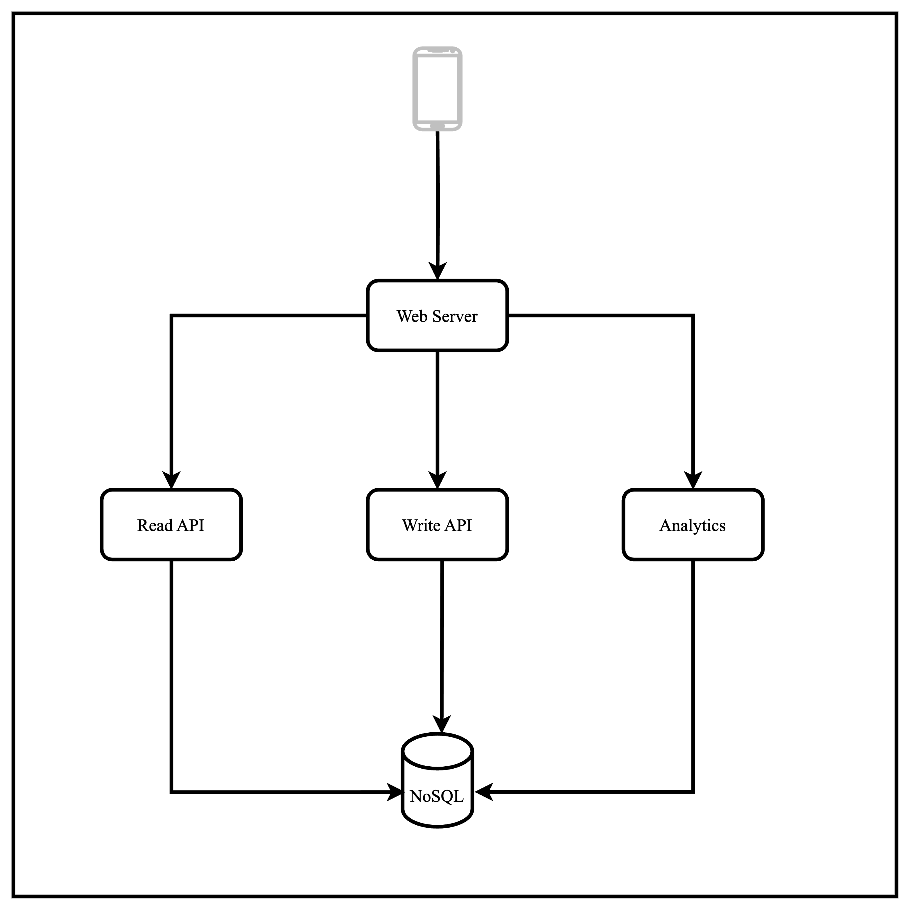
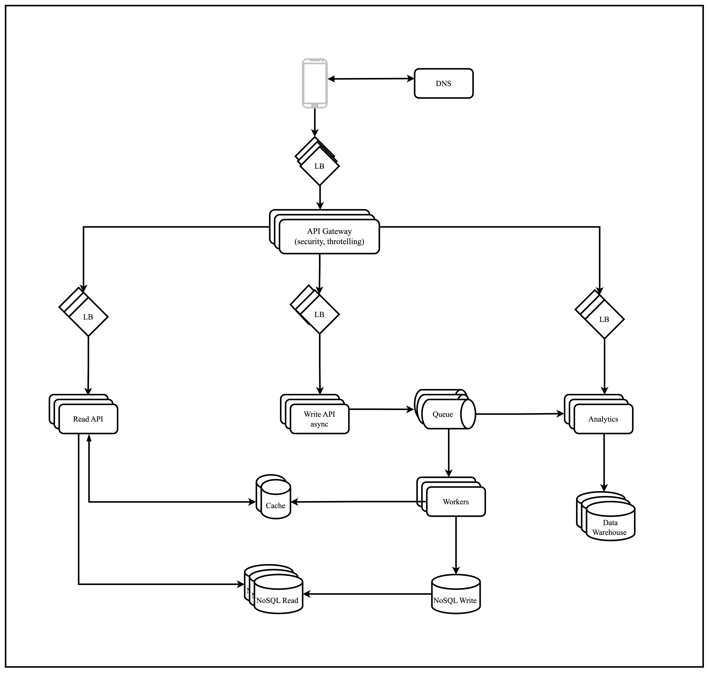

# Task:

- [x] Design architecture pattern for Instagram services
- [x] We analyse just news feed that contains video and photos.
- [x] We interested only in likes and comments functionality.
- [x] Find what will be bottleneck in each case
- [x] Find what might be a SPOF in each case
- [x] Imagine that your load made 10x raise in reading and writing

# Requirements:

## Functional

### Need to implement:

- User can add comments to photos and videos
- User can likes photos and videos 

### Out of scope:

- Upload photo
- Upload video
- Watch photos, videos in feed
- Create stories
- Following other users
- Send and receive messages

## Non-functional

- Scalable
- High Available
- Performante
- Durable
- Resiliente
- Maintantable
- Secure
- Cost efficient

# Estimates:

### Need to implement:

- Every 10 user leave comments
- Every comment size up to 5 KB
- We assume that comments are text only
- Every 5 user make like with a predefined size 8 bytes

### Out of scope:

- 1B users
- 200M DAU
- Every 100 user upload a photo or video
- Photo size up to 5 MB after encoding with several dimensions = 2 * 5 = 10MB
- Video size up to 100 MB after encoding with several dimensions = 2 * 100 = 200MB
- Every 100 user create stories
- Video size up to 50 MB after encoding with several dimensions = 2 * 50 = 100MB
- Every 200 user send and receive messages
- Every message size up to 5 KB

# Calculations:

- If every 10 user leave comments and every comment size up to 5 KB then we have 200M / 10 = 20M comments
- Every comment size up to 5 KB then we have 20M users * 5 Kb = 100M KB = **100GB comments daily**
- Every 5 user make like with a predefined size 8 bytes then we have 200M / 5 = 40M likes
- Every like size up to 8 bytes then we have 40M users * 8 bytes = 320M bytes = **320MB likes daily**

> Overall we have **100GB comments daily** and **320MB likes daily**

# High Level Design:



# Detailed Design:

### Use case: User leave/remove/edit the comment or like to the photo or video

1. The `user` sends a request to `DNS` to get the IP address of the Instagram service
2. The request goes to the `Load Balancer`
3. The `Load Balancer` forwards the request to the `API Gateway` where security checks and throttling are done
4. The `API Gateway` forwards the request to the `Write API async` service
5. The `Write API async` service writes the data to `Queue`
6. The `Workers` read the data from the `Queue` and write the data to the `NoSQL` database and to the `Cache`
7. The `Analytics service` reads the data from the `Queue` and writes the data to the `Data Warehouse`

### REST API:

- **POST** https://instagram.com/api/v1/like
- **POST** https://instagram.com/api/v1/comment
    ```json
    {
        "user_id": "{user_id}",
        "photo_id": "{photo_id}",
        "comment": "{comment}"
    }
    ```

Response: `comment_id`: **UUID**

- **DELETE** https://instagram.com/api/v1/comment&comment_id={comment_id}

- **EDIT** https://instagram.com/api/v1/comment&comment_id={comment_id}
    ```json
    {
        "comment": "{new comment}"
    }
    ```

### Use case: User read the comments or likes to the photo or video

1. The `user` sends a request to `DNS` to get the IP address of the Instagram service
2. The request goes to the `Load Balancer`
3. The `Load Balancer` forwards the request to the `API Gateway` where security checks and throttling are done
4. The `API Gateway` forwards the request to the `Read API` service
5. The `Read API` fetches the comments from the NoSQL database from the `Read replica`

### REST API:

- **GET** https://instagram.com/api/v1/comment&photo_id={photo_id}

Response:
```json
{
    "comments": [
        {
            "comment_id": "{comment_id}",
            "user_id": "{user_id}",
            "comment": "{comment}"
        }
    ]
}
```

- **GET** https://instagram.com/api/v1/like&photo_id={photo_id}

Response:
```json
{
    "likes": [
        {
            "user_id": "{user_id}"
        }
    ]
}
```




# Bottlenecks:

1. Application is `Read Heavy` because people mostly consume than publish content.
    - `Read replica` might be a bottleneck if we have a lot of read requests
2. `Queue` might be a bottleneck if we have a lot of write requests and workers can't handle the load

# SPOF:

1. `Load Balancer` is a SPOF because if it goes down then the whole system goes down, that is why we need to have a several `Load Balancers` in different regions
2. `Database` is a SPOF because if it goes down then the whole system goes down, that is why we need to have a several `Read replicas` in different regions

# 10x raise in reading and writing:

1. We can implement a throttling mechanism in the `API Gateway` to limit the number of requests in order to prevent the system from being overloaded
2. We need to have a several `Read replicas` in different regions
3. If we encounter a 10x write increase, read replicas might not be consistent with the master database. By using `Eventual Consistency` users eventually will see the updated data.
4. In case of a 10x read increase, we can use `Cache` to store the most frequently accessed data. This will reduce the load on the database and improve the response time.